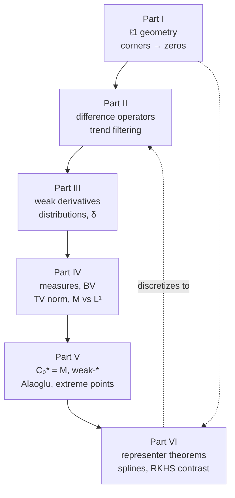

# Sparse Regularization: from $\ell_1$ Corners to Dirac Measures

**A newcomer's comprehensive review** — why an $\ell_1$ penalty produces exact zeros, and what
that fact becomes when the unknown is a function instead of a vector.

Start at [Part 0](#part-0--how-to-read-this): it gives the one question, the dependency map, the
notation, and three reading paths.

---

---

## Part 0 — How to read this

### 0.1 One question, six moves

Almost everyone meets this material as a pile of unrelated topics: a statistics course mentions
that the lasso "sets coefficients to zero", a numerical-methods course mentions splines, a real
analysis course mentions the Cantor measure, a functional analysis course proves Banach–Alaoglu,
and nobody says why these are the same story.

They are the same story. It has one question:

> **Why does an $\ell_1$ penalty produce exact zeros — and what does that fact become when the
> unknown is a function instead of a vector?**

The answer takes six moves, and the whole document is those six moves in order.

| Part | The move | The one-line takeaway |
| --- | --- | --- |
| **I** | Vectors | The $\ell_1$ ball has corners; minimizers land on corners; corners have exact zeros. |
| **II** | Differences | Penalize $\ell_1$ of *differences*, and "sparse" means *piecewise polynomial with knots the data chose*. |
| **III** | Distributions | The continuum version needs the derivative of a step function — so we redefine derivative. |
| **IV** | Measures | The derivative of a step is a *spike*, and a spike is a measure, not a function. $L^1$ has no room for it. |
| **V** | Duality | Measures are a dual space, so bounded sets are weak-\* compact — so the problem *has* a solution. |
| **VI** | Representer theorems | That solution is a **finite** sum of spikes: a spline with finitely many knots. $L^2$ penalties never do this. |

Read it in order the first time. Each Part opens the tools the next one spends.

### 0.2 Who this is for, and what it assumes

It assumes you have multivariable calculus, linear algebra (matrices, null spaces, ranks,
eigenvalues), and enough probability to know what least squares is doing. It assumes you have
heard of the lasso once.

It assumes **no** measure theory, **no** functional analysis, **no** convex analysis, and **no**
distribution theory. Those four are built here, from nothing, in Parts III–V. Every term is
defined at first use, and terms that appear in several Parts are re-defined locally rather than
back-referenced — so you can reread one Part without paging backwards.

What it is not: a substitute for a real analysis course. Proofs here are honest but chosen for
insight, and several are sketches with their gaps named. Where a result needs hypotheses too
technical to state usefully, the text says so instead of quietly dropping them. §7.4 says where to
go for the full treatment.

### 0.3 The dependency map

Solid arrows are hard prerequisites; the dashed arrow is the payoff loop — Part VI is the
continuum theorem whose discretization is Part II.



Three practical reading paths:

- **The two-day skim.** §0.1, then I.2, I.6, II.6, III.7, IV.8, V.8, VI.4, VI.7, then Part 7. That
  is the argument with the machinery removed — about a tenth of the words and most of the idea.
- **The course.** All six Parts in order, with the exercises. Budget a fortnight. The exercises are
  where the understanding actually happens; the solutions are folded away so you can resist them.
- **The reference.** Use the table of contents and §7.3, the glossary. Every section states its
  question in its first italic line, so you can find things by what they answer.

### 0.4 Notation

Fixed for the whole document. Where the literature disagrees with these choices, the text says so
at the point of first use.

| Symbol | Means |
| --- | --- |
| $n$, $x_1 < \cdots < x_n$, $y \in \mathbb{R}^n$ | sample size, design points in $[0,1]$, responses |
| $X \in \mathbb{R}^{n\times p}$, $\beta \in \mathbb{R}^p$ | design matrix, coefficient vector |
| $\lambda > 0$ | the regularization weight, always |
| $S_\lambda(z) = \operatorname{sgn}(z)(|z|-\lambda)_+$ | the soft-thresholding map |
| $D^{(1)} \in \mathbb{R}^{(n-1)\times n}$ | first difference *matrix*, $(D^{(1)}\beta)_i = \beta_{i+1}-\beta_i$ |
| $D^{(k)} \in \mathbb{R}^{(n-k)\times n}$ | $D^{(1)}$ applied $k$ times |
| trend filtering of **order** $k$ | penalizes $\|D^{(k+1)}\beta\|_1$; order $0$ = piecewise constant |
| $\Omega \subseteq \mathbb{R}^d$ open, $\Omega = (0,1)$ in 1D | the domain the unknown function lives on |
| $\varphi \in C_c^\infty(\Omega) = \mathcal{D}(\Omega)$ | test function |
| $\mathcal{D}'(\Omega)$, $\mathcal{S}(\mathbb{R}^d)$, $\mathcal{S}'(\mathbb{R}^d)$ | distributions, Schwartz space, tempered distributions |
| $\langle T, \varphi\rangle$, $\langle \mu,\varphi\rangle = \int\varphi\,\mathrm{d}\mu$ | the pairing, always (object, test function) |
| $f'$, $f''$, $f^{(k)}$ | **classical** derivatives |
| $\mathrm{D}f$, $\mathrm{D}^{k+1}f$ | **distributional** derivative — upright $\mathrm{D}$, an operator on functions |
| $\delta_t$, $H_t$ | Dirac measure at $t$, Heaviside step at $t$ ($H = H_0$) |
| $\mathcal{M}(\Omega)$ | finite signed Radon measures on $\Omega$ |
| $|\mu|$, $\ \|\mu\|_{\mathcal M} = |\mu|(\Omega)$ | total variation *measure*, total variation *norm* |
| $\mathrm{TV}(f) = |\mathrm{D}f|(\Omega)$ | total variation of a function ($=\int|f'|$ when $f \in C^1$) |
| $\mu_j \overset{*}{\rightharpoonup} \mu$ | weak-\* convergence |
| $m$, $\Phi:\mathcal{M}(\Omega)\to\mathbb{R}^m$, $z \in \mathbb{R}^m$ | number of measurements, forward operator, data |
| $\mathrm{L}$, $\mathcal{N}(\mathrm{L})$, $N_0 = \dim\mathcal{N}(\mathrm{L})$ | regularizing operator (usually $\mathrm{D}^{k+1}$) and its null space |
| $\mathcal{H}$, $\kappa(\cdot,\cdot)$ | reproducing kernel Hilbert space and its kernel |

Two collisions are deliberate and worth flagging now, because they are the entire point of §VI.6:
the italic matrix $D^{(k)}$ and the upright operator $\mathrm{D}^k$ are near-twins, and $m$
(measurements) equals $n$ (samples) in the regression story but not in general. Both Parts that
use both letters say so explicitly.

### 0.5 A warning about the word "sparse"

It is used here in three different senses, and conflating them is the single most common confusion
in this area:

1. **Few nonzero coefficients** (Part I) — a property of a vector in a fixed basis.
2. **Few nonzero differences** (Part II) — a property of a vector after applying a linear map,
   which is what makes the *fit* piecewise polynomial rather than the *coefficients* few.
3. **Finitely many atoms** (Parts IV–VI) — a property of a measure, meaning it is a finite
   combination of spikes rather than having a density. In infinite dimensions "sparse" means
   *finitely parameterized*, and the bound is the number of measurements $m$ — which need not be
   small (§VI.8).

Each Part says which sense it is using. When you find yourself surprised by a claim, check the
sense first.

---

## Part I — Sparsity you can see: the geometry of $\ell_1$

This document asks why an $\ell_1$ penalty produces exact zeros, and what that fact becomes when the unknown is a function. This Part answers the first half where you can literally draw the answer: $\beta\in\mathbb{R}^p$, $p=2$. Everything later — sparse *differences* (§II), spikes as derivatives (§III) and measures (§IV), solutions that are finite sums of spikes (§VI.4) — is this picture pushed into infinite dimensions.

*Notation.* $X\in\mathbb{R}^{n\times p}$, $\beta\in\mathbb{R}^p$, $y\in\mathbb{R}^n$, $\lambda>0$, $S_\lambda(z)=\operatorname{sgn}(z)(|z|-\lambda)_+$, per the notation table. I write $x_j\in\mathbb{R}^n$ for the $j$-th **column** of $X$ (predictor $j$) — the one place $x$ does double duty, the scalar design points $x_1<\cdots<x_n$ not appearing until §II. Residual $\hat r = y - X\hat\beta$.

### I.1 The two penalties, side by side

*Ridge and lasso are one idea with two notions of "size", and each has a penalized and a constrained form describing the same solutions.*

A penalty is a budget: you may shrink the residual sum of squares, but you pay for coefficients. Only the currency differs. Ridge charges $\sum_j\beta_j^2$, which punishes one large coefficient far more than several medium ones, so it spreads weight around. The lasso charges $\sum_j|\beta_j|$ at a flat rate per unit wherever that unit sits — so it has no reason to prefer spreading, and (§I.2) a reason to concentrate.

**Penalized form**, with the $\tfrac12$ on the loss throughout:

$$
\hat\beta^{\,\mathrm{ridge}}(\lambda) = \arg\min_{\beta}\ \tfrac12\|y-X\beta\|_2^2 + \lambda\|\beta\|_2^2,
\qquad
\hat\beta^{\,\mathrm{lasso}}(\lambda) = \arg\min_{\beta}\ \tfrac12\|y-X\beta\|_2^2 + \lambda\|\beta\|_1 .
$$

**Constrained form.** Minimize $\tfrac12\|y-X\beta\|_2^2$ subject to $\|\beta\|_2\le t$, respectively $\|\beta\|_1\le t$.

**Equivalence, precisely.** *(i)* If $\hat\beta$ solves the penalized lasso at $\lambda$, it solves the constrained lasso with $t=\|\hat\beta\|_1$: any $\beta'$ with $\|\beta'\|_1\le t$ and strictly smaller loss would also beat $\hat\beta$ on the penalized objective, since $\lambda\|\beta'\|_1\le\lambda\|\hat\beta\|_1$. *(ii)* Conversely, for every $t$ strictly between $0$ and the smallest $\ell_1$ norm attained by an unpenalized least-squares solution, some $\lambda>0$ has the same solution set — Lagrangian duality for a convex program whose feasible set has nonempty interior (Slater's condition; Boyd and Vandenberghe (2004)). Ridge is identical with $\|\cdot\|_2$. Convexity of loss *and* penalty is load-bearing: it closes the duality gap.

No formula is available, though. The pairing $\lambda\leftrightarrow t$ depends on $X$ and $y$: in §I.5, $\lambda=1$ pairs with $t=10/3$, $\lambda=3$ with $t=2$ — that data set and no other.

The two budget sets in $\mathbb{R}^2$ at the same $t$:

```
        L2 ball  {||b||_2 <= t}                 L1 ball  {||b||_1 <= t}
              b2                                       b2
               |                                        |
          *****|*****                                  /|\
       **      |      **                             /  |  \
      *        |        *                          /    |    \
     *         |         *                       /      |      \
   --*---------+---------*--- b1        --------*-------+-------*------- b1
     *         |         *                       \      |      /
      *        |        *                          \    |    /
       **      |      **                             \  |  /
          *****|*****                                  \|/
               |                                        |

   smooth: every boundary point           four corners, (+/-t,0) and (0,+/-t),
   looks like every other                 and at each one a coordinate is 0
```

**Common trap.** "$\lambda$ means the same for both, so compare ridge and lasso at $\lambda=1$." It does not: $\|\beta\|_2^2$ has units of coefficient-squared, $\|\beta\|_1$ of coefficient. At $\lambda=1$ in §I.5 the half-RSS is $1.833$ for the lasso and $3.864$ for ridge — not because ridge is worse, but because $\lambda=1$ buys a tighter budget there.

### I.2 Why a corner gives an exact zero

*Why "the ellipse hits the diamond at a spike" makes zeros plausible — and why that picture is an explanation, not a proof.*

Read the constrained form geometrically. The loss $\tfrac12\|y-X\beta\|_2^2$ is a quadratic in $\beta$; its level sets are concentric ellipses centred at the least-squares solution (unbounded cylinders if $X$ has a nontrivial null space). Inflate them from that centre: provided the least-squares point lies *outside* the budget set (if it lies inside, it is itself the solution and nothing is constrained), the constrained solution is the *first* point where an expanding ellipse touches the budget set. So "does a coordinate vanish?" becomes "where does an ellipse first touch this set?"

A disc has no distinguished points — the touch is tangential at a smooth point, both coordinates nonzero unless the geometry is exactly aligned. A diamond has four spikes pointing at the axes, and a spike is exactly where a coordinate is zero. Ellipses arriving at a slant get caught on one. First quadrant only; `o` is the least-squares point, `@` the first touch:

```
    b2                                        b2
   t +@ . .                                  t +. .
     |\      ` .                               |   `@ . .
     | \         ` .    o                      |      ` .   ` .   o
     |  \            ` .                       |         ` .    ` .
   --+----+-------------------> b1           --+-----------+------------> b1
     O    t                                    O           t
   L1: touch at vertex (0,t)                 L2: touch on a smooth arc,
       ==> b1 = 0 exactly                        both coordinates nonzero
```

**How large is the set of orientations that get caught?** Make it exact by *linearizing*: maximize a linear functional $c^\top\beta$, $c\neq0$, over the unit ball. Over $\{\|\beta\|_1\le1\}$ the maximizer is $\operatorname{sgn}(c_{j^*})e_{j^*}$ with $j^*$ maximizing $|c_j|$ — a vertex, with $p-1$ exact zeros — and it is *unique* whenever exactly one $j$ attains $\max_k|c_k|$. The exceptional set $\{c:|c_i|=|c_j|=\max_k|c_k|,\ i\neq j\}$ sits inside a finite union of hyperplanes, hence has Lebesgue measure zero in $\mathbb{R}^p$. That is what "large" means: everything but a measure-zero set. Over $\{\|\beta\|_2\le1\}$ the maximizer is $c/\|c\|_2$ for every $c\neq0$ — no zeros unless $c$ had one. Check: over $100{,}000$ Gaussian draws of $c\in\mathbb{R}^4$, $0$ exact ties, the $\ell_1$ maximizer had exactly one nonzero coordinate every time, and every $\ell_2$ maximizer had four.

> [!WARNING]
> The corner argument is a **heuristic**, not the proof. The loss is quadratic, its level sets curved, and first-contact reasoning against a curved body is not settled by the linearized calculation; nor does the picture say *which* coordinates vanish, or at what $\lambda$. It tells you why to expect zeros. The honest necessary-and-sufficient statement is §I.3.

**Common trap.** "The ellipse always hits a corner, so the lasso always zeroes something." No: for $t$ near $\|\hat\beta^{\,\mathrm{OLS}}\|_1$ the first touch is on an *edge* and nothing is zero — in §I.5 both coefficients survive for every $\lambda<3$. Corners win when the budget is tight, not always.

### I.3 The algebra behind the picture: subgradients and the KKT conditions

*What replaces "set the derivative to zero" at a kink, and what it says about exact zeros.*

$|t|$ has no derivative at $0$, but it has a whole *set* of supporting slopes there: every line through the origin of slope in $[-1,1]$ stays under the graph. That is the entire idea.

**Definition.** For convex $f:\mathbb{R}\to\mathbb{R}$, $g$ is a **subgradient** of $f$ at $t_0$ if $f(t)\ge f(t_0)+g(t-t_0)$ for all $t$; the set of such $g$ is the **subdifferential** $\partial f(t_0)$. Where $f$ is differentiable, $\partial f(t_0)=\{f'(t_0)\}$. For $f(t)=|t|$:

$$
\partial|t| = \begin{cases} \{+1\}, & t>0,\\ [-1,1], & t=0,\\ \{-1\}, & t<0.\end{cases}
$$

Two borrowed facts (Rockafellar (1970); Boyd and Vandenberghe (2004)): a convex $F$ is minimized at $\hat\beta$ **iff** $0\in\partial F(\hat\beta)$; and for $F=$ (differentiable loss) $+\ \lambda\|\cdot\|_1$ the subdifferential is the gradient plus coordinatewise subdifferentials. Convexity is load-bearing — without it $0\in\partial F$ is not sufficient.

**Lasso stationarity (KKT).** $\hat\beta$ is a solution iff there is $s\in\mathbb{R}^p$ with

$$
x_j^\top(y-X\hat\beta) = \lambda s_j,\qquad
s_j=\operatorname{sgn}(\hat\beta_j)\ \text{if } \hat\beta_j\neq0,\qquad
s_j\in[-1,1]\ \text{if } \hat\beta_j=0 .
$$

Read it off: $\hat\beta_j\neq0\Rightarrow|x_j^\top\hat r|=\lambda$ exactly; contrapositively $|x_j^\top\hat r|<\lambda\Rightarrow\hat\beta_j=0$; and $\hat\beta_j=0\Rightarrow|x_j^\top\hat r|\le\lambda$. So the slogan —

> coordinate $j$ is zero exactly when predictor $j$'s alignment with the residual is at most $\lambda$

— is right except at the boundary $|x_j^\top\hat r|=\lambda$, where both a zero and a nonzero $\hat\beta_j$ are permitted; that boundary is where coefficients enter and leave. Two caveats: $x_j^\top\hat r$ is an inner product, not a correlation, unless the columns are centred and scaled to unit norm; and $\hat r$ depends on $\hat\beta$, so this is a fixed-point characterization, not something evaluable before solving.

**Ridge, for contrast.** Its objective is differentiable, so stationarity is an *equation*: $-x_j^\top(y-X\hat\beta)+2\lambda\hat\beta_j=0$, i.e. $\hat\beta_j = x_j^\top\hat r/(2\lambda)$. So $\hat\beta_j=0$ demands $x_j^\top\hat r=0$ exactly — an equation, not an inequality. The data $(X,y)$ satisfying it form a Lebesgue-null set: that is the precise content of "ridge never gives exact zeros".

**Worked check.** In §I.5 at $\lambda=5$: $\hat\beta=(0,1)^\top$, $\hat r=(2,3,2)^\top$, $x_1=(1,0,1)^\top$, $x_2=(0,1,1)^\top$. Then $x_1^\top\hat r=2+2=4\le5$ (strict slack, so $\hat\beta_1=0$ is forced) and $x_2^\top\hat r=3+2=5=\lambda\operatorname{sgn}(1)$.

**Common trap.** "The inequality lets me screen predictors before fitting, using the OLS residual." No — $\hat r$ is the *lasso* residual at that $\lambda$. Safe screening rules exist, but they are bounds, not this identity.

### I.4 The orthogonal case in closed form: soft thresholding vs linear shrinkage

*The one case where coordinates do not interact: both estimators become one-line formulas, and the dead zone becomes visible.*

Let $X^\top X = I_p$ and $z = X^\top y$. Then $\tfrac12\|y-X\beta\|_2^2 = \tfrac12\|y\|_2^2 - z^\top\beta + \tfrac12\|\beta\|_2^2$, so up to a constant the problem splits into $p$ scalar problems. Lasso coordinate $j$: minimize $\tfrac12(\beta_j-z_j)^2+\lambda|\beta_j|$. For $\beta_j\neq0$, $\beta_j-z_j+\lambda\operatorname{sgn}(\beta_j)=0$, consistent only if $|z_j|>\lambda$; at $\beta_j=0$ the condition is $|z_j|\le\lambda$. Together, with the ridge form from $\beta_j-z_j+2\lambda\beta_j=0$:

$$
\hat\beta_j^{\,\mathrm{lasso}} = S_\lambda(z_j) = \operatorname{sgn}(z_j)(|z_j|-\lambda)_+ ,
\qquad
\hat\beta_j^{\,\mathrm{ridge}} = \frac{z_j}{1+2\lambda}.
$$

The $2$ is not decoration: it is differentiating $\lambda\beta_j^2$ against the $\tfrac12$ on the loss. Under the other common convention (unhalved loss) the denominator would be $1+\lambda$; we use $1+2\lambda$ throughout.

```
      soft threshold  S_L(z)                  linear shrinkage  z/(1+2L)
             |         /                              |         /
             |        /                               |       ./
             |       /                                |     ./
    ---------+==+==+---------- z           ----------+./------------- z
           /  -L  L                                ./ |
          /      |                               ./   |
         /       |                             ./     |

   the '=' segment lies ON the axis:        slope 1/(1+2L) everywhere, no
   output is exactly 0 for |z| <= L         flat piece; output is 0 only at
   (a DEAD ZONE); slope 1 outside,          the single point z = 0
   shifted toward 0 by L
```

**Worked example.** $p=3$, $X=I_3$, $y=z=(2.5,\,0.6,\,-1.4)^\top$, $\lambda=1$. Soft threshold: $S_1(2.5)=1.5$; $S_1(0.6)=0$ since $|0.6|\le1$; $S_1(-1.4)=-0.4$. So $\hat\beta^{\,\mathrm{lasso}}=(1.5,\,0,\,-0.4)^\top$. Ridge: divide by $3$, giving $(0.8\overline3,\,0.2,\,-0.4\overline6)^\top$ — three nonzeros, the middle one merely small. Both confirmed against direct numerical minimization.

**Common trap.** "Ridge with $\lambda$ large enough zeroes things, since $z_j/(1+2\lambda)\to0$." The limit is never attained: for finite $\lambda$ and $z_j\neq0$, $z_j/(1+2\lambda)\neq0$. That convergence is in the norm topology of $\mathbb{R}^p$ — all norms on $\mathbb{R}^p$ induce the same topology, which is why naming it costs nothing here and everything in §V.3. The lasso reaches zero at the *finite* $\lambda=|z_j|$.

### I.5 A two-predictor example worked entirely by hand

*One concrete data set where a coefficient hits exactly zero at a computable $\lambda$ while ridge never does.*

Take $n=3$, $p=2$:

$$
X=\begin{bmatrix}1&0\\0&1\\1&1\end{bmatrix},\quad
y=\begin{pmatrix}2\\4\\3\end{pmatrix},\quad
X^\top X=\begin{bmatrix}2&1\\1&2\end{bmatrix},\quad
z=X^\top y=\begin{pmatrix}5\\7\end{pmatrix}.
$$

The predictors are correlated: $x_1^\top x_2=1$ and $\|x_1\|_2=\|x_2\|_2=\sqrt2$, so the cosine between them is $1/2$ — a $60^\circ$ angle. Least squares: $\hat\beta^{\,\mathrm{OLS}} = \tfrac13(2\cdot5-7,\ -5+2\cdot7)^\top = (1,3)^\top$, fit $(1,3,4)^\top$, residual $(1,1,-1)^\top$, half-RSS $3/2$.

**Lasso, both coefficients positive.** KKT with $s=(1,1)^\top$ gives $(X^\top X)\beta = z-\lambda\mathbf 1$, so

$$
\hat\beta(\lambda) = \tfrac13\begin{bmatrix}2&-1\\-1&2\end{bmatrix}\begin{pmatrix}5-\lambda\\7-\lambda\end{pmatrix} = \Big(\tfrac{3-\lambda}{3},\ \tfrac{9-\lambda}{3}\Big)^\top .
$$

Both entries are positive precisely for $0\le\lambda<3$, so $\hat\beta_1$ hits **exactly zero at $\lambda=3$**, where $\hat\beta=(0,2)^\top$ — the vertex of the $\ell_1$ ball of radius $t=2$, exactly as §I.2 predicts.

**Lasso with $\hat\beta_1=0$.** Then $2\hat\beta_2=7-\lambda$, and the $j=1$ condition reads $|x_1^\top\hat r| = |\hat\beta_2-5| = (3+\lambda)/2\le\lambda\iff\lambda\ge3$: consistent. $\hat\beta_2$ reaches zero at $\lambda=7=\max_j|z_j|=\lambda_{\max}$, past which $\hat\beta=0$. Two knots, $\lambda=3$ and $\lambda=7$; linear in $\lambda$ on each of $[0,3]$, $[3,7]$, $[7,\infty)$.

**Ridge.** $(X^\top X+2\lambda I)\beta = z$, determinant $(2+2\lambda)^2-1 = (2\lambda+1)(2\lambda+3)$, so

$$
\hat\beta^{\,\mathrm{ridge}}(\lambda) = \Big(\tfrac{3+10\lambda}{(2\lambda+1)(2\lambda+3)},\ \tfrac{9+14\lambda}{(2\lambda+1)(2\lambda+3)}\Big)^\top ,
$$

numerators strictly positive for every $\lambda\ge0$: never zero.

Read the table as: the lasso kills $\hat\beta_1$ at $\lambda=3$ and keeps it dead; ridge shrinks both toward zero forever without arriving.

| $\lambda$ | lasso $\hat\beta_1$ | lasso $\hat\beta_2$ | $\|\hat\beta\|_1$ | ridge $\hat\beta_1$ | ridge $\hat\beta_2$ |
|---|---|---|---|---|---|
| $0$ | $1$ | $3$ | $4$ | $1$ | $3$ |
| $1$ | $2/3\approx0.6667$ | $8/3\approx2.6667$ | $10/3$ | $13/15\approx0.8667$ | $23/15\approx1.5333$ |
| $3$ | $\mathbf 0$ | $2$ | $2$ | $11/21\approx0.5238$ | $17/21\approx0.8095$ |
| $5$ | $\mathbf 0$ | $1$ | $1$ | $53/143\approx0.3706$ | $79/143\approx0.5524$ |

Every entry was checked two ways in `python3`: sign-pattern KKT systems, and brute-force grid search. The constrained form checks out too: the loss subject to $\|\beta\|_1\le10/3$ gave $(0.6667,2.6667)^\top$, subject to $\|\beta\|_1\le2$ gave $(0,2)^\top$ — §I.1's pairing, for this data set only.

**Common trap.** "$\hat\beta_1$ died, so predictor 1 is irrelevant." Its OLS coefficient is $1$ and $x_1^\top y=5$; what killed it is that $x_2$ buys the same direction more cheaply ($|x_2^\top y|=7$).

### I.6 What a "corner" really is: extreme points of the $\ell_1$ ball

*"Corner" has a definition that survives into infinite dimensions — and that definition is the seed of Parts V and VI.*

A corner is a point you cannot reach by averaging. Stand at $(0,t)$ on the diamond: every straight segment through it, however short, immediately leaves the set. Stand inside the flat edge from $(t,0)$ to $(0,t)$ and you *are* the average of two neighbours on that edge. Spikes are special; edges are not.

**Definitions.** $K\subseteq\mathbb{R}^p$ is **convex** if it contains the segment between any two of its points, and **compact** if it is closed and bounded. A point $v\in K$ is an **extreme point** if it is no nontrivial average of others: $v=(1-\theta)u+\theta w$ with $u,w\in K$, $\theta\in(0,1)$ forces $u=w=v$.

**Proposition.** The extreme points of $B_1=\{\beta\in\mathbb{R}^p:\|\beta\|_1\le1\}$ are exactly the $2p$ signed unit vectors $\pm e_1,\dots,\pm e_p$.

*Proof.* *These are extreme.* Let $e_j=(1-\theta)u+\theta w$, $u,w\in B_1$, $\theta\in(0,1)$. Then $1=\|e_j\|_1\le(1-\theta)\|u\|_1+\theta\|w\|_1\le1$, so $\|u\|_1=\|w\|_1=1$. Coordinate $j$ gives $1=(1-\theta)u_j+\theta w_j\le(1-\theta)|u_j|+\theta|w_j|\le1$, forcing $|u_j|=|w_j|=1$ with positive sign, so $u_j=w_j=1$; then $\|u\|_1=1$ forces $u_i=0$ for $i\neq j$, i.e. $u=e_j=w$. Same for $-e_j$.

*Nothing else is.* Let $\beta\in B_1$ be none of $\pm e_j$. If $\|\beta\|_1<1$, then $\beta\pm\varepsilon e_1\in B_1$ for small $\varepsilon>0$ and $\beta$ is their midpoint. Otherwise $\|\beta\|_1=1$ and $\beta$ has at least two nonzero coordinates $i\neq k$ (a single nonzero coordinate with $\|\beta\|_1=1$ *is* some $\pm e_j$). Put $d=\operatorname{sgn}(\beta_i)e_i-\operatorname{sgn}(\beta_k)e_k$, $\varepsilon=\min(|\beta_i|,|\beta_k|)$: then $\|\beta\pm\varepsilon d\|_1=1$, since coordinate $i$ gains in absolute value exactly what $k$ loses, so both perturbed points lie in $B_1$ and $\beta$ is their midpoint. $\square$

**Worked example.** $p=3$. Take $\beta=(\tfrac12,\tfrac12,0)^\top$: $\|\beta\|_1=1$, so it sits on the boundary, yet $\beta=\tfrac12 e_1+\tfrac12 e_2$ — an average of two points of $B_1$, hence not extreme. The proof's second recipe agrees: $i=1$, $k=2$, $d=e_1-e_2$, $\varepsilon=\min(\tfrac12,\tfrac12)=\tfrac12$, and $\beta\pm\tfrac12 d=(1,0,0)^\top,(0,1,0)^\top$, each of $\ell_1$ norm exactly $1$, with $\beta$ their midpoint. Take instead $\beta'=(0.4,0.4,0)^\top$, $\|\beta'\|_1=0.8<1$: the first recipe applies with $\varepsilon=0.2$, and $\beta'\pm0.2e_1=(0.6,0.4,0)^\top,(0.2,0.4,0)^\top$ have $\ell_1$ norms $1$ and $0.6$, both $\le1$, so $\beta'$ is again a midpoint. Only the six vectors $\pm e_1,\pm e_2,\pm e_3$ survive.

**Contrast.** In $B_2=\{\|\beta\|_2\le1\}$ *every* point of the sphere is extreme: if $\|\beta\|_2=1$ and $\beta=\tfrac12(u+w)$ with $\|u\|_2,\|w\|_2\le1$, the parallelogram identity $\|u+w\|_2^2+\|u-w\|_2^2 = 2\|u\|_2^2+2\|w\|_2^2\le4$ forces $\|u-w\|_2^2 = 0$. So $\ell_2$ has a continuum of extreme points, none sparse; $\ell_1$ has $2p$, all maximally sparse.

**The principle.** A linear functional on a nonempty compact convex $K\subseteq\mathbb{R}^p$ attains its maximum, and at least one maximizer is an extreme point (standard; Rockafellar (1970)). With the Proposition, that *is* the linearized calculation of §I.2. In infinite dimensions the corresponding tool is Krein–Milman (§V.7) — which delivers the *closed* convex hull of the extreme points, not the convex hull, so the maximum principle has to be recovered from it rather than read off — the ball is the total-variation ball in $\mathcal{M}(\Omega)$, its extreme points are exactly the signed Dirac measures $\pm\delta_x$ (§V.8), and *some* solution is therefore a finite sum of spikes (§VI.4) — not every solution, which is one of §VI.8's caveats. "Corner" becomes "$\pm\delta_x$"; "exact zero" becomes "finitely many knots".

**Common trap.** "Extreme point = boundary point." False, and the failure is the point: every interior point of the diamond's *edges* lies on the boundary, and none is extreme.

### I.7 Consequences and cautions

*What the lasso does not promise.*

**It is biased.** From §I.4 a large orthonormal-case coefficient returns as $z_j-\lambda$, not $z_j$: every survivor is pulled toward zero by exactly $\lambda$, an offset that stays the same size however strong the signal. Ridge is no cure: its error $|z_j-z_j/(1+2\lambda)| = 2\lambda|z_j|/(1+2\lambda)$ is *proportional* to the signal, so it grows rather than fades — at $\lambda=1$ it is $2/3$ when $z_j=1$ but $13.\overline3$ when $z_j=20$. The two biases differ in form (additive vs multiplicative), not in whether they vanish. Hence debiasing, and the non-convex penalties (SCAD, MCP) outside this document's scope.

**Correlated predictors: the choice is near-arbitrary.** In §I.5 the predictors sit $60^\circ$ apart and $x_2$ won only because $z_2=7$ beat $z_1=5$: on the both-positive branch $\hat\beta_1$ vanishes at $\lambda=2z_1-z_2=3$ while $\hat\beta_2$ would need $\lambda=2z_2-z_1=9$, so the mere ordering of $z_1,z_2$ picks the survivor. Nothing about the modelling does — and for data with $z_1,z_2$ nearly tied (say $z=(6,\,6.05)^\top$, with those two thresholds at $5.95$ and $6.1$) an arbitrarily small change in $y$ flips which variable is selected. With duplicated columns there is no choice at all. Take $X=\begin{bmatrix}1&1\\1&1\end{bmatrix}$, $y=(1,1)^\top$, $\lambda=1$: the objective is $(1-\beta_1-\beta_2)^2+|\beta_1|+|\beta_2|$ (the $\tfrac12$ cancels against the two identical rows), minimized at total mass $\beta_1+\beta_2=1/2$ with both entries $\ge0$, so *every* $\beta=(a,\tfrac12-a)^\top$, $0\le a\le\tfrac12$, solves it. I verified the objective equals $0.75$ at $a=0,\,0.1,\,0.25,\,0.4,\,0.5$ and is strictly larger off that segment ($0.76$ at $(0.3,0.3)^\top$, $0.95$ at $(0.6,-0.1)^\top$). The elastic net (Zou and Hastie (2005)) adds a ridge term to break the tie.

**Uniqueness.** Two safe statements. *(a)* If $\operatorname{rank}(X)=p$ the loss is strictly convex and the solution is unique for every $\lambda>0$. *(b)* Even when it is not, the fit $X\hat\beta$ is the same for all solutions and all share one $\ell_1$ norm — in the duplicate-column example, fit $(0.5,0.5)^\top$ and $\|\hat\beta\|_1=0.5$ along the whole segment. Beyond that, Tibshirani (2013) proves uniqueness for every $y$ and $\lambda>0$ when the columns of $X$ are in **general position**, a condition on affine spans of signed subsets of columns that holds with probability one if the entries of $X$ come from a continuous distribution. That affine-span condition is easy to garble, so I do not restate it; see Tibshirani (2013) for its exact form.

**The path is piecewise linear.** When the solution is unique at every $\lambda>0$ — e.g. $\operatorname{rank}(X)=p$, as in §I.5 — the map $\lambda\mapsto\hat\beta(\lambda)$ is continuous (norm topology on $\mathbb{R}^p$) and piecewise linear with finitely many knots, the knots being where the active set changes: $\lambda=3,7$ in §I.5. Without uniqueness one can still *select* a piecewise linear path through the solution sets, but $\hat\beta(\lambda)$ is then not a single-valued function. Hence the whole path is exactly computable (LARS: Efron, Hastie, Johnstone and Tibshirani (2004); also Osborne, Presnell and Turlach (2000)). The same piecewise structure in the fitted *function* is what §II.6 exploits.

**$\lambda$ must be chosen.** Nothing in this Part picks it; in practice, $K$-fold cross-validation on a grid running down from $\lambda_{\max}=\max_j|x_j^\top y|$.

> [!WARNING]
> Sparsity is not model selection. Zeros in $\hat\beta$ do not make the nonzeros the true support. Support recovery needs extra conditions on $X$ — irrepresentable/incoherence-type conditions (Zhao and Yu (2006); Meinshausen and Bühlmann (2006)) — plus signal strong enough relative to noise. Worse, the $\lambda$ minimizing prediction error is generally *not* the $\lambda$ recovering the support: cross-validated lasso tends to keep extra variables. Report a lasso fit as "a sparse predictive model", not as "the relevant variables".

**Common trap.** "The lasso zeroes coefficients, therefore it selects variables, therefore the survivors are the true predictors." Every arrow is weaker than it looks, and the last is usually false without conditions nobody can check on real data.

### I.8 Exercises

**1.** With $X$ orthonormal, $z=X^\top y=(1.2,\,-0.4,\,0.3)^\top$ and $\lambda=0.5$, compute the lasso and ridge solutions.

<details><summary>Solution</summary>

Lasso, componentwise $S_{0.5}$: $1.2-0.5=0.7$; $|-0.4|\le0.5\Rightarrow0$; $|0.3|\le0.5\Rightarrow0$. So $(0.7,\,0,\,0)^\top$, two exact zeros. Ridge: $z/(1+2\cdot0.5)=z/2=(0.6,\,-0.2,\,0.15)^\top$, no zeros. Verified in `python3`.

</details>

**2.** For the data of §I.5, compute $\hat\beta^{\,\mathrm{lasso}}(2)$ and verify the KKT conditions.

<details><summary>Solution</summary>

$\lambda=2<3$, so the both-positive branch applies: $\hat\beta=((3-2)/3,(9-2)/3)=(1/3,\,7/3)^\top$. Fit $(1/3,\,7/3,\,8/3)^\top$, so $\hat r=(5/3,\,5/3,\,1/3)^\top$. Then $x_1^\top\hat r = 5/3+1/3 = 2 = \lambda$ and $x_2^\top\hat r = 5/3+1/3 = 2 = \lambda$, matching $s=(1,1)^\top$. Verified numerically.

</details>

**3.** *(Find the flaw.)* "The corner argument proves it: the ellipse must hit the diamond somewhere, the diamond's extreme points are the signed unit vectors, so the solution is a signed unit vector scaled by $t$."

<details><summary>Solution</summary>

Two flaws. (i) §I.6's extreme-point principle concerns maximizing a *linear* functional; the loss is quadratic, so its minimizer over the ball need not be extreme. (ii) Even for a linear functional the conclusion is "at least one maximizer is extreme", not "every solution is". Concretely, §I.5 at $\lambda=1$ gives $(2/3,\,8/3)^\top$: on the boundary of the radius-$10/3$ ball, on an edge, no zeros.

</details>

**4.** Show directly, without subgradients, that $\arg\min_b\tfrac12(b-z)^2+\lambda|b| = S_\lambda(z)$.

<details><summary>Solution</summary>

Split on the sign of $b$. On $b\ge0$ the objective is the smooth $\tfrac12(b-z)^2+\lambda b$, minimized over $[0,\infty)$ at $b=(z-\lambda)_+$; on $b\le0$ it is $\tfrac12(b-z)^2-\lambda b$, minimized over $(-\infty,0]$ at $b=-(-z-\lambda)_+$. At most one of $(z-\lambda)_+$, $(-z-\lambda)_+$ is nonzero (they need $z>\lambda$, resp. $z<-\lambda$); comparing objective values keeps that one when it exists, $0$ otherwise — i.e. $\operatorname{sgn}(z)(|z|-\lambda)_+$.

</details>

**5.** *(Connects to Part II.)* Let $\theta=D^{(1)}\beta\in\mathbb{R}^{n-1}$ with $(D^{(1)}\beta)_i=\beta_{i+1}-\beta_i$. In what sense is penalizing $\|D^{(1)}\beta\|_1$ "the lasso in disguise", and what breaks in the disguise?

<details><summary>Solution</summary>

$\|D^{(1)}\beta\|_1$ is an $\ell_1$ norm of a *linear image* of $\beta$, so §I.3's KKT analysis goes through after a change of variables, and the sparsity induced is sparsity in $\theta$: most consecutive differences exactly zero, i.e. $\beta$ piecewise constant with a few jumps. What breaks: $D^{(1)}$ is not invertible — the constant vector lies in its null space — so $\beta$ is not recoverable from $\theta$ alone and the null-space component must be carried separately. That null space is why differences encode polynomials (§II.2), and why trend filtering of order $k$, which penalizes $\|D^{(k+1)}\beta\|_1$, fits piecewise polynomials of degree $k$ (§II.6).

</details>

**6.** *(Connects to Parts V–VI.)* The unit $\ell_1$ ball has $2p$ extreme points and a linear functional is maximized at one of them. State the infinite-dimensional analogue you expect, and name the one hypothesis that becomes hard.

<details><summary>Solution</summary>

Expected analogue: the unit ball of $\|\cdot\|_{\mathcal M}$ in $\mathcal{M}(\Omega)$ has extreme points exactly $\{\pm\delta_x:x\in\Omega\}$ (§V.8), a suitable linear functional is extremized at one of them, and minimizers of $\mathcal{M}$-norm-regularized problems are therefore finite sums of spikes (§VI.4). The hard hypothesis is **compactness**: in $\mathbb{R}^p$ "closed and bounded" suffices, but in infinite dimensions a norm-closed bounded set need not be compact. The repair is to change topology — the ball is compact in the weak-\* topology (Banach–Alaoglu, §V.4) — which then demands only weak-\* lower semicontinuity of the objective (§V.5). That is why Part V exists.

</details>

### I.9 Sources for Part I

- Tibshirani (1996), *Regression shrinkage and selection via the lasso* — the original, with the constrained form and the diamond picture. Hoerl and Kennard (1970), *Ridge regression: biased estimation for nonorthogonal problems*.
- Donoho and Johnstone (1994), *Ideal spatial adaptation by wavelet shrinkage* — soft thresholding as an estimator. Chen, Donoho and Saunders (1998), *Atomic decomposition by basis pursuit* — the atomic-selection view §VI.7 returns to.
- Efron, Hastie, Johnstone and Tibshirani (2004), *Least angle regression*; Osborne, Presnell and Turlach (2000), *On the lasso and its dual* — the piecewise linear path.
- Zou and Hastie (2005), *Regularization and variable selection via the elastic net*. Tibshirani, Ryan J. (2013), *The lasso problem and uniqueness*.
- Zhao and Yu (2006), *On model selection consistency of Lasso*; Meinshausen and Bühlmann (2006), *High-dimensional graphs and variable selection with the lasso*.
- Hastie, Tibshirani and Wainwright (2015), *Statistical Learning with Sparsity: the Lasso and Generalizations*; Hastie, Tibshirani and Friedman (2009), *The Elements of Statistical Learning*.
- Rockafellar (1970), *Convex Analysis*; Boyd and Vandenberghe (2004), *Convex Optimization* — subgradients, KKT, duality, extreme points.

---

## Part II — Sparsity in differences: fused lasso, trend filtering, adaptive splines

Part I put the $\ell_1$ penalty on the coefficients, and the ball's corners gave exact zeros (§I.2, §I.6). Change one thing: penalize the $\ell_1$ norm of the *differences* of $\beta$. The geometry is untouched — still corners, still exact zeros — but a zero now means two neighbours forced to agree, not a predictor discarded. Sparse differences give a piecewise-polynomial fit whose breakpoints the data chose, and Parts III–VI take the continuum limit of the matrices below.

### II.1 Discrete difference operators $D^{(1)}, D^{(2)}, D^{(k)}$

*What matrix turns a vector into its differences, and what does it look like?*

Think of $\beta \in \mathbb{R}^n$ as heights along a fence. First differences are the $n-1$ steps between posts, second differences the changes in those steps — the bends. Each differencing costs one row, because a difference needs two neighbours. Precisely: $D^{(1)} \in \mathbb{R}^{(n-1)\times n}$ with $(D^{(1)}\beta)_i = \beta_{i+1}-\beta_i$, and $D^{(k)} \in \mathbb{R}^{(n-k)\times n}$ is $D^{(1)}$ applied $k$ times. For $n=6$ the row counts for $k = 1,2,3,4$ are $5,4,3,2$, and

$$D^{(1)} = \begin{bmatrix} -1 & 1 & 0 & 0 & 0 & 0\\ 0 & -1 & 1 & 0 & 0 & 0\\ 0 & 0 & -1 & 1 & 0 & 0\\ 0 & 0 & 0 & -1 & 1 & 0\\ 0 & 0 & 0 & 0 & -1 & 1\end{bmatrix}_{5\times 6}, \qquad D^{(2)} = \begin{bmatrix} 1 & -2 & 1 & 0 & 0 & 0\\ 0 & 1 & -2 & 1 & 0 & 0\\ 0 & 0 & 1 & -2 & 1 & 0\\ 0 & 0 & 0 & 1 & -2 & 1\end{bmatrix}_{4\times 6}.$$

$D^{(2)}$ really is $D^{(1)}$ twice. Row 1 of the $4\times5$ first-difference matrix is $(-1,1,0,0,0)$, so it takes minus row 1 plus row 2 of the $5\times6$ matrix:

$$-(-1,1,0,0,0,0) + (0,-1,1,0,0,0) = (1,-1,0,0,0,0)+(0,-1,1,0,0,0) = (1,-2,1,0,0,0),$$

exactly row 1 of $D^{(2)}$; other rows are the same shifted, and I confirmed the full product numerically. The rows of $D^{(3)}$ and $D^{(4)}$ are $(-1,3,-3,1)$ and $(1,-4,6,-4,1)$ sliding right — the signed binomials $(-1)^{k-j}\binom{k}{j}$.

**Banded, and that is the whole computational story.** Each row of $D^{(k)}$ has at most $k+1$ nonzeros, all adjacent, so $D^{(k)}(D^{(k)})^\top$ is banded with bandwidth $2k+1$ — *fixed*, independent of $n$. A banded system of size $n$ and bandwidth $b$ solves in $O(nb^2)$ rather than $O(n^3)$, the only reason trend filtering runs at $n=10^6$ (§II.9).

**Common trap.** $D^{(2)}$ is an *unnormalized* second difference, not the second derivative: on spacing $h$ the derivative is about $h^{-2}D^{(2)}\beta$, so halving $h$ at fixed $\lambda$ changes the problem.

### II.2 Null spaces: why differences encode polynomials

*What does the difference penalty refuse to see?*

Differencing a constant gives zero; a line gives a constant, and differencing again gives zero. Each $D^{(1)}$ drops polynomial degree by exactly one, so after $k$ applications everything of degree $\le k-1$ is gone and degree $k$ survives as a nonzero constant.

**Statement.** For $n>k\ge1$, $\mathcal{N}(D^{(k)}) \subset \mathbb{R}^n$ has dimension exactly $k$, spanned by the discrete polynomials in the *index*, $v^{(d)} = (1^d, 2^d, \dots, n^d)$, $d = 0,\dots,k-1$. Dimension: $D^{(k)}$ is in row echelon form (row $i$ has its first nonzero in column $i$), so its rank is its row count $n-k$. Spanning: for $d\ge1$, differencing $i^d$ gives a polynomial in $i$ of degree exactly $d-1$ (and $d=0$ is killed outright), so $k$ differences kill $i^d$ iff $d<k$; the $v^{(d)}$ are independent because a Vandermonde matrix is. Load-bearing: $n>k$, else there are no rows.

At $n=6$ the computed ranks were $5,4,3,2$ for $k = 1,2,3,4$, so nullities $1,2,3,4$; all lower powers returned exactly $0$, and $D^{(k)}v^{(k)}$ returned the constant vectors $1,2,6,24$ — that is $k!$, the discrete echo of $\frac{\mathrm{d}^k}{\mathrm{d}x^k}x^k = k!$.

**What this means for the fit.** Trend filtering of order $k$ penalizes $\|D^{(k+1)}\beta\|_1$, and $\mathcal{N}(D^{(k+1)})$ is the discrete polynomials of degree $\le k$. The penalty is *blind* to exactly those trends, so they pass through unshrunk and the estimator is equivariant: $\hat\beta(y+v) = \hat\beta(y)+v$ for $v \in \mathcal{N}(D^{(k+1)})$. At $n=8$, $\lambda=1$, the two sides agreed to $5\times10^{-9}$ for $k=0$ with $v = 3\cdot(1,\dots,1)$ and to $4\times10^{-11}$ for $k=1$ with $v_i = 3+0.7\,i$; with $v_i = i^2$, *not* in $\mathcal{N}(D^{(2)})$, the gap was $1.45$. This unpenalized polynomial part is the finite-dimensional shadow of $\mathcal{N}(\mathrm{L})$, with $N_0 = \dim\mathcal{N}(\mathrm{L}) = k+1$, in §VI.4.

**Common trap.** $\mathcal{N}(D^{(k)})$ is polynomials in the *index* $i$, not in the $x_i$; those agree only for even spacing — the bug §II.3 repairs.

### II.3 Unequal spacing and the weighted difference operator

*What goes wrong when the $x_i$ are not evenly spaced?*

$D^{(2)}$ measures bend per index step, but the same bend is far more curvature across two narrow gaps than two wide ones — so on an uneven grid it charges a *straight line* for curvature it does not have. Take $n=7$, $x = (0,\ 0.1,\ 0.15,\ 0.45,\ 0.5,\ 0.9,\ 1.0)$:

$$D^{(2)}x = (-0.05,\ 0.25,\ -0.25,\ 0.35,\ -0.30),$$

five nonzeros and a penalty of $1.20$ for a perfectly straight function. §II.2 was not wrong — it promised blindness to polynomials in the *index*, and here the index and the $x_i$ have parted company.

**The fix: divided differences.** The $j$-th divided difference of $\beta$ on $x_i,\dots,x_{i+j}$, times $j!$, estimates the $j$-th derivative. Write $D^{(1)}_r$ for the $(r-1)\times r$ first-difference matrix and $D^{(k)}_x$ for the spacing-corrected $D^{(k)}$ — same object, corrected weights. The trend filtering recursion is

$$D^{(1)}_x = D^{(1)}, \qquad D^{(k+1)}_x = D^{(1)}_{n-k}\cdot \operatorname{diag}\!\left(\frac{k}{x_{1+k}-x_1},\ \frac{k}{x_{2+k}-x_2},\ \dots,\ \frac{k}{x_n - x_{n-k}}\right)\cdot D^{(k)}_x \quad (k\ge1).$$

At each level: difference the previous level, then divide by the *span* of the points involved. The $k\ge1$ is needed — at $k=0$ that diagonal would be all zeros, so $D^{(1)}_x = D^{(1)}$ is a base case, not an instance. Two honest notes. The *outermost* difference is unweighted on purpose, because total variation sums jump sizes without dividing by any gap. And the index bookkeeping differs between authors, so rather than a closed form for the entries of $D^{(k)}_x$ I give the recursion and point to R. J. Tibshirani (2014). The invariant content is that every row is a positive multiple of a divided difference: row $i$ acts as $(k-1)!\,(x_{i+k}-x_i)$ times the $k$-th order divided difference on $x_i,\dots,x_{i+k}$ — checked to $5\times10^{-13}$ for $k=1,2,3,4$ on an uneven grid. Not $k!$ times it: the unweighted outermost difference costs one factorial and leaves a span behind.

**Worked check.** For the $x$ above the computed operator is

$$D^{(2)}_x = \begin{bmatrix} 10 & -30 & 20 & 0&0&0&0\\ 0 & 20 & -23.\overline{3} & 3.\overline{3} & 0&0&0\\ 0&0& 3.\overline{3} & -23.\overline{3} & 20 & 0 & 0\\ 0&0&0& 20 & -22.5 & 2.5 & 0\\ 0&0&0&0& 2.5 & -12.5 & 10\end{bmatrix},$$

with $D^{(2)}_x x = (0,0,0,0,0)$ exactly and $D^{(2)}_x x^2 = (0.15, 0.35, 0.35, 0.45, 0.50)$ — which is $1!\,(x_{i+2}-x_i)$, since the second divided difference of $x^2$ is $1$. At third order $D^{(3)}_x$ annihilated $x^0,x^1,x^2$ to $10^{-16}$ and returned $(0.9,\ 0.8,\ 1.5,\ 1.1)$ on $x^3$, i.e. $2!\,(x_{i+3}-x_i)$. On an even grid $x_i = (i-1)h$ every span is $kh$, so the recursion telescopes to $D^{(k+1)}_x = h^{-k}D^{(k+1)}$ — verified for $h = 0.5$, $k = 0,1,2,3$. That one global constant absorbs into $\lambda$, so unequal spacing is the only place the weights matter.

**Common trap.** An implementation is not spacing-aware merely because it takes an `x` argument: if a straight line through your $x$ has nonzero penalty, the operator is unweighted.

### II.4 Fused lasso and 1D total variation denoising

*What does the simplest difference penalty produce?*

Penalize the sum of absolute jumps. The cheapest way to shrink that sum is to set some jumps to *exactly* zero, and a zero jump glues two neighbours into a block — so the fit is a staircase whose treads widen as $\lambda$ grows.

**The problem.** For $y \in \mathbb{R}^n$ (the spacing of the $x_i$ is irrelevant at this order, since $D^{(1)}_x = D^{(1)}$, §II.3),

$$\hat\beta = \arg\min_{\beta\in\mathbb{R}^n}\ \tfrac12\|y-\beta\|_2^2 + \lambda\|D^{(1)}\beta\|_1 ,$$

whose loss alone is strictly convex, so the minimizer is unique for every $\lambda>0$. This is the *fused lasso signal approximator*: the case $X=I$, $\lambda_1 = 0$ of the general fused lasso of Tibshirani, Saunders, Rosset, Zhu and Knight (2005), which adds a second penalty $\lambda_1\|\beta\|_1$ to get fits that are sparse *and* locally constant at once. Its continuum 2D ancestor is the image model of Rudin, Osher and Fatemi (1992), whence "TV denoising".

**Structure.** Stationarity gives $\hat\beta = y - (D^{(1)})^\top u$ with $u \in \mathbb{R}^{n-1}$, $\|u\|_\infty\le\lambda$, and $u_j = \lambda\operatorname{sgn}(\hat\beta_{j+1}-\hat\beta_j)$ whenever that difference is nonzero — the same subgradient bookkeeping as §I.3, with $D^{(1)}$ now sitting inside the $\ell_1$ where the identity used to be. Since $\hat\beta_j = y_j - u_{j-1}+u_j$ with $u_0 = u_n = 0$, summing over a maximal constant block $a,\dots,b$ telescopes:

$$\hat\beta_a = \frac{1}{b-a+1}\left(\sum_{i=a}^{b} y_i + u_b - u_{a-1}\right),$$

verified block by block at $\lambda = 0.5, 1, 2$ on the data of §II.5. The fitted value is the block mean of $y$ plus a boundary correction of magnitude at most $2\lambda/(b-a+1)$, equal to the block mean exactly when the block sits inside a monotone run (then $u_{a-1} = u_b = \pm\lambda$, same sign, and the correction cancels).

Four facts, each scoped to this 1D $X=I$ case: (1) $\lambda = 0$ gives $\hat\beta = y$; (2) $\sum_i\hat\beta_i = \sum_i y_i$ for **every** $\lambda$, since $u_0 = u_n = 0$ — the fit never moves the global mean; (3) for $\lambda \ge \lambda_{\max} := \max_{1\le j\le n-1}|\sum_{i\le j}(y_i-\bar y)|$ the fit is the constant $\bar y$; (4) **monotone fusion** — blocks only merge as $\lambda$ increases, never split. Fact 4 is a theorem here (Friedman, Hastie, Höfling and Tibshirani 2007; Hoefling 2010) but fails with a general design $X$, on graphs other than a chain, and for $k\ge1$, where path algorithms must handle splits.

> [!WARNING]
> Fact 4 is the one most often over-generalized. "Groups only fuse" is a property of the chain with $X = I$; do not carry it into $k \ge 1$.

**Common trap.** "Each block gets its block mean" is false: at $\lambda = 2$ in §II.5 the block $1..4$ is fitted at $2.0$, while $y_1,\dots,y_4$ average $1.5$.

### II.5 A TV denoising problem solved by hand, and the taut-string picture

*Can I watch the staircase form?*

Take $n=8$ and a step-like signal with noise, $y = (1,\ 2,\ 1,\ 2,\ 8,\ 7,\ 9,\ 8)$, $\bar y = \tfrac{38}{8} = 4.75$, first four entries averaging $1.5$ and last four $8.0$. I solved it two ways — active-set enumeration of the dual box QP (all $3^7 = 2187$ sign patterns) and L-BFGS-B on the same dual — agreeing to $10^{-7}$. Each row is the fitted staircase; last columns are $\|D^{(1)}\hat\beta\|_1$ and the fitted total.

| $\lambda$ | $\hat\beta$ | blocks | penalty | total |
|---|---|---|---|---|
| $0$ | $(1,\,2,\,1,\,2,\,8,\,7,\,9,\,8)$ | 8 singletons | $13.0$ | $38$ |
| $0.5$ | $(1.5,\,1.5,\,1.5,\,2,\,7.5,\,7.5,\,8.25,\,8.25)$ | 1–3 / 4 / 5–6 / 7–8 | $6.75$ | $38$ |
| $1.0$ | $(1.\overline{6},\,1.\overline{6},\,1.\overline{6},\,2,\,7.5,\,7.5,\,8,\,8)$ | same four | $6.\overline{3}$ | $38$ |
| $2.0$ | $(2,\,2,\,2,\,2,\,7.5,\,7.5,\,7.5,\,7.5)$ | 1–4 / 5–8 | $5.5$ | $38$ |
| $13.0$ | $(4.75,\dots,4.75)$ | 1–8 | $0$ | $38$ |

Sweeping $\lambda$ from $0.001$ to $14$ in steps of $0.002$ (7000 values), the partition passed through $8\to6\to5\to4\to2\to1$ blocks with **zero** split events: fact 4 of §II.4, observed. And $\lambda_{\max} = 13$, computed in §II.10 exercise 3; the fit was still $(4.725, 4.775)$ at $12.9$.

#### The taut string

Let $Y_j = \sum_{i\le j} y_i$ with $Y_0 = 0$, and put $S_j = Y_j + u_j$. Then $\hat\beta_j = S_j - S_{j-1}$, the constraint $\|u\|_\infty\le\lambda$ becomes $|S_j - Y_j| \le \lambda$, the ends are pinned ($S_0 = 0$, $S_n = Y_n$), and the dual objective is $\tfrac12\sum_j(S_j-S_{j-1})^2$. So:

> the TV solution is the *derivative* of the path of least total squared increment through a tube of radius $\lambda$ around the **cumulative sum** of $y$ — and that is the tube's shortest path: the taut string.

Not on faith: minimizing Euclidean length $\sum_j\sqrt{1+(S_j-S_{j-1})^2}$ over the tube reproduced my dual $S$ to $10^{-4}$ at $\lambda=1$ and $\lambda=2$. The identification is due to Davies and Kovac (2001), whose taut-string algorithm solves exactly this problem; Grasmair (2007) proves the equivalence of the taut string and total-variation regularization in full.

The picture at $\lambda = 2$, to scale. I plot the *centred* cumulative sum $Y_j - j\bar y$, which shears string and walls identically and leaves the tube unchanged: `o` is the cumulative sum (tube centre), `~` the walls at $\pm2$, `*` the string.

```
   1 | ~~                                           ~~
   0 |o* ~~                                       ~~ *o
  -1 |  ** ~                                    ~~ **
  -2 |~   **~~                                 ~ **   ~
  -3 | ~~   **~~                             ~~*o   ~~
  -4 |   ~~ o **~~~                         ~**   ~~
  -5 |     ~    ** ~                       **   ~~
  -6 |      ~~    o**~                  ***    ~
  -7 |        ~~     **              ~**     ~~
  -8 |          ~~~    **          ~**    o ~
  -9 |             ~     **      ~**       ~
 -10 |              ~~  o  **  ~**  o   ~~~
 -11 |                ~      ***     ~~~
 -12 |                 ~~          ~~
 -13 |                   ~~   o  ~~
 -14 |                     ~~  ~~
 -15 |                       ~~
     +-------------------------------------------------
      0     1     2     3     4     5     6     7     8
```

Two straight segments meet at $j=4$, slopes $-2.75$ and $+2.75$; add back $\bar y = 4.75$ for the fitted levels $2.0$ and $7.5$ — the $\lambda = 2$ row above. **Where the string is straight the fit is constant; the fit can change value only where the string touches a wall — necessary, not sufficient.** The computed $u = (0,1,1,2,2,1.5,2,0.5,0)$ saturates at $|u_j| = \lambda = 2$ for $j=3,4,6$, so the string touches the upper wall three times, yet it *bends* only at $j=4$: at $j=3$ and $j=6$ it grazes the wall and carries straight on, which is why the fit has two blocks and not four. The KKT condition runs one way — a nonzero jump forces $u_j = \pm\lambda$, but $u_j = \pm\lambda$ forces nothing. Narrow the tube and the string follows every wiggle; widen it to $13$ and it becomes one chord.

**Common trap.** The tube surrounds the *cumulative sum*, not $y$: $\lambda$ bounds accumulated residual, which is why a large jump survives while small wiggles are erased.

### II.6 Trend filtering: piecewise polynomials with adaptively chosen knots

*How do we get piecewise lines and cubics instead of staircases?*

If sparse first differences mean "mostly flat with a few jumps", sparse *second* differences mean "mostly straight with a few bends". Move the penalty one derivative up and the fit gets one degree smoother, kinking wherever the data insist.

**The estimator.** Trend filtering of order $k$ is

$$\hat\beta = \arg\min_{\beta\in\mathbb{R}^n}\ \tfrac12\|y-\beta\|_2^2 + \lambda\big\|D^{(k+1)}\beta\big\|_1$$

(with $D^{(k+1)}_x$ on an uneven design, §II.3). Order $k$ penalizes the $(k{+}1)$-st difference and returns a degree-$k$ piecewise polynomial: $k=0$ piecewise constant, which is §II.4; $k=1$ piecewise linear; $k=3$ piecewise cubic.

> [!WARNING]
> This convention is the most garbled thing in the trend filtering literature — some papers penalize $\|D^{(k)}\beta\|_1$ and call *that* order $k$. Before comparing any rate or code default, check which power of $D$ appears.

**A nonzero second difference is exactly a kink.** For $\beta = (0,1,2,3,3,3)$, $D^{(1)}\beta = (1,1,1,0,0)$ and $D^{(2)}\beta = (0,0,-1,0)$ — one nonzero, at $i=3$ — and the slope changes exactly once, between steps $3\to4$ and $4\to5$, so the kink sits at index $4$. Meanwhile $\beta = (0,1,2,3,4,5)$ gives $D^{(2)}\beta = (0,0,0,0)$: pure line, no kink, no penalty. So $\|D^{(2)}\beta\|_1$ totals the kink sizes — the convex surrogate for counting them (§I.1).

**A real solve.** With $n=10$ and $y = (1.2, 1.9, 3.1, 3.8, 5.1, 5.0, 4.9, 5.2, 4.8, 5.1)$ — a hinge plus wiggles — order-1 trend filtering at $\lambda = 0.5$ returned

$$\hat\beta = (1.1847,\ 2.1,\ 3.0153,\ 3.9306,\ 4.8459,\ 4.8988,\ 4.9518,\ 5.0047,\ 5.0576,\ 5.1106),$$

whose first differences are $0.9153$ four times then $0.0529$ five times, and whose second differences vanish except $-0.8624$ at $i=4$: **one** nonzero out of eight. At $\lambda = 0.1$ and $2.0$ there was still exactly one, same place, shrinking to $-0.94$ and $-0.5712$. The knot was chosen, not specified.

**It is a lasso in disguise.** The penalty is $\|A\beta\|_1$ for fixed $A$, so substituting $\beta = H\theta$ for an invertible $H$ built from a basis of $\mathcal{N}(A)$ plus a right inverse of $A$ gives an ordinary lasso in $\theta$ with design $H$, the first $k+1$ coordinates unpenalized (§II.2). For $k=0$, $H$ is the lower-triangular matrix of ones; coordinate-descent lasso in $\theta$ with only $\theta_1$ unpenalized, on the §II.5 data at $\lambda = 1$, reproduced the TV fit exactly with $\theta = (1.\overline{6},\,0,\,0,\,0.\overline{3},\,5.5,\,0,\,0.5,\,0)$. The nonzeros of the *penalized* block of $\theta$ *are* the knots — here $\theta_4,\theta_5,\theta_7$, the three jumps; $\theta_1 = 1.\overline{6}$ is the unpenalized level, not a knot. So this is a convex quadratic program, and Part I's corner arguments apply in the rotated coordinates.

**Common trap.** "Order $k$" does not mean "penalize the $k$-th difference": here order $k$ penalizes $D^{(k+1)}$ and fits degree $k$.

### II.7 Locally adaptive regression splines: the continuum problem

*What is trend filtering an approximation to?*

Drop the vector and ask for a *function*: instead of the absolute jumps of $\beta$, penalize the total variation of $f^{(k)}$ — the total amount the $k$-th derivative moves up and down. This infinite-dimensional problem has a finite-dimensional answer.

**The problem (Mammen and van de Geer, 1997).** Over functions $f$ on $[0,1]$ whose $k$-th derivative exists in the weak sense (§III.3) and has finite total variation, minimize

$$\tfrac12\sum_{i=1}^n\big(y_i - f(x_i)\big)^2 + \lambda\,\mathrm{TV}\big(f^{(k)}\big), \qquad \mathrm{TV}\big(f^{(k)}\big) = \big|\mathrm{D}^{k+1}f\big|\big((0,1)\big),$$

which equals $\int_0^1|f^{(k+1)}|\,\mathrm{d}x$ when $f^{(k+1)}$ exists and is integrable. Two $D$'s in one line: upright $\mathrm{D}$ is the distributional derivative *operator on functions* (§III.3), italic $D^{(k)}$ the *matrix on vectors* of §II.1 — their near-identity is the punchline of §VI.6. (Their loss constant differs; it only rescales $\lambda$.)

**Their result.** A minimizer exists and is a **spline of degree $k$** — piecewise polynomial of degree $k$, with $k-1$ continuous derivatives at its breakpoints — with knots restricted to (a subset of) the design points. Load-bearing: *finitely many* point evaluations in the loss; a total variation penalty — an $\ell_1$-flavoured measure norm, not an $L^2$ energy; $f^{(k)}$ of bounded variation. Swap the penalty for $\int(f^{(k+1)})^2$ and you get a smoothing spline of degree $2k+1$ with a knot at *every* design point (§VI.2). Two caveats: for $k=0$ the knots are pinned down only up to the gaps between design points (fitted values are unique, the function is not), and I am not restating their exact regularity conditions.

**Worked instance.** Take $k=0$ and the eight numbers of §II.5 at $\lambda = 2$. Any step function equal to $2.0$ on an interval containing $x_1,\dots,x_4$ and $7.5$ on one containing $x_5,\dots,x_8$, jumping anywhere inside $(x_4,x_5)$, is a minimizer, each with $\mathrm{TV}(f) = |7.5-2.0| = 5.5$ — the computed $\|D^{(1)}\hat\beta\|_1$ exactly. That is the "jump anywhere in the gap" non-uniqueness.

**The relation to trend filtering, stated carefully.** These are **not the same estimator**. Trend filtering minimizes the same loss over the span of the *falling factorial basis*, not over the degree-$k$ spline space with knots at the design points. R. J. Tibshirani (2014) shows the two spaces coincide for $k=0$ and $k=1$ — so the estimators agree there — and differ for $k\ge2$: falling factorial functions are degree-$k$ piecewise polynomials that just barely fail to be splines. Each one is *continuous* at its own knot, but its **first** derivative already jumps there (at $k=2$ by exactly the gap between the two design points in its factor, which I measured as $0.2$ on a grid with those points at $0.3$ and $0.5$), whereas a degree-$k$ spline needs $k-1$ continuous derivatives — which for $k\ge2$ includes the first. On a seven-point uneven grid, sampled densely, I got rank $7$ for each space and joint rank $7$ at $k=0,1$, against joint rank $11$ at $k=2$ and $10$ at $k=3$: the same span, then genuinely different ones. He then shows the spaces are close enough that trend filtering inherits the same minimax rate (§II.8) — which is what makes it an adaptive spline method, not an identical one.

**Common trap.** Trend filtering *is not* locally adaptive regression splines — same rate, different estimator once $k\ge2$.

### II.8 Why TV adapts and $L^2$ smoothing does not

*Why is $\ell_1$ on differences fundamentally better at a jump?*

It is about billing. An $L^2$ penalty charges $(\text{jump})^2$: eleven steps of $0.5$ cost $11\times0.25 = 2.75$, one step of $5.5$ costs $30.25$. So the cheap way to climb is *many small steps* — a ramp — and a budget spent smearing cannot also flatten noise elsewhere. An $\ell_1$ penalty charges $|\text{jump}|$, so those two options cost the *same*: it buys one sharp feature and stays flat everywhere else.

**Statement.** Fix $k\ge0$, let $\mathcal{F}_k(C) = \{f : \mathrm{TV}(f^{(k)}) \le C\}$, and measure error in the *in-sample* (empirical $L^2$) norm $\frac1n\sum_{i=1}^n(\hat f(x_i)-f_0(x_i))^2$; every rate below is in that norm, in expectation — nothing about uniform or pointwise convergence. The minimax rate over $\mathcal{F}_k(C)$ is

$$n^{-(2k+2)/(2k+3)} \qquad\big(\,n^{-2/3}\ \text{for } k=0,\quad n^{-4/5}\ \text{for } k=1\,\big),$$

attained by §II.7's estimator (Mammen and van de Geer 1997) and by trend filtering (R. J. Tibshirani 2014). A **linear smoother** is any $\hat f = Sy$ with $S$ depending on $x$ and $\lambda$ but not on $y$ — smoothing splines, kernel and local-polynomial smoothers, ridge, and the penalty $\lambda\|D^{(1)}\beta\|_2^2$ all qualify. None attains that rate over $\mathcal{F}_k(C)$; the linear-versus-nonlinear accounting is due to Donoho and Johnstone (1994, 1998), and the exponent standardly reported for the best linear smoother here is $n^{-(2k+1)/(2k+2)}$, i.e. $n^{-1/2}$ at $k=0$. That exponent is *implied by* their results rather than displayed in this form as a theorem about this class, and its precise statement depends on how the class is normalized, so treat only the qualitative claim as fully robust. The failure is specific to this class: over a *Sobolev* class ($\int(f^{(k+1)})^2 \le C$) the smoothing spline is minimax optimal.

**Numbers.** A step from $0$ to $5$ at index $101$, $n = 200$, noise s.d. $0.5$, seed $7$. Compare $\lambda\|D^{(1)}\beta\|_2^2$ (linear — the discrete cousin of a smoothing spline) with $\lambda\|D^{(1)}\beta\|_1$, each at its best $\lambda$; column three uses only indices $1..80$ and $121..200$.

| estimator | best $\lambda$ | MSE | MSE away from jump | max abs. error |
|---|---|---|---|---|
| $L^2$ on differences (linear) | $0.70$ | $0.0680$ | $0.0488$ | $1.866$ |
| TV, $\ell_1$ on differences | $5.50$ | $0.00653$ | $0.00587$ | $0.301$ |

A factor of $10.4$ in MSE — and the dilemma is structural, not a tuning accident. Tuning $\lambda$ to *minimize* the $L^2$ estimator's error away from the jump, the best attainable was $0.0190$ at $\lambda = 24$, still $3.2\times$ TV's $0.00587$; there its transition band spanned $40$ of the $80$ samples in $61..140$, against TV's $2$:

```
TRUE STEP
                                 ******************************
   ******************************

L2, lambda = 24 (linear smoother)
                                        *********************
                                  ******
                               ***
                             **
                       ******
   **********************

TV, lambda = 5.5
                                 ******************************
   ******************************
```

That is spatial inhomogeneity: the truth needs resolution in one place and none elsewhere, and a linear smoother has a single dial for the whole domain.

**Common trap.** TV does not always win: on a smooth truth the $L^2$ estimator is minimax optimal and TV pays for unneeded flexibility.

### II.9 Algorithms, in one page

*How is any of this computed?*

**Order $k=0$.** The taut string (Davies and Kovac 2001) sweeps §II.5's tube geometrically in $O(n)$ with tiny constants. Johnson's dynamic program (2013) is exact in $O(n)$ and also handles $\ell_0$ segmentation. Condat (2013) is direct, $O(n)$ in practice ($O(n^2)$ worst case) — the usual library default.

**General $k$.** The primal–dual interior point method of Kim, Koh, Boyd and Gorinevsky (2009) takes Newton steps on a *banded* system, $O(n)$ per iteration by §II.1, reaching high accuracy in tens of iterations; best for one $\lambda$ solved precisely. The ADMM of Ramdas and Tibshirani (2016) splits the $\ell_1$ into a soft-threshold step (§I.4) and a banded solve, $O(n)$ per iteration: fast to moderate accuracy, slow tail, extends to other losses and graphs — the choice for warm-started cross-validation. The dual path of Tibshirani and Taylor (2011) traces the *exact* solution as $\lambda$ decreases, one knot at a time, at a cost growing with the knot count; use it for small $n$ or the whole path. Hoefling (2010) gives the analogous path for the signal approximator.

**One number, because every entry here rests on it.** Interior point and ADMM both spend their time solving $I + \rho\,(D^{(k+1)})^\top D^{(k+1)}$ against a right-hand side. At $k=1$, $n = 200{,}000$ that matrix is symmetric with half-bandwidth $2$, so it stores as $3$ diagonals — $3 \times 200{,}000 \times 8 = 4.8$ MB — and `solveh_banded` solved it in $0.02$ s to residual $3\times10^{-15}$. Densely it is $200{,}000^2 \times 8 = 320$ GB, and a dense Cholesky costs $n^3/3 \approx 2.7\times10^{15}$ flops against the banded $nb^2 = 8\times10^{5}$: a factor of $3\times10^{9}$. That gap, not the choice of algorithm, is what §II.1's bandedness buys.

**Common trap.** Handing the primal to a generic dense QP solver. Bandedness is the only reason these scale; forming an $n\times n$ matrix turns $O(n)$ work into $O(n^3)$.

### II.10 Exercises

**1.** Write $D^{(3)}$ for $n=6$ and verify it equals the $3\times4$ first-difference matrix times $D^{(2)}$. (Check the shapes first: $D^{(2)}$ is $4\times6$, so the left factor has $4$ columns, not $5$.)

<details><summary>Solution</summary>

$D^{(3)}$ is $3\times6$ with rows $(-1,3,-3,1)$ sliding right. Row 1 of $D^{(1)}_{3\times4}$ is $(-1,1,0,0)$, so it takes minus row 1 plus row 2 of $D^{(2)}_{4\times6}$: $-(1,-2,1,0,0,0)+(0,1,-2,1,0,0) = (-1,3,-3,1,0,0)$; other rows shift. Confirmed numerically.

</details>

**2.** *Find the flaw.* "The 1D TV solution is piecewise constant with each block at its block mean, so at $\lambda=2$ the fit on indices $1..4$ of §II.5 is $\frac{1+2+1+2}{4} = 1.5$."

<details><summary>Solution</summary>

Piecewise constant is right, "block mean" is not. The identity is $\hat\beta_a = \frac{1}{b-a+1}(\sum_{i=a}^b y_i + u_b - u_{a-1})$, $u_0 = u_n = 0$. Here $a=1$ so $u_0=0$, and $u_4 = \lambda = 2$, giving $(6+2)/4 = 2.0$ — the solver's answer. The block mean is exact only inside a monotone run, where the boundary duals share a sign and cancel.

</details>

**3.** Compute $\lambda_{\max}$ for $y = (1,2,1,2,8,7,9,8)$ and state the fit above it.

<details><summary>Solution</summary>

$\bar y = 4.75$; cumulative sums of $y-\bar y$ are $(-3.75,-6.5,-10.25,-13,-9.75,-7.5,-3.25,0)$, largest magnitude $13$ over $j\le7$. So $\lambda_{\max} = 13$ and $\hat\beta = 4.75\cdot(1,\dots,1)$ above it; numerically the fit was still $(4.725,4.775)$ at $12.9$.

</details>

**4.** For $x = (0,0.1,0.15,0.45,0.5,0.9,1.0)$ compute $D^{(2)}x$ and say why order-1 trend filtering with the naive operator is broken here.

<details><summary>Solution</summary>

$D^{(2)}x = (-0.05,0.25,-0.25,0.35,-0.30)$: the penalty charges $1.20$ for a function straight in $x$, so the estimator shrinks a trend it should pass through untouched. §II.2's equivariance is not violated — it is equivariance in the *index*, and index and $x$ agree only on an even grid. The weighted operator restores it in $x$: $D^{(2)}_x x = 0$ exactly (§II.3).

</details>

**5.** Show that $\sum_i\hat\beta_i = \sum_i y_i$ for every $\lambda$ in 1D TV denoising.

<details><summary>Solution</summary>

$\hat\beta = y - (D^{(1)})^\top u$, so $\sum_i\hat\beta_i = \sum_i y_i - (D^{(1)}\mathbf{1})^\top u$; but $\mathbf{1}\in\mathcal{N}(D^{(1)})$ (§II.2), so the correction vanishes. Equivalently $\hat\beta_j = y_j - u_{j-1}+u_j$ telescopes. The verified total was $38$ at every $\lambda$ tested.

</details>

**6.** *Connects forward.* In §II.6 trend filtering became a lasso in the falling-factorial coordinates $\theta$ with the first $k+1$ coordinates unpenalized. Why exactly $k+1$, and what does that block become in the continuum?

<details><summary>Solution</summary>

Because $\dim\mathcal{N}(D^{(k+1)}) = k+1$ (§II.2) — the discrete polynomials of degree $\le k$ — and a basis separating that null space from its complement leaves those coordinates untouched. In the continuum $\mathrm{L} = \mathrm{D}^{k+1}$ has the polynomials of degree $\le k$ as null space, so $N_0 = k+1$. The representer theorems of §VI.4 and §VI.5 give a free element of $\mathcal{N}(\mathrm{L})$ plus a finite sum of spikes: the unpenalized $\theta$ block is the discrete polynomial part, the nonzero penalized coordinates the spikes (§VI.6).

</details>

### II.11 Sources for Part II

- Rudin, Osher, Fatemi (1992), *Nonlinear total variation based noise removal algorithms*.
- Mammen, van de Geer (1997), *Locally adaptive regression splines*.
- Donoho, Johnstone (1994), *Ideal spatial adaptation by wavelet shrinkage*; (1998), *Minimax estimation via wavelet shrinkage*.
- Davies, Kovac (2001), *Local extremes, runs, strings and multiresolution*.
- Tibshirani, Saunders, Rosset, Zhu, Knight (2005), *Sparsity and smoothness via the fused lasso*.
- Friedman, Hastie, Höfling, Tibshirani (2007), *Pathwise coordinate optimization*.
- Grasmair (2007), *The equivalence of the taut string algorithm and BV-regularization*.
- Kim, Koh, Boyd, Gorinevsky (2009), *$\ell_1$ trend filtering*.
- Hoefling (2010), *A path algorithm for the fused lasso signal approximator*.
- Tibshirani, Taylor (2011), *The solution path of the generalized lasso*.
- Johnson (2013), *A dynamic programming algorithm for the fused lasso and $\ell_0$-segmentation*.
- Condat (2013), *A direct algorithm for 1D total variation denoising*.
- R. J. Tibshirani (2014), *Adaptive piecewise polynomial estimation via trend filtering*.
- Ramdas, Tibshirani (2016), *Fast and flexible ADMM algorithms for trend filtering*.

Every numeral in §II.1–II.9 came from numpy and scipy: null spaces and spline-space ranks by SVD; TV solutions by active-set enumeration of the dual QP, cross-checked against L-BFGS-B, the taut string, and coordinate descent in the lasso coordinates.

---

## Part III — When derivatives do not exist: distributions

Part II ended with a continuum problem (§II.7): minimize squared error plus $\lambda\,\mathrm{TV}(f^{(k)})$, where $\mathrm{TV}(f^{(k)}) = |\mathrm{D}^{k+1}f|(\Omega)$. Every symbol in that penalty is so far undefined, and not out of fussiness: the fits we *want* — staircases, broken lines — have no $(k{+}1)$-st derivative in the sense you were taught. This Part builds the derivative they do have.

*Notation.* $\Omega\subseteq\mathbb{R}^d$ open, $\Omega=(0,1)$ in the 1D story; $\varphi$ is always a test function; $f'$, $f^{(k)}$ are **classical** derivatives; upright $\mathrm{D}f$, $\mathrm{D}^{k+1}f$ are **distributional** derivatives (an operator on functions), never the italic matrix $D^{(k)}$ of §II.1 (an operator on vectors). $H_t$ is the Heaviside step at $t$, $\delta_t$ the Dirac measure at $t$.

### III.1 The problem: $|x|$, the step, and the missing derivative

*Why must "derivative" be redefined before the continuum version of trend filtering can even be written down?*

Order-$0$ trend filtering returns a staircase (§II.4), order $1$ a broken line (§II.6). We want to say "the derivative is concentrated at the steps" and charge for it. At a step there is nothing to say: the difference quotient never settles, and no choice of value at the bad point rescues it.

Take $|x|$ at $0$: the quotient is $\frac{|h|-|0|}{h} = \frac{|h|}{h} = \operatorname{sgn}(h)$, so $+1$ for every $h>0$ and $-1$ for every $h<0$ — two one-sided limits, no limit. Take $H=H_0$ with the convention $H(0)=1$. For $h>0$ the quotient is $\frac{1-1}{h}=0$; for $h<0$ it is $-\frac1h$, which is $+10$ at $h=-0.1$ and $+1000$ at $h=-0.001$, diverging to $+\infty$. Switch to $H(0)=0$ and the failure merely relocates: the right quotient becomes $\frac1h\to+\infty$, the left becomes $0$. That the failure moves with an arbitrary convention is the hint that the value at one point is the wrong thing to adjust.

Now the decisive point. Set $g(x)=0$ for $x\neq0$ and $g(0)=C$, any number you like, so $g$ agrees with $H'$ at every point where $H'$ exists. Yet

$$\int_{-1}^{1}g(x)\,\mathrm{d}x = 0, \qquad H(1)-H(-1) = 1 ,$$

the integral vanishing because a function vanishing off a single point has the same integral as the zero function — Riemann or Lebesgue, for every finite $C$. So the fundamental theorem of calculus — $\int_a^b F' = F(b)-F(a)$ for $F$ continuously differentiable on $[a,b]$; differentiability at every point is on its own not enough, $F'$ must also be integrable — is false once "differentiable everywhere" is weakened to "differentiable off one point, with the derivative filled in there by hand". The whole jump — the number $1$, the thing the penalty must bill for — is destroyed. Any repair must let the derivative be something that is *not* a function of $x$.

**Common trap.** "It exists almost everywhere, so who cares about a measure-zero set." What is lost by ignoring that set is exactly the jump, which is exactly the feature $\ell_1$ regularization exists to find and price. The null set is where all the signal is.

### III.2 Test functions: $C_c^\infty$, with an explicit bump

*What may we test a function against, and does even one such probe exist?*

We give up values at points and ask for weighted averages against smooth probes. Two properties get spent, each once. **Compact support** pays for the boundary term in integration by parts (§III.3) and keeps the average finite even for badly behaved $f$. **Infinite smoothness** pays for derivatives: each derivative moved off $f$ costs one derivative of the probe, and we intend to do that arbitrarily often.

The **support** of $\varphi$ is the closure of $\{x:\varphi(x)\neq0\}$; *compactly supported in $\Omega$* means that support is a closed bounded set inside $\Omega$ ("compact" = closed and bounded, for subsets of $\mathbb{R}^d$), so $\varphi$ vanishes near the boundary. Write $C_c^\infty(\Omega)=\mathcal{D}(\Omega)$ for the infinitely differentiable, compactly supported functions on $\Omega$. One exists: on $\mathbb{R}^d$ set

$$\varphi(x) = \frac1c\exp\!\left(\frac{-1}{1-|x|^2}\right) \text{ for } |x|<1, \qquad \varphi(x)=0 \text{ for } |x|\ge1 .$$

Inside the ball this is ordinary calculus. At the boundary $1-|x|^2\downarrow0$, so $\frac{1}{1-|x|^2}\to+\infty$ and the exponential $\to0$. Every derivative of $\varphi$ is (a rational function with denominator a power of $1-|x|^2$) $\times$ (that same exponential), and $e^{-1/u}$ decays faster as $u\downarrow0$ than any power of $1/u$ grows — so every derivative tends to $0$ there, matching the identically-zero function outside. Hence $\varphi\in C_c^\infty(\mathbb{R}^d)$.

**Numbers, $d=1$, by quadrature.** $\int_{-1}^1 e^{-1/(1-x^2)}\mathrm{d}x = 0.443994$, so $c=0.443994$ and $1/c=2.252284$; then $\int\varphi=1$ by construction, the peak is $\varphi(0)=e^{-1}/c=0.828569$, the second moment is $\int x^2\varphi = 0.158114$, and $\int\varphi^2 = 0.675117$. Since $x\mapsto\varphi\big(\frac{x-t}{r}\big)$ has support $[t-r,t+r]$, probes fit inside any interval we like.

**Common trap.** "A smooth function vanishing on an open set must vanish everywhere." True for *analytic* functions on a connected domain; $\varphi$ is the standing proof that smooth is strictly weaker. At $x=1$ every Taylor coefficient of $\varphi$ is $0$, yet $\varphi\neq0$ nearby.

### III.3 Integration by parts as a definition: the weak derivative

*If we cannot ask what $f'$ is at a point, what can we ask?*

Integration by parts moves a derivative from $f$ onto $\varphi$. The result never mentions $f'$, so it still makes sense when $f'$ does not exist. Promote the identity to a definition. For $\Omega=(a,b)$, $f\in C^1(\Omega)$, $\varphi\in C_c^\infty(\Omega)$,

$$\int_a^b f'\varphi\,\mathrm{d}x = \Big[f\varphi\Big]_a^b - \int_a^b f\varphi'\,\mathrm{d}x = -\int_a^b f\varphi'\,\mathrm{d}x ,$$

the boundary term vanishing because $\varphi\equiv0$ near $a$ and near $b$. That is compact support, spent in full.

**Definition.** Let $f,g$ be *locally integrable* on $\Omega$ ($\int_K|f|<\infty$ for every compact $K\subset\Omega$; write $f\in L^1_{\mathrm{loc}}(\Omega)$). Then $g$ is a **weak derivative** of $f$ if $\int_\Omega g\varphi\,\mathrm{d}x = -\int_\Omega f\varphi'\,\mathrm{d}x$ for every $\varphi\in C_c^\infty(\Omega)$. Load-bearing: local integrability makes both integrals finite, the probe confining them to a compact set; compact support kills the boundary term, and without it the definition picks up an uncontrolled boundary term and is simply wrong. Uniqueness holds only up to a null set, and rests on a standard lemma (du Bois-Reymond): if $h\in L^1_{\mathrm{loc}}$ and $\int h\varphi=0$ for all $\varphi\in C_c^\infty(\Omega)$, then $h=0$ almost everywhere. I use this lemma; I do not prove it. **Consistency:** for $f\in C^1(\Omega)$ the integration-by-parts identity just derived is exactly the statement that $f'$ is a weak derivative of $f$, and by the lemma it is the only one up to a null set — nothing is broken, nothing renamed.

**The gain: $\mathrm{D}|x| = \operatorname{sgn}$.** On $(-1,1)$, split at $0$ and integrate by parts on each half:

$$-\int_{-1}^{1}|x|\varphi' = \int_{-1}^{0}x\varphi' - \int_{0}^{1}x\varphi' = \left(-\int_{-1}^{0}\varphi\right)+\left(\int_{0}^{1}\varphi\right) = \int_{-1}^{1}\operatorname{sgn}(x)\varphi(x)\,\mathrm{d}x,$$

since $[x\varphi]_{-1}^{0} = [x\varphi]_{0}^{1} = 0$ (at $x=0$ the factor $x$ vanishes, at $\pm1$ the probe does). So $\mathrm{D}|x| = \operatorname{sgn}$: an honest bounded function, defined everywhere, no spike needed. The fundamental theorem is restored, $\int_{-1}^{x}\operatorname{sgn} = |x|-1 = |x|-|-1|$.

**Checked numerically.** Let $\psi(x) = (1+2x)\exp\!\big(1-\frac{1}{1-x^2}\big)$ for $|x|<1$, zero outside: smooth function times bump, so $\psi\in C_c^\infty(\mathbb{R})$ with support $[-1,1]$, and $\psi$ with all its derivatives vanishes at $\pm1$ — all any boundary term needs. The factor $1+2x$ is there because an even probe would make both sides vanish trivially. Quadrature gave $-\int|x|\psi' = 0.8073052754$ and $\int\operatorname{sgn}\psi = 0.8073052754$, agreeing to $15$ digits; on a $C^1$ function, $-\int x^2\psi' = 0.7633095944 = \int 2x\psi$.

**Common trap.** Thinking the weak derivative is "the classical one where it exists, patched by hand at the bad points". It is not a pointwise object — only pinned down up to a null set — and for $H$, §III.6 shows no patch works.

### III.4 Approximate identities and mollifiers

*How does a spike arise as a limit of ordinary functions, and in exactly which topology?*

Squeeze the bump horizontally by $\varepsilon$, stretch it vertically by $\varepsilon^{-d}$ so the area stays $1$: a tall thin hill of mass $1$. Against a continuous $g$ it averages $g$ over a shrinking window, so it should return $g(0)$.

**Definition.** $\varphi_\varepsilon(x) = \varepsilon^{-d}\varphi(x/\varepsilon)$, with $\varphi$ the normalized bump of §III.2. Substituting $u=x/\varepsilon$, $\mathrm{d}x=\varepsilon^d\mathrm{d}u$, gives $\int\varphi_\varepsilon = \int\varphi = 1$ for every $\varepsilon$, while the support shrinks to $\{|x|\le\varepsilon\}$ and the peak grows like $\varepsilon^{-d}\varphi(0)$ — computed mass $1.000000000000$ at $\varepsilon=0.3$ and $0.03$, with peaks $2.761896$ and $27.618961$. Such a family is an **approximate identity**, or **mollifier**.

**Proposition, with proof.** If $g$ is bounded near $0$ and continuous at $0$, then $\int\varphi_\varepsilon g\to g(0)$. Since $\int\varphi_\varepsilon=1$,

$$\left|\int\varphi_\varepsilon g\,\mathrm{d}x - g(0)\right| = \left|\int\varphi_\varepsilon(x)\big(g(x)-g(0)\big)\mathrm{d}x\right| \le \left(\int|\varphi|\right)\sup_{|x|\le\varepsilon}\big|g(x)-g(0)\big| \xrightarrow[\varepsilon\downarrow0]{} 0 .$$

Load-bearing: mass exactly $1$, $\int|\varphi|<\infty$, support shrinking to $\{0\}$, continuity of $g$ at $0$. Note what is *not* load-bearing: nonnegativity of $\varphi$, since the bound only used $\int|\varphi|<\infty$ — nonnegativity is what makes $\varphi_\varepsilon\,\mathrm{d}x$ a probability measure and gives $\int|\varphi|=1$, hence $\|f*\varphi_\varepsilon\|_{L^p}\le\|f\|_{L^p}$. Continuity at $0$, by contrast, is essential: for $g=H$ the limit is $\tfrac12$ — computed, $(H*\varphi_\varepsilon)(0) = 0.500000$ for every $\varepsilon$, by symmetry of the bump.

> [!TIP]
> Name the topology or the claim is empty. "$\varphi_\varepsilon\to\delta_0$" means the pairing against each fixed continuous probe converges, one probe at a time. In Part V's vocabulary that is **weak-\*** convergence — convergence of $\langle\mu_j,\varphi\rangle$ for every $\varphi$ in a fixed space of probes — written $\varphi_\varepsilon\,\mathrm{d}x\overset{*}{\rightharpoonup}\delta_0$ (§V.3). It is not convergence in any norm: in the total-variation norm of Part IV the distance from $\varphi_\varepsilon\,\mathrm{d}x$ to $\delta_0$ is $2$ for every $\varepsilon$ (§IV.8), and $\varphi_\varepsilon$ converges in no $L^p$ norm — in $L^1$ the family is not even Cauchy (Exercise 3), and $\|\varphi_\varepsilon\|_{L^2}^2 = \varepsilon^{-1}\!\int\!\varphi^2 = 0.675117/\varepsilon$ blows up ($1.350234$, $6.751168$, $67.511681$ at $\varepsilon = 0.5, 0.1, 0.01$).

**Mollification theorem.** For $f\in L^1_{\mathrm{loc}}(\mathbb{R}^d)$ the convolution $(f*\varphi_\varepsilon)(x) = \int f(x-s)\varphi_\varepsilon(s)\mathrm{d}s$ is $C^\infty$ (differentiate under the integral; the derivatives land on $\varphi_\varepsilon$). Convergence, in the senses stated: if $f\in L^p(\mathbb{R}^d)$, $1\le p<\infty$, then $\|f*\varphi_\varepsilon-f\|_{L^p}\to0$ — convergence in the $L^p$ **norm**; if $f$ is continuous then $f*\varphi_\varepsilon\to f$ **uniformly on compact subsets** — the sup norm on each compact set. Pointwise convergence everywhere is false in general (the value $\tfrac12$ at the jump of $H$), and $p=\infty$ is excluded. Corollary we lean on: $C_c^\infty$ is dense in $L^p$ for $1\le p<\infty$, which is why probes pin a function down almost everywhere.

**Worked numbers.** With $g(x)=e^x$, $g(0)=1$: read down the table to see the mollified value approach $1$, the error second order in $\varepsilon$ because the bump is even ($\int x\varphi=0$), leading term $\tfrac12g''(0)\varepsilon^2\!\int\!x^2\varphi = \varepsilon^2(0.158114)/2$.

| $\varepsilon$ | $\int\varphi_\varepsilon e^x\,\mathrm{d}x$ | error | $\varepsilon^2\cdot0.158114/2$ |
| --- | --- | --- | --- |
| $1.0$ | $1.081296714436$ | $8.130\times10^{-2}$ | $7.906\times10^{-2}$ |
| $0.2$ | $1.003165806897$ | $3.166\times10^{-3}$ | $3.162\times10^{-3}$ |
| $0.01$ | $1.000007905704$ | $7.906\times10^{-6}$ | $7.906\times10^{-6}$ |

And the $L^p$ sense, checked on $f=H$: $\int_{-1}^1|H*\varphi_\varepsilon-H|$ is $0.083613$ at $\varepsilon=0.25$ and $0.016723$ at $\varepsilon=0.05$, a ratio of exactly $5.0$, so this $L^1$ error is linear in $\varepsilon$ — it is $2\varepsilon\int_0^1x\varphi = 0.334454\,\varepsilon$ exactly.

**Common trap.** "$\varphi_\varepsilon\to\delta_0$ and each $\varphi_\varepsilon$ is a function, so $\delta_0$ is a function." Limits live wherever the topology lives. Here the limit lies in a space strictly larger than any $L^p$, and §III.6 proves no function can be it.

### III.5 Distributions $\mathcal{D}'(\Omega)$: definition and examples

*What space holds both ordinary functions and spikes, and why does everything in it have derivatives of every order?*

Stop asking for values; ask only for weighted averages. A **distribution** assigns a number to each probe, linearly, without wild sensitivity to the probe. Every locally integrable function does this; so do objects that are not functions. And the rule can always be differentiated, because the derivative is pushed onto the probe, which has infinitely many derivatives to give.

**Definition.** $T:\mathcal{D}(\Omega)\to\mathbb{R}$ is a distribution if it is linear and, for every compact $K\subset\Omega$, there are $C_K\ge0$ and an integer $N_K\ge0$ with

$$\big|\langle T,\varphi\rangle\big| \le C_K\max_{0\le j\le N_K}\ \sup_x\big|\varphi^{(j)}(x)\big| \qquad\text{for all }\varphi\in\mathcal{D}(\Omega)\text{ supported in }K$$

(in $d$ dimensions, all partials of order $\le N_K$). The space of these is $\mathcal{D}'(\Omega)$. This bound is what "continuous" means for us; it is equivalent to continuity for the standard topology on $\mathcal{D}(\Omega)$, which we never need to build. If one $N_K$ works for every $K$, the least such is the **order** of $T$. Order matters more than it looks: the order-$0$ distributions — controlled by $\sup|\varphi|$ alone, no derivatives of the probe — are exactly the ones coming from measures (locally finite ones — finite total mass is an extra demand, made in §III.9), the bridge Part IV builds (§IV.6, §V.2).

Examples, with their bounds. **(1)** Every $f\in L^1_{\mathrm{loc}}(\Omega)$, via $\langle T_f,\varphi\rangle = \int f\varphi\,\mathrm{d}x$, with $|\langle T_f,\varphi\rangle|\le\big(\int_K|f|\big)\sup|\varphi|$: order $0$. **(2)** $\delta_t$: $\langle\delta_t,\varphi\rangle = \varphi(t)$, with $|\varphi(t)|\le\sup|\varphi|$: order $0$. **(3)** $\mathrm{D}\delta_0$: $\langle\mathrm{D}\delta_0,\varphi\rangle = -\varphi'(0)$, bounded by $\sup|\varphi'|$: order $1$ — and genuinely not order $0$, hence *not* a measure (§IV.6), because squeezing the probe $\psi$ of §III.3 to $\psi(x/\varepsilon)$ leaves $\sup|\psi|$ fixed at $1.487879$ while multiplying $|\psi'(0)| = 2$ by $1/\varepsilon$, so no bound by $\sup|\varphi|$ alone can survive. **(4)** *Harder, flagged as such* — the principal value on $(-1,1)$: $\big\langle\operatorname{pv}\frac1x,\varphi\big\rangle = \lim_{a\downarrow0}\int_{a<|x|<1}\frac{\varphi(x)}{x}\mathrm{d}x$. Pairing $x$ against $-x$ rewrites the integral as $\int_a^1\frac{\varphi(x)-\varphi(-x)}{x}\mathrm{d}x$, whose integrand is bounded by $2\sup|\varphi'|$ via the mean value theorem; so the limit exists, with $|\langle\operatorname{pv}\frac1x,\varphi\rangle|\le2\sup|\varphi'|$: order $\le1$.

**The headline: every distribution is infinitely differentiable.** Define

$$\langle\mathrm{D}T,\varphi\rangle = -\langle T,\varphi'\rangle, \qquad\text{and generally}\qquad \big\langle\mathrm{D}^kT,\varphi\big\rangle = (-1)^k\big\langle T,\varphi^{(k)}\big\rangle .$$

This lands back in $\mathcal{D}'(\Omega)$: if $\varphi\in\mathcal{D}$ then $\varphi'\in\mathcal{D}$ (differentiating preserves smoothness and cannot enlarge the support), and the bound for $\mathrm{D}T$ on $K$ is the bound for $T$ with $N_K$ raised by one. No hypotheses beyond $T\in\mathcal{D}'$. Differentiation never leaves the space and may be repeated forever, each repetition costing one order. **The sign flip is forced, not chosen:** for $f\in C^1$ we computed $\int f'\varphi = -\int f\varphi'$ (§III.3), so if $\mathrm{D}$ is to agree with $'$ on $C^1$ functions then $\langle\mathrm{D}T_f,\varphi\rangle$ must equal $-\langle T_f,\varphi'\rangle$. With a plus, $\mathrm{D}$ would return $-f'$ on smooth functions.

**Worked numbers.** Let $\eta(x) = \exp\!\big(1-\frac{1}{1-(2x-1)^2}\big)$ for $0<x<1$, zero outside: a probe with support $[0,1]$, peak $\eta(1/2)=1$, all derivatives vanishing at $0$ and $1$. Computed: $\eta'(1/2)=0$, $\eta''(1/2)=-8.0$ exactly, $\eta'(1/3)=1.4892135231$. So $\langle\mathrm{D}\delta_{1/3},\eta\rangle = -\eta'(1/3) = -1.4892135231$ and $\langle\mathrm{D}^2\delta_{1/2},\eta\rangle = \eta''(1/2) = -8.0$. The derivative of a spike is a perfectly definite rule; it just is not a spike.

**Common trap.** Reading $\langle T,\varphi\rangle$ as "$\int T\varphi$" always. The bracket is primitive; the integral is one special case, example (1). For $\delta_t$ there is no integrand.

### III.6 The Dirac delta is not a function

*Why is there no function whose integral against every probe returns the probe's value at $0$?*

Any *fixed* function's integral over a shrinking window around $0$ tends to $0$: the window shrinks and the function, being fixed, cannot compensate. Evaluation at $0$ does not shrink. That mismatch is the entire proof.

**Definition.** For $0\in\Omega$, $\delta_0\in\mathcal{D}'(\Omega)$ is the evaluation functional $\langle\delta_0,\varphi\rangle = \varphi(0)$: linear, with $|\varphi(0)|\le\sup|\varphi|$, so order $0$.

**Claim.** No $g\in L^1_{\mathrm{loc}}(\mathbb{R})$ satisfies $\int g\varphi\,\mathrm{d}x = \varphi(0)$ for every $\varphi\in C_c^\infty(\mathbb{R})$.

*Proof by support.* Any $\varphi$ supported in $\{|x|>a\}$ has $\varphi(0)=0$, so the identity forces $\int g\varphi=0$ for all of them, and the du Bois-Reymond lemma (§III.3) gives $g=0$ a.e. on $\{|x|>a\}$. Let $a$ run through $1,\tfrac12,\tfrac13,\dots$: then $g=0$ a.e. on $\{x\neq0\}$, hence a.e. on $\mathbb{R}$, one point contributing nothing to any integral. So $\int g\varphi=0$ for *every* probe — yet $\varphi/0.828569$ (the normalized bump rescaled) has value $1$ at $0$, forcing $0=1$.

*Proof by concentrating probes, quantitatively.* Hold the peak fixed instead of the mass: $\varphi^{[\varepsilon]}(x) = \exp\!\big(1-\frac{1}{1-(x/\varepsilon)^2}\big)$ for $|x|<\varepsilon$, zero outside, so $\varphi^{[\varepsilon]}(0)=1$ for every $\varepsilon$ and the identity would force $\int g\varphi^{[\varepsilon]}=1$ for every $\varepsilon$. But $\big|\int g\varphi^{[\varepsilon]}\big|\le\int_{-\varepsilon}^{\varepsilon}|g|\to0$ for any $g$ integrable near $0$. The hardest case is a $g$ blowing up at $0$: take $g(x)=|x|^{-1/2}$, locally integrable with $\int_{-1}^1|x|^{-1/2}\mathrm{d}x = 4.000000$ (computed). The computed pairings $\int g\varphi^{[\varepsilon]}$ are $2.158697$, $0.965399$, $0.305286$, $0.096540$ at $\varepsilon = 0.5, 0.1, 0.01, 0.001$ — falling like $\sqrt\varepsilon$ (dividing $\varepsilon$ by $100$ divides the pairing by exactly $10.0000$), heading to $0$ even though $g$ is unbounded at $0$. The left side goes to $0$; the right side is stuck at $1$.

**"$\delta(x)=\infty$ at $0$ and $0$ elsewhere" defines nothing.** $\infty$ is not a real number, so that is not a function $\mathbb{R}\to\mathbb{R}$. Replace it by any finite $M$ and the integral over $[-1,1]$ is $0$; insist on $+\infty$ and the Lebesgue integral of a function vanishing off a null set is still $0$, whatever the values there. Never $1$.

> [!WARNING]
> The notation $\int\delta_0(x)\varphi(x)\,\mathrm{d}x$ is everywhere in applied writing and is harmless *as an abbreviation* for $\langle\delta_0,\varphi\rangle = \varphi(0)$. It becomes dangerous the moment you manipulate "$\delta_0(x)$" as a value — squaring it, composing with it, evaluating it. There is no $\delta_0(x)$.

**Common trap.** "$\delta$ is a very tall, very narrow function." Tall-and-narrow describes each $\varphi_\varepsilon$, all genuine functions. It does not describe the limit, which is not one.

### III.7 Derivative of a step is a spike; second derivative of a kink is a spike

*What does $\mathrm{D}^{k+1}$ do to a piecewise polynomial, and why is that the continuum form of trend filtering?*

Differentiating a step ought to return "all of the change, concentrated exactly where it happened". A distribution can say that sentence; a function cannot. Throughout, $\Omega=(0,1)$ and $\eta$ is the probe of §III.5, with computed values $\eta(1/4)=\eta(3/4)=0.7165313106$, $\eta(1/3)=0.8824969026$, $\eta(0.4)=\eta(0.6)=0.9591894571$, $\eta(1/2)=1$.

**(a) $\mathrm{D}H_t = \delta_t$.** For $t\in(0,1)$ and $\varphi\in C_c^\infty((0,1))$,

$$\langle\mathrm{D}H_t,\varphi\rangle = -\int_0^1 H_t\varphi'\,\mathrm{d}x = -\int_t^1\varphi'\,\mathrm{d}x = -\big(\varphi(1)-\varphi(t)\big) = \varphi(t) = \langle\delta_t,\varphi\rangle,$$

as $\varphi(1)=0$ by compact support. Computed at $t=1/2$: $-\int_{1/2}^1\eta' = 0.9999999999999996$ against $\eta(1/2)=1$.

**(b) $\mathrm{D}^2$ of a ReLU is a spike.** With $\mathrm{ReLU}(x-t)=(x-t)_+$, first $\mathrm{D}(x-t)_+ = H_t$:

$$-\int_0^1 (x-t)_+\varphi' = -\int_t^1 (x-t)\varphi' = -\Big(\big[(x-t)\varphi\big]_t^1 - \int_t^1\varphi\Big) = \int_t^1\varphi = \int_0^1 H_t\varphi ,$$

and then (a) gives $\mathrm{D}^2(x-t)_+ = \delta_t$. Computed at $t=1/2$, using $\langle\mathrm{D}^2f,\varphi\rangle = +\int f\varphi''$: $\int(x-\tfrac12)_+\eta'' = 1.0000000000000004$ against $\eta(1/2)=1$. The same computation plus $|x| = 2x_+-x$ gives $\mathrm{D}^2|x| = 2\delta_0$ (the linear part contributes nothing); with the probe of §III.3, $\int|x|\psi'' = 2.0$ exactly against $2\psi(0)=2$.

**(c) Piecewise constant.** If $f = \text{const}+\sum_{i=1}^r c_iH_{t_i}$ with $0<t_1<\cdots<t_r<1$ — piecewise constant with jump $c_i$ at $t_i$ — then linearity and (a) give $\mathrm{D}f = \sum_i c_i\delta_{t_i}$. Computed instance: $f = 2H_{1/4}-3H_{1/2}+H_{3/4}$ gives $\mathrm{D}f = 2\delta_{1/4}-3\delta_{1/2}+\delta_{3/4}$; quadrature returned $-\int_0^1 f\eta' = -0.8504060683$, and by hand $2(0.7165313106)-3(1)+0.7165313106 = -0.8504060682$, the last digit differing only through rounding of the tabulated $\eta$ values. Total spike mass $6$ — the sum of absolute jumps, continuum twin of $\|D^{(1)}\beta\|_1$ from §II.4.

**(d) Degree-$k$ splines.** Let $f$ be piecewise polynomial of degree $\le k$ on $(0,1)$ with breakpoints $t_1<\cdots<t_r$, and assume $f$ has $k-1$ continuous derivatives across each breakpoint — exactly what "spline of degree $k$" means (§II.7); at $k=0$ the condition is vacuous and (d) is just (c). Then the first derivative allowed to jump is $f^{(k)}$, piecewise constant with jumps $a_i = f^{(k)}(t_i^+)-f^{(k)}(t_i^-)$, so by (c)

$$\mathrm{D}^{k+1}f = \sum_{i=1}^{r}a_i\,\delta_{t_i}, \qquad\text{total spike mass }\sum_{i=1}^{r}|a_i| .$$

The $C^{k-1}$ matching is load-bearing: without it a lower derivative also jumps and $\mathrm{D}^{k+1}f$ contains *derivatives of deltas* (e.g. $\mathrm{D}^2H_t = \mathrm{D}\delta_t$, order $1$), which are not measures and have no total mass.

Three computed instances. $k=2$: $f=(x-1/3)_+^2$ is degree $2$, $C^1$ at $1/3$, with $f''=2H_{1/3}$, so $\mathrm{D}^3f = 2\delta_{1/3}$ — quadrature $-\int f\eta''' = 1.7649938052$ against $2\eta(1/3) = 1.7649938052$. Generally $\mathrm{D}^{k+1}(x-t)_+^k = k!\,\delta_t$; at $k=3$, $t=0.4$: $\int f\eta'''' = 5.7551367427$ against $6\eta(0.4) = 5.7551367427$. And $k=1$ with two knots: $f(x) = x+3(x-\tfrac14)_+-5(x-\tfrac35)_+$ is continuous with slopes $1,4,-1$, so $\mathrm{D}^2f = 3\delta_{1/4}-5\delta_{3/5}$, mass $8$ — quadrature $\int f\eta'' = -2.646353354$ against $3(0.7165313106)-5(0.9591894571) = -2.646353354$.

**This is the continuum statement whose discretization is trend filtering.** The penalty of §II.7 is $\mathrm{TV}(f^{(k)}) = |\mathrm{D}^{k+1}f|\big((0,1)\big)$, which part (d) makes $\sum_i|a_i|$ for a degree-$k$ spline: the total mass of the spikes, an $\ell_1$ norm of knot weights. Replace $f$ by its sampled values $\beta_i = f(x_i)$ and the upright $\mathrm{D}^{k+1}$ by the italic matrix $D^{(k+1)}$, and $\sum_i|a_i|$ becomes $\|D^{(k+1)}\beta\|_1$ up to a spacing factor computed in Exercise 5. Mind the index convention, the one most often garbled: trend filtering *of order $k$* penalizes $\|D^{(k+1)}\beta\|_1$, the $(k{+}1)$-st difference, matching $\mathrm{D}^{k+1}$ here — so $k=0$ is piecewise constant, $k=1$ piecewise linear, $k=3$ piecewise cubic. That correspondence is §VI.6; the theorem that a minimizer really *is* a finite sum of spikes, hence a spline with finitely many knots, is §VI.5.

**Common trap.** "$\mathrm{D}^{k+1}$ of any piecewise polynomial is a sum of spikes at the breakpoints." Only under the $C^{k-1}$ matching. Otherwise you get derivatives of spikes, which are not measures, cannot be penalized by a total-variation norm, and fall out of the theory.

### III.8 Schwartz space and tempered distributions

*Which probes let us take Fourier transforms, and what is $\hat\delta$?*

$C_c^\infty$ has one defect for Fourier purposes: the transform of a nonzero compactly supported function is never compactly supported, so the transform does not map $\mathcal{D}$ into $\mathcal{D}$. (Reason, one line: over a bounded support the defining integral still converges for *complex* $\xi$, so $\hat f$ extends to an entire function, and an entire function vanishing on a nonempty open set is identically $0$.) The fix keeps smoothness and replaces "vanishes outside a bounded set" with "decays faster than every polynomial" — a condition the transform *does* preserve.

**Definition.** The **Schwartz space** $\mathcal{S}(\mathbb{R}^d)$ is the smooth $f$ with $\sup_x|x^Nf^{(j)}(x)|<\infty$ for all integers $N,j\ge0$ (in $d$ dimensions, every monomial times every partial derivative is bounded). Compact support beats every polynomial, so $C_c^\infty\subset\mathcal{S}$ strictly — the Gaussian $e^{-\pi|x|^2}$ is Schwartz with no compact support — while $1/(1+x^2)$ (decaying only like $x^{-2}$) and $e^{-|x|}$ (not smooth at $0$) are excluded. **Tempered distributions** $\mathcal{S}'(\mathbb{R}^d)$ are the continuous linear functionals on $\mathcal{S}$ — its *dual space*, meaning the continuous linear maps into the scalars (§V.1) — continuity again a bound by finitely many of the quantities $\sup|x^Nf^{(j)}|$. Since $C_c^\infty\subset\mathcal{S}$, restriction gives $\mathcal{S}'\subset\mathcal{D}'$, strictly: the locally integrable $e^{x^2}$ is a distribution but not a tempered one. The witness is explicit — $e^{-\sqrt{1+x^2}}$ is Schwartz (smooth everywhere, and it and all its derivatives decay like $e^{-|x|}$), yet $\int e^{x^2}e^{-\sqrt{1+x^2}}\,\mathrm{d}x = \infty$, since the integrand exceeds $e^{x^2-|x|-1}\to\infty$. So $e^{x^2}$ does not even define a functional on $\mathcal{S}$, let alone a continuous one.

**The payoff, and the convention.** One bookkeeping change from §III.5, where the scalars were $\mathbb{R}$: for Fourier work take probes and pairings complex-valued, since $\hat\varphi$ is complex even when $\varphi$ is not. Nothing else in the definitions moves. Fix

$$\hat f(\xi) = \int_{\mathbb{R}^d} f(x)e^{-2\pi i\,x\cdot\xi}\,\mathrm{d}x, \qquad f(x) = \int_{\mathbb{R}^d}\hat f(\xi)e^{+2\pi i\,x\cdot\xi}\,\mathrm{d}\xi .$$

With the $2\pi$ inside the exponent the transform is a bijection of $\mathcal{S}$ onto itself, inversion carries no prefactor, and $e^{-\pi|x|^2}$ is its own transform — computed at $d=1$, $\xi=0.7$: the integral is $0.2145139730612621+0.0i$ against $e^{-\pi(0.7)^2} = 0.2145139730612620$, agreeing to $15$ digits. Because $\mathcal{S}$ is preserved we may *define* $\hat T$ for $T\in\mathcal{S}'$ by $\langle\hat T,\varphi\rangle = \langle T,\hat\varphi\rangle$; the same recipe is meaningless on $\mathcal{D}'$, since $\hat\varphi\notin\mathcal{D}$. That is why $\mathcal{S}'$ is the home of Fourier analysis. Two computations:

$$\langle\hat{\delta_0},\varphi\rangle = \hat\varphi(0) = \int\varphi\,\mathrm{d}x = \langle1,\varphi\rangle \Rightarrow \hat{\delta_0}=1; \qquad \langle\hat1,\varphi\rangle = \int\hat\varphi(\xi)\,\mathrm{d}\xi = \varphi(0) \Rightarrow \hat1 = \delta_0,$$

the second by the inversion formula at $x=0$, which in this convention has no prefactor. **The convention matters:** with $\hat f(\xi) = \int f(x)e^{-ix\xi}\mathrm{d}x$ instead, $\hat{\delta_0}=1$ still but $\hat1 = 2\pi\delta_0$ in $d=1$ and $(2\pi)^d\delta_0$ in general — pure bookkeeping, and where most published constant errors live. More generally $\hat{\delta_t}(\xi) = e^{-2\pi it\xi}$, an oscillation of modulus $1$: a spike in $x$ is maximally spread in $\xi$, one honest way to see that sparsity in one domain is the opposite of sparsity in the other (§VI.7).

**Common trap.** "$\mathcal{S}$ is bigger than $\mathcal{D}$, so $\mathcal{S}'$ is bigger than $\mathcal{D}'$." Duality reverses inclusions: a larger space of probes is harder to be continuous on, so its dual is *smaller*. $\mathcal{S}'\subset\mathcal{D}'$.

### III.9 What distributions cannot do

*What did we give up for derivatives of everything — and which loss is the reason Part IV exists?*

We bought unlimited differentiability by discarding pointwise values. Everything needing a value at a point, or a product of two of these objects, is gone.

**No pointwise values.** Two locally integrable functions agreeing almost everywhere define the same distribution, so "the value of $T$ at $x$" is undefined. Not academic: the loss in §II.7 is built from point evaluations $f(x_i)$, so Part VI must check that its measurements $\Phi$ make sense on the space being optimized over (§VI.4).

**No general product.** The non-example is $\delta_0\cdot\delta_0$: replace each factor by $\varphi_\varepsilon$ and the candidate diverges, $\int\varphi_\varepsilon^2 = 0.675117/\varepsilon$ (§III.4): $0.675117$ at $\varepsilon=1$, $67.511681$ at $\varepsilon=0.01$. What *is* defined is multiplication by a smooth $a$: $\langle aT,\varphi\rangle = \langle T,a\varphi\rangle$, legitimate because $a\varphi\in\mathcal{D}$; so $a\delta_0 = a(0)\delta_0$ and $x\delta_0 = 0$. The obstruction is not laziness — Schwartz (1954) proved an impossibility theorem: no associative product on distributions can simultaneously extend the ordinary product of continuous functions and obey the Leibniz rule for $\mathrm{D}$. I state the conclusion; the precise axiom list is in that paper. **No general composition** either: $T\circ g$ is definable for smooth $g$ with nonvanishing derivative, not in general, and never for a distribution composed with a distribution.

**And the one that matters here: derivatives, but no norm.** Part II's penalty was a *size*: $\lambda\|D^{(k+1)}\beta\|_1$ discretely, $\lambda\,\mathrm{TV}(f^{(k)})$ in the continuum. Part III hands us $\mathrm{D}^{k+1}f$ and nothing to measure it with. The definition of $\mathcal{D}'$ mentions no norm, the convergence it comes with is the probe-by-probe convergence of §III.4 and is not induced by one, and no canonical number $\|T\|$ is available for a general distribution. What is the size of $\mathrm{D}\delta_0$? Nothing here answers that, and at this generality there is no useful answer.

Read the table as three objects of increasing badness; pairings are the computed values against the probe $\eta$.

| object | $\langle\cdot,\eta\rangle$ | order | a measure? | $\|\cdot\|_{\mathcal{M}}$ |
| --- | --- | --- | --- | --- |
| $\mathrm{D}f$, $f = 2H_{1/4}-3H_{1/2}+H_{3/4}$ | $-0.850406068$ | $0$ | yes | $6$ |
| $\mathrm{D}^2f$, $f = x+3(x-\tfrac14)_+-5(x-\tfrac35)_+$ | $-2.646353354$ | $0$ | yes | $8$ |
| $\mathrm{D}\delta_{1/3}$ | $-1.489213523$ | $1$ | no | undefined |

> [!NOTE]
> **The hinge of this document.** Distributions give the derivative; **measures** give the norm. Restrict from all of $\mathcal{D}'$ to the order-$0$ distributions, those bounded using $\sup|\varphi|$ alone. Those are the (Radon) measures — measures finite on compact sets and well behaved on open ones, built properly in §IV.6. Each carries a total mass $|\mu|(\Omega)$ (§IV.5), which can still be infinite: $\frac1x\,\mathrm{d}x$ on $(0,1)$ is order $0$ yet has total mass $\int_0^1\frac{\mathrm{d}x}{x} = \infty$. On the ones where it is finite — that is $\mathcal{M}(\Omega)$, the *finite* signed Radon measures — it is a genuine norm, $\|\mu\|_{\mathcal{M}} = |\mu|(\Omega)$, and for a finite sum of spikes $\big\|\sum_i a_i\delta_{t_i}\big\|_{\mathcal{M}} = \sum_i|a_i|$ — literally the $\ell_1$ norm of the jumps. So requiring $\mathrm{D}^{k+1}f$ to be a finite measure, i.e. $\mathrm{TV}(f^{(k)})<\infty$, is no footnote on §II.7: it is what turns that expression into a well-posed optimization problem. Part IV builds $\mathcal{M}(\Omega)$ and $\|\cdot\|_{\mathcal{M}}$ and shows $L^1$ cannot substitute (§IV.8); Part V shows this norm is a *dual* norm, $\mathcal{M} = C_0^*$ (§V.2), which buys existence of a minimizer (§V.6); Part VI shows the minimizer is a finite sum of spikes (§VI.4, §VI.5).

**Common trap.** "Distributions are the right space for total-variation regularization." They are the right space for the *derivative*. The right space for the *penalty* is measures. Believing otherwise makes Parts IV and V look like unmotivated abstraction, when they are forced by this one gap.

### III.10 Exercises

**1.** On $(0,1)$ let $f = H_{1/4}+2H_{1/2}-H_{3/4}$. Write $\mathrm{D}f$, give $\|\mathrm{D}f\|_{\mathcal{M}}$, and evaluate $\langle\mathrm{D}f,\eta\rangle$ from the tabulated values of §III.7.

<details><summary>Solution</summary>

$\mathrm{D}f = \delta_{1/4}+2\delta_{1/2}-\delta_{3/4}$, mass $1+2+1=4$, and $\langle\mathrm{D}f,\eta\rangle = 0.7165313106+2-0.7165313106 = 2$ exactly, the outer terms cancelling because $\eta$ is symmetric about $1/2$. Confirmed numerically as $2.0$.

</details>

**2.** *Find the flaw.* "$H^2 = H$ pointwise. Differentiate: $\delta_0 = \mathrm{D}H = \mathrm{D}(H^2) = 2H\,\mathrm{D}H = 2H(0)\delta_0$. Therefore $H(0)=\tfrac12$."

<details><summary>Solution</summary>

Two failures, both from §III.9. The Leibniz step needs a product of two distributions, which does not exist. And even reading $H\delta_0$ as "multiply $\delta_0$ by the function $H$", the rule $a\delta_0 = a(0)\delta_0$ requires $a$ smooth — at minimum continuous at $0$ — and $H$ is exactly not. What makes it look right is that mollifying does produce $\tfrac12$: computed, $(H*\varphi_\varepsilon)(0) = 0.500000$ for every $\varepsilon$. But that number comes from the symmetry of the bump, not from $H$: shift the bump to $\varphi_\varepsilon(s-\varepsilon/2)$, still smooth, still mass $1$, still concentrating at $0$, and the same computation returns $\int_{-1}^{-1/2}\varphi = 0.122967$ instead — for every $\varepsilon$. Two mollifiers, two answers, which is the tell that no value of $H(0)$ was ever determined.

</details>

**3.** *Find the flaw.* "Each $\varphi_\varepsilon$ is in $L^1$ with $\|\varphi_\varepsilon\|_{L^1}=1$, and $\varphi_\varepsilon\to\delta_0$. As $L^1$ is complete, the limit is in $L^1$, so $\delta_0$ is an $L^1$ function."

<details><summary>Solution</summary>

Completeness concerns sequences Cauchy **in the $L^1$ norm**, and this one is not: computed, $\|\varphi_{0.5}-\varphi_{0.1}\|_{L^1} = 1.447640$, $\|\varphi_{0.5}-\varphi_{0.01}\|_{L^1} = 1.939735$, $\|\varphi_{0.5}-\varphi_{0.001}\|_{L^1} = 1.993794$ — distances growing toward $2$ rather than shrinking, because the two bumps concentrate on nearly disjoint sets. Nor is the failure only against a fixed large $\varepsilon$: the distance depends on the *ratio* alone, so $\|\varphi_{0.01}-\varphi_{0.001}\|_{L^1} = \|\varphi_{0.001}-\varphi_{0.0001}\|_{L^1} = 1.712251$, the same at every scale — no tail of the family is Cauchy. The convergence in §III.4 is weak-\*, probe by probe, and completeness says nothing about it. Independently, §III.6 rules out any $L^1$ limit.

</details>

**4.** Prove $x\,\mathrm{D}\delta_0 = -\delta_0$ on $\mathbb{R}$, and decide whether $x^2\,\mathrm{D}\delta_0 = 0$.

<details><summary>Solution</summary>

Multiplication by the smooth function $x$ is defined (§III.9), so $\langle x\mathrm{D}\delta_0,\varphi\rangle = \langle\mathrm{D}\delta_0,x\varphi\rangle = -\frac{\mathrm{d}}{\mathrm{d}x}(x\varphi)\big|_0 = -\big(\varphi(0)+0\cdot\varphi'(0)\big) = \langle-\delta_0,\varphi\rangle$. For $x^2$: $-\frac{\mathrm{d}}{\mathrm{d}x}(x^2\varphi)\big|_0 = -(2x\varphi+x^2\varphi')\big|_0 = 0$, so yes. One factor of $x$ does not kill $\mathrm{D}\delta_0$; two do.

</details>

**5.** *Connects to Part II.* Take $\beta = (0,1,2,3,3,3)$ from §II.6, sampled at $x_i = (i-1)/5$, and let $f$ be the continuous piecewise-linear interpolant on $(0,1)$. Compute $\mathrm{D}^2f$ and compare $\|\mathrm{D}^2f\|_{\mathcal{M}}$ with $\|D^{(2)}\beta\|_1$.

<details><summary>Solution</summary>

$D^{(1)}\beta = (1,1,1,0,0)$ and $D^{(2)}\beta = (0,0,-1,0)$, so $\|D^{(2)}\beta\|_1 = 1$. With spacing $h=0.2$ the interpolant's slopes are $(5,5,5,0,0)$: one kink, at $x=0.6$, slope jump $0-5 = -5$. So $\mathrm{D}^2f = -5\delta_{0.6}$ and $\|\mathrm{D}^2f\|_{\mathcal{M}} = 5 = h^{-1}\|D^{(2)}\beta\|_1$. For order $k=0$ (a piecewise-constant interpolant) the factor is $h^0=1$ and the masses agree exactly. These spacing factors are the bookkeeping §II.3's weighted difference operator carries, and getting them right is what makes §VI.6 an identity rather than a proportionality.

</details>

**6.** Show $\operatorname{pv}\frac1x$ of §III.5 is well defined with order $\le1$, and check numerically that it equals $\mathrm{D}\log|x|$.

<details><summary>Solution</summary>

For $\varphi$ supported in $[-R,R]$, $R\le1$, and $0<a<R$, symmetry of the domain gives $\int_{a<|x|<R}\frac{\varphi(x)}{x}\mathrm{d}x = \int_a^R\frac{\varphi(x)-\varphi(-x)}{x}\mathrm{d}x$. The mean value theorem gives $|\varphi(x)-\varphi(-x)|\le2x\sup|\varphi'|$, so the integrand is bounded by $2\sup|\varphi'|$ uniformly in $a$; the integral converges as $a\downarrow0$ with $|\langle\operatorname{pv}\frac1x,\varphi\rangle|\le2R\sup|\varphi'|$, a bound of order $1$. Since $R\le1$ this is the sharper form of the bound $2\sup|\varphi'|$ quoted in §III.5, not a different one. For the identity, $\log|x|\in L^1_{\mathrm{loc}}$, so $\langle\mathrm{D}\log|x|,\varphi\rangle = -\int\log|x|\varphi'$. With the probe $\psi$ of §III.3: computed $-\int_{-1}^1\log|x|\psi' = 2.4138006449$, while $\int_{a<|x|<1}\psi(x)/x\,\mathrm{d}x$ gives $2.3738019782$, $2.4134006449$, $2.4137966449$ at $a = 10^{-2},10^{-4},10^{-6}$ — converging to the same value. The order bound holds: $\sup|\psi'|\approx5.1037$ on a fine grid, and $2R\sup|\psi'|\approx10.21\ge2.4138$.

</details>

### III.11 Sources for Part III

- Schwartz (1950, 1951), *Théorie des distributions* — the origin of everything here; and Schwartz (1954), *Sur l'impossibilité de la multiplication des distributions* — the impossibility theorem quoted in §III.9.
- Strichartz, *A Guide to Distribution Theory and Fourier Transforms* — the gentlest serious treatment, the right next step from here. Friedlander and Joshi, *Introduction to the Theory of Distributions* — more systematic, still readable. Hörmander, *The Analysis of Linear Partial Differential Operators I* — definitive, for when you need it and not before.
- Brezis, *Functional Analysis, Sobolev Spaces and Partial Differential Equations* — mollifiers, density of $C_c^\infty$ in $L^p$, weak derivatives with the estimates. Evans, *Partial Differential Equations* — the same toolkit for use; its appendix on mollifiers is the shortest useful account.
- Rudin, *Functional Analysis* — distributions and the Fourier transform in the language Part V uses. Stein and Shakarchi, *Fourier Analysis: An Introduction* — the $e^{-2\pi ix\xi}$ convention of §III.8. Lighthill, *An Introduction to Fourier Analysis and Generalised Functions* — the short applied route to $\delta$.
- The du Bois-Reymond lemma used in §III.3 and §III.6 is standard; any of the above states it.

Every numeral above was computed, not recalled: integrals by `scipy.integrate.quad` with singular or non-smooth points passed as explicit breakpoints, and derivatives of the probes $\psi$ and $\eta$ up to order four by a forward-mode Taylor-jet recursion — which is why the identities of §III.7 close to $11$–$15$ digits rather than to finite-difference accuracy.

---

## Part IV — Measures: the right home for spikes

Part III produced $\delta_t$ and proved no function can be it (§III.6). It lives in $\mathcal{D}'(\Omega)$ — but so do $\mathrm{D}\delta_0$ and worse, objects with no "total mass" at all and therefore nothing to penalize. This Part carves out the sub-space where mass still means something: **measures**. Two payoffs: the penalty of §III.7, "total mass of the spikes", becomes a genuine norm (§IV.5); and $L^1$ cannot hold the limits of concentrating sequences while $\mathcal{M}$ can (§IV.8), which is why the continuum problem of §II.7 must be posed over measures to have a solution at all.

Sets throughout are **Borel**: the smallest family of subsets containing every open set and closed under complement and countable union. Sections IV.1–IV.5 work on $[0,1]$; from §IV.6 the ambient set is $\Omega=(0,1)$, and every atom used sits strictly inside, so nothing depends on the endpoints.

### IV.1 Measure before density

*What is a measure before any talk of densities, and why does that generality make room for $\delta_t$?*

A measure is a way of assigning mass to sets. The order of the words matters: mass goes to **sets**, not to points. A density is only a *recipe* for assigning it — "put $\rho(x)\,\mathrm{d}x$ on each infinitesimal piece" — and recipes are optional. Allow any consistent mass-assignment and you may put a whole gram on one point, which no recipe of that form can do.

**Definition.** A **positive finite Borel measure** on $[0,1]$ is a map $\mu$ from Borel sets to $[0,\infty)$ with $\mu(\emptyset)=0$ that is **countably additive**: for pairwise disjoint Borel $A_1,A_2,\dots$,

$$\mu\Big(\bigcup_{k=1}^{\infty}A_k\Big) = \sum_{k=1}^{\infty}\mu(A_k).$$

Load-bearing: *countable* additivity, not finite. Finite additivity cannot force $\mu$ of a shrinking sequence of sets to shrink, and every limit statement in this Part uses that. Integration is written $\langle\mu,\varphi\rangle=\int\varphi\,\mathrm{d}\mu$.

**Three measures on $[0,1]$.** (1) **Lebesgue** $\mathcal{L}$: $\mathcal{L}([a,b]) = b-a$, ordinary length. (2) **Dirac** $\delta_{1/2}$: $\delta_{1/2}(A)=1$ if $\tfrac12\in A$, else $0$ — countably additive because exactly one piece of a disjoint family can contain $\tfrac12$. (3) A **density measure** $\mu_\rho(A)=\int_A 3x^2\,\mathrm{d}x$. Computed: $\mu_\rho([0,1])=1.0$, $\mu_\rho([0,\tfrac12])=0.125=\tfrac18$, $\mu_\rho([\tfrac13,\tfrac23])=0.259259259259=\tfrac{7}{27}$.

**The point of separation.** $\delta_{1/2}(\{\tfrac12\})=1$, and no density can match it: for any $\rho\in L^1$, $\int_{\{1/2\}}\rho\,\mathrm{d}x=0$, because $\{\tfrac12\}$ has Lebesgue measure $0$ and an integral over a set of length zero vanishes whatever the integrand. Concretely, $\mu_\rho$ of the window $[\tfrac12-\varepsilon,\tfrac12+\varepsilon]$ is $0.0015000020$ at $\varepsilon=10^{-3}$ and $1.5000000\times10^{-6}$ at $\varepsilon=10^{-6}$ — heading to $0$, while $\delta_{1/2}$ of that window is pinned at $1$.

That mismatch is *literally the same computation* as §III.6, where a fixed $g$ paired against probes concentrating at $0$ was forced to $0$ while $\varphi(0)$ stayed at $1$. So: **the reason $\delta$ is not a function is the reason it has no density.** Moving to measures does not repair the gap; it changes the category, so the object with the gap becomes a citizen.

**Common trap.** "A measure *is* its density, so a measure without a density is a formal fiction." Backwards. Mass-assignment is primary and total; density is a derived and partial description. §IV.3 says exactly which measures admit one.

### IV.2 The three species: absolutely continuous, singular continuous, atomic

*If not every measure has a density, what else is there — and is "no density" the same as "made of spikes"?*

Three ways to hold a kilogram on $[0,1]$: smear it (some mass in every interval), pile it on countably many points, or — the surprise — spread it over a set of *zero length* without charging any single point.

**Species 1: absolutely continuous.** $\mu\ll\mathcal{L}$, meaning $\mathcal{L}(A)=0\Rightarrow\mu(A)=0$. Representative: $\mu_\rho$ with $\rho=3x^2$ from §IV.1.

**Species 2: purely atomic.** An **atom** is a point $t$ with $\mu(\{t\})>0$; $\mu$ is purely atomic if $\mu=\sum_i a_i\delta_{t_i}$, a countable sum with $a_i>0$. Representative $\mu_a = 2\delta_{1/4}+3\delta_{1/2}+\delta_{3/4}$, total mass $6$. Integration is evaluation and weighting: $\langle\mu_a,\varphi\rangle = 2\varphi(\tfrac14)+3\varphi(\tfrac12)+\varphi(\tfrac34)$. Computed: $\int 1\,\mathrm{d}\mu_a = 6.0$, $\int x\,\mathrm{d}\mu_a = 2.75$, $\int x^2\,\mathrm{d}\mu_a = 1.4375$, $\int\sin(\pi x)\,\mathrm{d}\mu_a = 5.121320343560$.

**Species 3: singular continuous — the Cantor measure $c$.** Remove middle thirds: level $1$ leaves $[0,\tfrac13]\cup[\tfrac23,1]$, level $n$ leaves $2^n$ closed intervals of length $3^{-n}$. Define $c$ by splitting mass evenly at every stage, so each level-$n$ interval gets $2^{-n}$. Three facts follow. *Support has zero length:* the level-$n$ cover has length $(2/3)^n$ — computed $0.666667,\ 0.131687,\ 3.0073\times10^{-4},\ 1.5683\times10^{-9}$ at $n=1,5,20,50$ — so the Cantor set is Lebesgue-null. *No atoms:* a point lies in one level-$n$ interval for every $n$, so $c(\{t\})\le 2^{-n}$ for all $n$, hence $c(\{t\})=0$. *CDF continuous but not absolutely continuous:* $F(x)=c([0,x])$ is the devil's staircase — computed $F(\tfrac13)=F(\tfrac12)=F(\tfrac23)=0.5$ exactly (flat across the removed middle third, so $c((\tfrac13,\tfrac23))=0.0$), $F(\tfrac19)=0.25$, and $F(0.7)=0.6$ *exactly* — because $0.7 = 0.\overline{2002}_3 = \tfrac{56}{80}$ has a base-$3$ expansion using only the digits $0$ and $2$, so $0.7$ lies in the Cantor set, and halving each digit gives $F(0.7)=0.\overline{1001}_2=\tfrac{9}{15}$. (A bisection routine returns $0.5999999999$; the exactness is a fact about the expansion, not an artifact of the arithmetic.) $F$ is continuous and increasing with $F(1)=1$, yet $F'=0$ at every point off the Cantor set, i.e. Lebesgue-a.e. So $F$ is *not* the integral of its derivative: $\int_0^1 F'\,\mathrm{d}x = 0 \neq 1 = F(1)-F(0)$.

Read across the table to tell the species apart; the last column is the practical test.

| | atoms? | has a density? | support's Lebesgue measure | CDF $F(x)=\mu([0,x])$ |
| --- | --- | --- | --- | --- |
| absolutely continuous ($3x^2\,\mathrm{d}x$) | no | yes | positive | continuous, $F'=\rho$ a.e., $F=\int_0^x\rho$ |
| purely atomic ($2\delta_{1/4}+3\delta_{1/2}+\delta_{3/4}$) | yes | no | $0$ | jumps: staircase with finitely/countably many risers |
| singular continuous (Cantor $c$) | **no** | **no** | $0$ | continuous, but $F'=0$ a.e. and $F$ still climbs |

```
   a.c.  3x^2 dx          atomic                singular continuous
      _.-''|               |                    ' '  ' '   ' '  ' '
   _.-'    |           |   |   |                 |    |     |    |
  |________|           |___|___|___             _|____|_____|____|_
  0        1           0  1/4 1/2 3/4 1        0                   1
  mass in every        mass on 3 points        mass on a dust of
  interval                                     zero total length
```

**Common trap — and it is the standard one.** "Singular means atomic." False, and $c$ is the counterexample: singular with respect to $\mathcal{L}$ (all mass on a Lebesgue-null set) yet with no atoms whatsoever. "Singular" means *concentrated on a null set*; "atomic" means *concentrated on points*. The Cantor set is null but has the cardinality of the continuum and Hausdorff dimension $\log 2/\log 3 = 0.630929753571$, so there is room to be null without being pointlike. Hence §IV.3's decomposition has three pieces, not two — and hence §VI.4's representer theorems must *prove* atomicity rather than inherit it from singularity.

### IV.3 Radon–Nikodym and the Lebesgue decomposition

*Exactly which measures have densities, and what is left over when one does not?*

If $\mu$ never charges a set that $\nu$ ignores, then $\mu$ is "made of $\nu$" and there should be a local exchange rate $\mathrm{d}\mu/\mathrm{d}\nu$. That is Radon–Nikodym. And any $\mu$ at all splits into the part that respects $\nu$ and the part concentrated exactly where $\nu$ is not looking.

**Radon–Nikodym theorem.** Let $\nu$ be a positive $\sigma$-finite measure ($\Omega$ a countable union of sets of finite $\nu$-measure) and $\mu$ a finite (positive or signed) measure on the same Borel sets, with $\mu\ll\nu$. Then there is $f\in L^1(\nu)$ with $\mu(A)=\int_A f\,\mathrm{d}\nu$ for every Borel $A$, unique $\nu$-almost everywhere; write $f=\mathrm{d}\mu/\mathrm{d}\nu$. Load-bearing: **$\mu\ll\nu$**, without which the conclusion is plainly false — take $\nu=\mathcal{L}$, $\mu=\delta_{1/2}$, already killed in §IV.1; and **$\sigma$-finiteness**, without which the theorem genuinely fails (counting measure on $[0,1]$ against $\mathcal{L}$ is the usual counterexample). Uniqueness is $\nu$-a.e., never pointwise.

**Lebesgue decomposition theorem.** Every finite signed Borel measure $\mu$ on $[0,1]$ splits *uniquely* as $\mu=\mu_{\mathrm{ac}}+\mu_{\mathrm{s}}$ with $\mu_{\mathrm{ac}}\ll\mathcal{L}$ and $\mu_{\mathrm{s}}$ **singular** with respect to $\mathcal{L}$ (some Borel $S$ has $\mathcal{L}(S)=0$ and $|\mu_{\mathrm{s}}|([0,1]\setminus S)=0$). With Radon–Nikodym, $\mu_{\mathrm{ac}}=\rho\,\mathrm{d}x$ for a unique $\rho\in L^1$. The singular part splits again, uniquely, as $\mu_{\mathrm{s}}=\mu_{\mathrm{at}}+\mu_{\mathrm{sc}}$: collect the at-most-countably-many $t$ with $\mu(\{t\})\neq0$ into $\mu_{\mathrm{at}}=\sum_i\mu(\{t_i\})\,\delta_{t_i}$, and $\mu_{\mathrm{sc}}$ is the atomless singular remainder. (For finite $\mu$ the atom set must be countable: only finitely many points can carry mass above any threshold.)

**Worked example with all three pieces.** Take

$$\mu = 3x^2\,\mathrm{d}x \;+\; 2\delta_{1/2} \;+\; 3c .$$

The pieces are forced to be the ones named: $\mu_{\mathrm{ac}}=3x^2\,\mathrm{d}x$, mass $1.0$; $\mu_{\mathrm{at}}=2\delta_{1/2}$, mass $2.0$ (and $\tfrac12$ is *not* in the Cantor set, so no piece competes for it); $\mu_{\mathrm{sc}}=3c$, mass $3.0$; total $\mu([0,1])=6$. Computed: $\mu([0,\tfrac12]) = 0.125+2+3(0.5) = 3.625$; $\mu([0,\tfrac13]) = 0.037037037037+0+3(0.5) = 1.537037037037$ (no atom, since $\tfrac12\notin[0,\tfrac13]$); $\mu([0.4,0.6]) = 0.152+2+3(0)=2.152$, the Cantor part contributing nothing because $[0.4,0.6]$ lies inside the removed middle third.

**Common trap.** "Radon–Nikodym says every measure has a density." It says every measure *absolutely continuous with respect to a given $\sigma$-finite $\nu$* has one. Drop that hypothesis and you are asserting spikes are functions.

### IV.4 Signed measures, Hahn and Jordan decomposition

*How do we allow negative mass without ever writing $\infty-\infty$, and can a signed measure always be split into a positive and a negative half?*

We need signs: a step down is a negative spike (§III.7), and any penalty on $\mathrm{D}f$ must handle both. Intuitively $\Omega$ divides into the region where $\mu$ deposits and the region where it withdraws; reading the two separately recovers two ordinary positive measures.

**Definition.** A **finite signed Borel measure** maps Borel sets to $\mathbb{R}$ with $\mu(\emptyset)=0$, countably additive, the series for a disjoint union converging absolutely (the sum must not depend on the order we list the pieces in). The **finiteness convention** — values in $\mathbb{R}$, not $[-\infty,\infty]$ — is what forbids $\infty-\infty$; more general treatments allow $+\infty$ *or* $-\infty$ but never both, for the same reason. Every finite signed measure is automatically bounded (§IV.5).

**Hahn decomposition.** There are disjoint Borel $P,N$ with $P\cup N=[0,1]$, $\mu(A)\ge0$ for every Borel $A\subseteq P$ and $\mu(A)\le0$ for every Borel $A\subseteq N$. The pair is unique up to sets that $\mu$ assigns zero to on both sides.

**Jordan decomposition.** Set $\mu_+(A)=\mu(A\cap P)$, $\mu_-(A)=-\mu(A\cap N)$. Then $\mu_+,\mu_-$ are positive finite measures with $\mu=\mu_+-\mu_-$, they are **mutually singular** (concentrated on the disjoint sets $P$ and $N$), and among mutually singular pairs the representation is **unique**.

**Worked example.** On $[0,1]$ let

$$\mu = (4x-1)\,\mathrm{d}x - 3\delta_{3/4}.$$

The density changes sign at $x=\tfrac14$, so $P=[\tfrac14,1]\setminus\{\tfrac34\}$ and $N=[0,\tfrac14)\cup\{\tfrac34\}$. Then $\mu_+=(4x-1)\mathbf{1}_{[1/4,1]}\,\mathrm{d}x$ with mass $\int_{1/4}^{1}(4x-1)\,\mathrm{d}x = 1.125=\tfrac98$, and $\mu_-=(1-4x)\mathbf{1}_{[0,1/4)}\,\mathrm{d}x+3\delta_{3/4}$ with mass $0.125+3=3.125=\tfrac{25}{8}$. Checks: $\mu_+-\mu_-$ totals $1.125-3.125=-2.0$, matching the direct $\int_0^1(4x-1)\,\mathrm{d}x-3 = 1.0-3=-2.0$; and $\mu_++\mu_-$ totals $4.25=\tfrac{34}{8}$, which §IV.5 will name.

**Mutual singularity is doing visible work.** Drop it and uniqueness collapses instantly: for *any* positive finite $\nu$, $\mu = (\mu_++\nu) - (\mu_-+\nu)$ is another difference of positive measures. With $\nu=\mathcal{L}$ the halves have masses $2.125$ and $4.125$, summing to $6.25$ instead of $4.25$. Without mutual singularity there is no canonical pair, hence no well-defined total mass, hence no norm; it is what makes $\mu_++\mu_-$ *minimal* among all such splittings.

**Common trap.** "$\mu_+$ is the positive part of the density." Only when there *is* a density. In general $\mu_+$ is defined by the Hahn sets and collects positive atoms too. Here the negative atom at $\tfrac34$ sits inside the region where the density is positive, and the decomposition copes by putting the single point $\{\tfrac34\}$ into $N$.

### IV.5 The total variation measure and the TV norm

*What is the "total mass" of a signed measure, and why is that number the hero of this book?*

Total mass should mean: chop $\Omega$ up so that no positive and negative mass cancel inside a piece, then add absolute values. A supremum over all choppings does that automatically — refining a partition can only expose more cancellation, so it can only raise the sum.

**Definition.** The **total variation measure** of a finite signed $\mu$ is

$$|\mu|(A) = \sup\Big\{\sum_{k=1}^{\infty}|\mu(A_k)| \;:\; \{A_k\} \text{ a countable Borel partition of } A\Big\},$$

which is a positive finite measure and satisfies $|\mu| = \mu_++\mu_-$. The **total variation norm** is $\|\mu\|_{\mathcal{M}} = |\mu|(\Omega)$. Much of the literature writes $\|\cdot\|_{TV}$ for exactly this; the document uses $\|\cdot\|_{\mathcal{M}}$ throughout.

**Worked example, with the supremum climbing.** On $[0,1]$ take

$$\mu = 2\delta_{1/4}-3\delta_{1/2}+\delta_{3/4}+(4x-1)\,\mathrm{d}x .$$

The trivial partition $\{[0,1]\}$ gives $|\mu([0,1])| = |2-3+1+1| = 1.0$ — total cancellation. The three-set partition at $0.375,0.625$ gives pieces $1.90625,\,-2.75,\,1.84375$, absolute values summing to $6.5$. The seven-set partition $[0,\tfrac14),\{\tfrac14\},(\tfrac14,\tfrac12),\{\tfrac12\},(\tfrac12,\tfrac34),\{\tfrac34\},(\tfrac34,1]$ isolates every atom and never straddles the density's sign change, giving $0.125+2+0.125+3+0.375+1+0.625 = 7.25$, and no refinement beats it. Independently, $\|\mu\|_{\mathcal{M}} = |2|+|-3|+|1| + \int_0^1|4x-1|\,\mathrm{d}x = 6 + 1.25 = 7.25$ (computed $\int_0^1|4x-1|\mathrm{d}x = 0.125+1.125 = 1.25$). The two agree: **the norm is the sum of absolute masses.**

**Norm axioms, one line each.** *Definite:* $|\mu|\ge0$ always, and $|\mu|(\Omega)=0$ forces $|\mu(A)|\le|\mu|(\Omega)=0$ for every $A$, i.e. $\mu=0$. *Homogeneous:* $|a\mu|(A)=|a|\,|\mu|(A)$, every partition sum scaling by $|a|$. *Triangle:* for any partition, $\sum_k|\mu(A_k)+\nu(A_k)|\le\sum_k|\mu(A_k)|+\sum_k|\nu(A_k)|\le\|\mu\|_{\mathcal{M}}+\|\nu\|_{\mathcal{M}}$; take the sup.

**The two facts that make this the star.** First, $\|\delta_t\|_{\mathcal{M}}=1$ for **every** $t$ — a spike anywhere costs exactly one unit, no location is cheaper, no scale parameter can blow up. Second, for distinct $t_1,\dots,t_r$,

$$\Big\|\sum_{i=1}^{r}a_i\delta_{t_i}\Big\|_{\mathcal{M}} = \sum_{i=1}^{r}|a_i| = \|a\|_1 .$$

So on purely atomic measures the $\mathcal{M}$-norm **is** the $\ell_1$ norm of the weights. Every intuition from Part I about $\ell_1$ transfers verbatim to the atomic part of $\mathcal{M}$, and that is the sense in which sparse regularization survives into infinite dimensions (§VI.7). The example of §III.7(c), $\mathrm{D}f=2\delta_{1/4}-3\delta_{1/2}+\delta_{3/4}$, has $\|\mathrm{D}f\|_{\mathcal{M}}=6$: the sum of absolute jumps, the continuum twin of $\|D^{(1)}\beta\|_1$ from §II.4.

**Common trap.** "$\|\mu\|_{\mathcal{M}} = |\mu(\Omega)|$." That is the *trivial partition's* value, $1.0$, against the true $7.25$. $\mu(\Omega)$ lets cancellation happen; $\|\mu\|_{\mathcal{M}}$ forbids it.

### IV.6 Radon measures and the space $\mathcal{M}(\Omega)$

*Which measures behave well enough that integrating continuous functions against them determines them — and what is the Banach space we will optimize over?*

We only ever probe a measure by integrating continuous test functions against it (§III.5). For that to pin $\mu$ down, $\mu$ must be finite on compact sets and recoverable from its values on compact sets. "Radon" names exactly those requirements.

**The words.** A topological space is **Hausdorff** if distinct points have disjoint neighbourhoods, and **locally compact** if every point has a neighbourhood with compact closure ("compact" = closed and bounded, for subsets of $\mathbb{R}^d$). Every open $\Omega\subseteq\mathbb{R}^d$ is locally compact Hausdorff. On such a space a positive Borel measure is **Radon** if it is **locally finite** (every point has a neighbourhood of finite measure) and **inner regular** on Borel sets: $\mu(A)=\sup\{\mu(K):K\subseteq A,\ K \text{ compact}\}$. A signed measure is Radon if $|\mu|$ is. Conventions differ slightly between texts — some require outer regularity on Borel sets and inner regularity only on open sets — and the differences are invisible on the spaces we use, so we will not belabour them.

**Definition.** $\mathcal{M}(\Omega)$ is the vector space of finite signed Radon measures on $\Omega$ with the norm $\|\mu\|_{\mathcal{M}}=|\mu|(\Omega)$. It is a **Banach space**: a normed vector space in which every Cauchy sequence converges.

> [!NOTE]
> **The word "Radon" should stop being scary.** On $\Omega$ an open subset of $\mathbb{R}^d$ — the only setting this document needs — *every* finite Borel measure is automatically Radon, because $\mathbb{R}^d$ is second countable and locally compact. So for the rest of the book you may read $\mathcal{M}(\Omega)$ as "the finite signed Borel measures on $\Omega$". The word earns its keep only on nastier spaces; it is kept because §V.2's representation theorem is standardly stated with it.

**Why the definition is what it is.** Local finiteness makes $\int\varphi\,\mathrm{d}\mu$ finite for every $\varphi\in C_c(\Omega)$; inner regularity makes $\varphi\mapsto\int\varphi\,\mathrm{d}\mu$ injective, so two Radon measures agreeing on all continuous probes are equal. That two-way street is the content of §V.2, $C_0(\Omega)^*\cong\mathcal{M}(\Omega)$.

**Worked check.** $\delta_{1/2}$ on $(0,1)$ is locally finite (every set has measure $\le1$) and inner regular (the compact $\{\tfrac12\}$ already carries all the mass), so $\delta_{1/2}\in\mathcal{M}((0,1))$ with $\|\delta_{1/2}\|_{\mathcal{M}}=1$. But $\mathrm{D}\delta_{1/2}$ is **not** in $\mathcal{M}$: bounding it needs $\sup|\varphi'|$, not $\sup|\varphi|$ (§III.5, example 3), so it is not order $0$ and has no total mass at all. And $\mathcal{L}$ on $\mathbb{R}$ is Radon but not finite, so it lies outside $\mathcal{M}(\mathbb{R})$, while $\mathcal{L}$ on $(0,1)$ has $\|\mathcal{L}\|_{\mathcal{M}}=1$.

**Common trap.** "Radon is an extra restriction I must check." On open subsets of $\mathbb{R}^d$ it is free. The condition that is *not* free — and that fails for $\mathrm{D}\delta_t$ — is being a measure at all.

### IV.7 Functions of bounded variation

*What class of functions has a measure for a derivative, and do the two standard definitions of "total variation of a function" agree?*

A function has bounded variation if the total up-and-down distance travelled by its graph is finite. Separately, §III.7 said $\mathrm{D}f$ of a piecewise-constant $f$ is a sum of spikes with the jump heights as masses. Same condition, two sides: the total climb equals the total spike mass.

**(a) Classical pointwise definition.** For $f:[a,b]\to\mathbb{R}$,

$$V(f;[a,b]) = \sup\Big\{\sum_{i=0}^{N-1}|f(t_{i+1})-f(t_i)| \;:\; a=t_0<t_1<\cdots<t_N=b\Big\},$$

and $f$ has bounded variation if $V(f;[a,b])<\infty$.

**(b) Distributional definition.** $f\in L^1(\Omega)$, $\Omega=(a,b)$, is **BV** if there is a finite signed measure $\mathrm{D}f\in\mathcal{M}(\Omega)$ with $\int_\Omega f\varphi'\,\mathrm{d}x = -\langle\mathrm{D}f,\varphi\rangle$ for all $\varphi\in C_c^\infty(\Omega)$ — exactly §III.3's weak derivative, with the derivative allowed to be a measure rather than a function. Then $\mathrm{TV}(f) = |\mathrm{D}f|(\Omega)$, and when $f\in C^1$ this is $\int_\Omega|f'|\,\mathrm{d}x$.

**Reconciliation, stated carefully.** (b) cannot see pointwise values, since $f\in L^1$ is an equivalence class modulo null sets, while (a) is destroyed by them: for $f = 2H_{1/4}-3H_{1/2}+H_{3/4}$ on $(0,1)$, redefining $f(\tfrac12)=100$ leaves (b) untouched but raises (a) from $6$ to $202$ (computed: $2+98+101+1$). The bridge is the **essential variation**, $\mathrm{TV}(f)=\inf\{V(g;[a,b]) : g=f \text{ a.e.}\}$, whose infimum is attained by a **good representative** — for instance the right-continuous one. Under that reading (a) and (b) agree. We use it and do not develop it further.

**Worked example, both ways.** Let $f = 2H_{1/4}-3H_{1/2}+H_{3/4}$ on $(0,1)$ (as in §III.7(c)), taking values $0,\,2,\,-1,\,0$ on the four intervals. *Way (a):* the sup is attained by any partition with one node per interval, giving $|2-0|+|-1-2|+|0-(-1)| = 2+3+1 = 6$. *Way (b):* $\mathrm{D}f=2\delta_{1/4}-3\delta_{1/2}+\delta_{3/4}$, so $|\mathrm{D}f|((0,1)) = 2+3+1 = 6$. Same number. Verified by quadrature against the probe $\eta$ of §III.5: $-\int_0^1 f\eta'\,\mathrm{d}x = -0.850406068274$ against $2\eta(\tfrac14)-3\eta(\tfrac12)+\eta(\tfrac34) = -0.850406068279$.

**Structural facts in 1D** (standard; Ambrosio, Fusco and Pallara (2000)). A BV function's good representative has one-sided limits $f(t^\pm)$ at **every** point and at most **countably many** discontinuities, all of jump type — no oscillatory wildness survives. Applying §IV.3's Lebesgue decomposition to $\mathrm{D}f$ gives three recognizable pieces:

$$\mathrm{D}f = \underbrace{f'\,\mathrm{d}x}_{\text{a.c.}} \;+\; \underbrace{\sum_j\big(f(t_j^+)-f(t_j^-)\big)\delta_{t_j}}_{\text{atomic = the jumps}} \;+\; \underbrace{(\mathrm{D}f)_{\mathrm{sc}}}_{\text{Cantor part}} .$$

The middle term is the precise form of §III.7's bridge: **the atoms of $\mathrm{D}f$ are the jumps of $f$, with the jump heights as masses.** The third term is not decoration: the Cantor function $F$ of §IV.2 is BV with $\mathrm{TV}(F)=F(1)-F(0)=1$ (computed: summing $|\Delta F|$ over a $20001$-point grid gives $1.0$), has no jumps at all, and $\mathrm{D}F=c$ — purely singular continuous.

**Common trap.** "$f'=0$ almost everywhere, so $f$ is constant, so $\mathrm{TV}(f)=0$." The Cantor function refutes every arrow: $F'=0$ a.e., $F$ is not constant, $\mathrm{TV}(F)=1$. The pointwise a.e. derivative is only the *absolutely continuous part* of $\mathrm{D}f$, blind to the other two.

### IV.8 $\mathcal{M}$ vs $L^1$: why $L^1$ is not closed under concentration

*$L^1$ already has an $\ell_1$-looking norm — why is it the wrong space, and what exactly does $\mathcal{M}$ have that it lacks?*

$L^1$ looks like the obvious continuum analogue of $\ell_1$: its norm is an integral of absolute values and squares nothing. The defect is not the norm, it is the *space*. A concentrating sequence of unit-mass bumps has nowhere to converge to inside $L^1$ — the limit exists, but it is a spike, and $L^1$ has no spikes. $\mathcal{M}$ is $L^1$ with the spikes added.

**The embedding is isometric.** Map $f\in L^1(\Omega)$ to $\mu_f = f\,\mathrm{d}x$. Then $\mu_f$ is absolutely continuous and $|\mu_f| = |f|\,\mathrm{d}x$ by §IV.4–§IV.5, so

$$\|\mu_f\|_{\mathcal{M}} = \int_\Omega|f|\,\mathrm{d}x = \|f\|_{L^1}.$$

Distances are preserved exactly: $L^1(\Omega)$ sits inside $\mathcal{M}(\Omega)$ as the absolutely continuous measures, same norm, no distortion.

**But the image is not closed.** Take the mollifiers of §III.4: $\varphi_\varepsilon(x)=\varepsilon^{-1}\varphi(x/\varepsilon)$, nonnegative with $\|\varphi_\varepsilon\|_{L^1}=1.000000000000$ (computed at $\varepsilon=1,0.3,0.03$) and peaks $\varepsilon^{-1}\varphi(0)$, computed $0.828569,\,2.761896,\,27.618961$.

*They are not Cauchy in $L^1$ — here is the argument.* For nonnegative $u,v$ with $\int u=\int v=1$, the identity $|u-v| = u+v-2\min(u,v)$ gives $\|u-v\|_{L^1} = 2\big(1-\int\min(u,v)\big)$. Fix $\varepsilon$, take $\varepsilon'<\varepsilon$. Outside $[-\varepsilon',\varepsilon']$, $\varphi_{\varepsilon'}=0$ so $\min=0$; inside, $\min\le\varphi_\varepsilon\le\varepsilon^{-1}\varphi(0)$. Hence $\int\min \le 2\varepsilon'\varepsilon^{-1}\varphi(0)$ and

$$\|\varphi_\varepsilon-\varphi_{\varepsilon'}\|_{L^1} \;\ge\; 2 - 4\varphi(0)\,\frac{\varepsilon'}{\varepsilon} \;\xrightarrow[\varepsilon'\downarrow0]{}\; 2 .$$

With $\varepsilon=0.5$ the bound reads $2-6.628551\,\varepsilon'$: computed $0.342862,\,1.337145,\,1.933714,\,1.993371$ at $\varepsilon'=0.25,\,0.1,\,0.01,\,0.001$, against true distances $\|\varphi_{0.5}-\varphi_{\varepsilon'}\|_{L^1} = 0.772926,\,1.447640,\,1.939735,\,1.993794$. The distances grow toward $2$, the maximum possible for two unit-norm elements. So the sequence is not Cauchy in the $L^1$ **norm topology**, and completeness of $L^1$ has nothing to say — there is no $L^1$ limit to find.

*Yet in $\mathcal{M}$ they are bounded and do converge, in a named weaker sense.* $\|\varphi_\varepsilon\,\mathrm{d}x\|_{\mathcal{M}}=1$ for every $\varepsilon$, and $\int\varphi_\varepsilon g\,\mathrm{d}x\to g(0)=\langle\delta_0,g\rangle$ for every $g\in C_0$ (§III.4). That is **weak-\* convergence**, $\varphi_\varepsilon\,\mathrm{d}x\overset{*}{\rightharpoonup}\delta_0$ — convergence of the pairing against each fixed continuous probe, one probe at a time (§V.3). Computed with $g(x)=\cos 4x$, so $g(0)=1$: pairings $0.717115572954,\,0.987407292023,\,0.999873514742,\,0.999998735091$ at $\varepsilon=0.5,\,0.1,\,0.01,\,0.001$. In the $\mathcal{M}$-**norm** they do not converge either: $\varphi_\varepsilon\,\mathrm{d}x$ is absolutely continuous, $\delta_0$ atomic, hence mutually singular, so $\|\varphi_\varepsilon\,\mathrm{d}x-\delta_0\|_{\mathcal{M}} = 1+1 = 2$ for every $\varepsilon$.

> [!WARNING]
> Two different failures, often confused. The bumps fail to converge in the $L^1$ norm *and* in the $\mathcal{M}$ norm. What they do converge in is weak-\*. Every convergence claim in this book names its topology for exactly this reason.

**The consequence in optimization terms.** Let $\Omega=(-1,1)$, one measurement $\varphi_1(x)=\exp\!\big(1-\tfrac{1}{1-x^2}\big)$ (a probe with $\max\varphi_1=\varphi_1(0)=1$), data $z=1$, loss $E(w)=\tfrac12(w-z)^2$, $\lambda=0.25$. Compare

$$\min_{u\in L^1}\ \tfrac12\Big(\int\varphi_1 u\,\mathrm{d}x-1\Big)^2+\lambda\|u\|_{L^1} \qquad\text{versus}\qquad \min_{\mu\in\mathcal{M}}\ \tfrac12\big(\langle\mu,\varphi_1\rangle-1\big)^2+\lambda\|\mu\|_{\mathcal{M}} .$$

Over $\mathcal{M}$: $\mu=a\delta_0$ gives $\tfrac12(a-1)^2+\lambda|a|$, minimized at $a=1-\lambda=0.75$ with value $\lambda-\tfrac{\lambda^2}{2} = 0.21875$. Over $L^1$: for $u\neq0$ with $t=\|u\|_{L^1}$ we have $|\int\varphi_1u|<t$ **strictly**, since equality would need all of $u$'s mass where $\varphi_1=1$, i.e. at the single point $0$. So writing $s=\int\varphi_1u$, the objective exceeds $\tfrac12(s-1)^2+\lambda|s| \ge \min_a[\tfrac12(a-1)^2+\lambda|a|] = 0.21875$; and $u=0$ gives $0.5$. Every $u\in L^1$ therefore scores strictly above $0.21875$ — yet $u=0.75\,\varphi_\varepsilon$ approaches it: computed objectives $0.226961056,\,0.219955248,\,0.218824191,\,0.218752965,\,0.218750030$ at $\varepsilon=0.5,\,0.2,\,0.05,\,0.01,\,0.001$. **The $L^1$ infimum is $0.21875$ and is not attained; the same problem over $\mathcal{M}$ attains it at $0.75\,\delta_0$.** The minimizing sequence concentrates and $L^1$ has no room for the limit. §V.6 turns this into the general existence theorem.

**The structural reason, and the echo of Part I.** A **dual space** is the space of continuous linear functionals on some Banach space (§V.1). $\mathcal{M}(\Omega)=C_0(\Omega)^*$ (§V.2), and dual spaces have weak-\* compact balls (Banach–Alaoglu, §V.4) — exactly what turns a bounded minimizing sequence into a convergent one. $L^1(\Omega)$ for non-atomic $\Omega$ has neither property: it is not **reflexive** (not recovered as the dual of its own dual), and a classical result says $L^1[0,1]$ is not isomorphic to the dual of *any* Banach space (standard; stated in Albiac and Kalton, *Topics in Banach Space Theory*). Sharper and directly on-spine: **the closed unit ball of $L^1[0,1]$ has no extreme points at all** (Exercise 6), whereas the extreme points of the $\mathcal{M}$-ball are exactly the $\pm\delta_x$ (§V.8).

This is the function-space echo of Part I, line for line. In $\mathbb{R}^p$ the $\ell_1$ ball has $2p$ corners $\pm e_j$ (§I.6) and minimizers land on them, while the round $\ell_2$ ball has no sparse corners. In function space the $\mathcal{M}$ ball has corners $\pm\delta_x$ and minimizers land on them (§VI.4), while $L^2$/RKHS balls are round and never sparse (§VI.3). And note where $\ell_1$ itself sits: $\ell_1 = c_0^*$ *is* a dual space, and it is $L^1$ of a purely **atomic** measure space. The corners were the atoms all along. Remove the atoms — pass to $L^1$ of Lebesgue measure — and the corners, the duality, and the existence theorem go with them.

**Common trap.** "$\|f\|_{L^1}$ is the continuum $\ell_1$ norm, so minimizing it gives sparse functions." Right norm, wrong space. Sparsity in the continuum means *atoms*, an $L^1$ function has none by construction, and the infimum runs off the edge of the space instead of landing on a spike.

### IV.9 Exercises

**1.** On $[0,1]$ let $\mu = 3\delta_{1/5}-2\delta_{1/2}+(2x-1)\,\mathrm{d}x$. Give the Jordan decomposition, $\|\mu\|_{\mathcal{M}}$, and $\mu([0,1])$.

<details><summary>Solution</summary>

$2x-1$ is negative on $[0,\tfrac12)$, positive on $(\tfrac12,1]$, and the positive atom at $\tfrac15$ sits inside the negative region — the trap of §IV.4. So $P = \{\tfrac15\}\cup(\tfrac12,1]$, $N = [0,\tfrac12]\setminus\{\tfrac15\}$, giving $\mu_+ = 3\delta_{1/5}+(2x-1)\mathbf{1}_{(1/2,1]}\mathrm{d}x$ with mass $3+0.25=3.25$ and $\mu_- = 2\delta_{1/2}+(1-2x)\mathbf{1}_{[0,1/2)}\mathrm{d}x$ with mass $2+0.25=2.25$. Computed: $\|\mu\|_{\mathcal{M}}=5.5 = 3+2+\int_0^1|2x-1|\mathrm{d}x = 5+0.5$, and $\mu([0,1]) = 1.0$, matching $3-2+\int_0^1(2x-1)\mathrm{d}x = 1+0$.

</details>

**2.** *Find the flaw.* "$\mu$ is singular with respect to $\mathcal{L}$, so all its mass sits on a Lebesgue-null set, so that set is countable, so $\mu$ is a countable sum of Diracs."

<details><summary>Solution</summary>

"Null implies countable" is false. The Cantor set is null — its level-$n$ cover has length $(2/3)^n$, computed $1.5683\times10^{-9}$ at $n=50$ — yet uncountable, with Hausdorff dimension $0.630929753571$. The Cantor measure $c$ is singular with *no* atoms ($c(\{t\})\le2^{-n}$ for all $n$). This is §IV.2's "singular $=$ atomic" error, and it is why §IV.3 has three pieces.

</details>

**3.** *Find the flaw.* "$\varphi_\varepsilon\,\mathrm{d}x\overset{*}{\rightharpoonup}\delta_0$, and $\|\varphi_\varepsilon\,\mathrm{d}x\|_{\mathcal{M}}=\|\delta_0\|_{\mathcal{M}}=1$; the norms agree in the limit, so $\varphi_\varepsilon\,\mathrm{d}x\to\delta_0$ in $\mathcal{M}$."

<details><summary>Solution</summary>

Equality of norms is not convergence of the elements. $\varphi_\varepsilon\,\mathrm{d}x$ is absolutely continuous and $\delta_0$ atomic, hence mutually singular, so by §IV.5 the total variation of the difference is $1+1=2$ for every $\varepsilon$. (Compare $\|\delta_s-\delta_t\|_{\mathcal{M}}=2$ for $s\neq t$ however close: the $\mathcal{M}$ norm sees no geometry.) Weak-\* convergence plus $\|\mu_j\|_{\mathcal{M}}\to\|\mu\|_{\mathcal{M}}$ still does not give $\mathcal{M}$-norm convergence — which is why §V.3 and §V.5 are separate sections.

</details>

**4.** Prove $\big\|\sum_{i=1}^r a_i\delta_{t_i}\big\|_{\mathcal{M}} = \sum_{i=1}^r|a_i|$ for distinct $t_1,\dots,t_r$ and real $a_i$.

<details><summary>Solution</summary>

*Lower bound:* pick disjoint Borel $A_1,\dots,A_r$ with $t_i\in A_i$ (possible since the points are distinct — small intervals will do) and let $A_0$ be the rest. Then $\mu(A_i)=a_i$ and $\mu(A_0)=0$, so this partition's sum is $\sum_i|a_i|$ and the sup is at least that. *Upper bound:* for any partition $\{B_k\}$, $\mu(B_k)=\sum_{i:t_i\in B_k}a_i$, so $|\mu(B_k)|\le\sum_{i:t_i\in B_k}|a_i|$; summing over $k$ counts each $i$ once, giving $\le\sum_i|a_i|$. Hence equality; $r=1$, $a_1=1$ gives $\|\delta_t\|_{\mathcal{M}}=1$ for every $t$.

</details>

**5.** *Connects to Part II and Part III.* Take $\beta=(0,1,2,3,3,3)$ from §II.6, sampled at $x_i=(i-1)/5$, and let $f$ be its continuous piecewise-linear interpolant on $(0,1)$. Identify the three Lebesgue pieces (§IV.3) of $\mathrm{D}f$ and of $\mathrm{D}^2f$, and relate $\|\mathrm{D}^2f\|_{\mathcal{M}}$ to $\|D^{(2)}\beta\|_1$.

<details><summary>Solution</summary>

$f$ is continuous, so $\mathrm{D}f$ has no atoms and no Cantor part: it is purely absolutely continuous, $\mathrm{D}f = f'\,\mathrm{d}x$ with $f'$ the step function of slopes. Computed with $h=0.2$: $D^{(1)}\beta = (1,1,1,0,0)$, slopes $f' = (5,5,5,0,0)$. Then $\mathrm{D}^2f$ is purely **atomic**: one slope jump, $0-5=-5$ at $x=0.6$, so $\mathrm{D}^2f = -5\delta_{0.6}$ and $\|\mathrm{D}^2f\|_{\mathcal{M}} = 5.0$. Meanwhile $D^{(2)}\beta = (0,0,-1,0)$ with $\|D^{(2)}\beta\|_1 = 1.0$, so $\|\mathrm{D}^2f\|_{\mathcal{M}} = h^{-1}\|D^{(2)}\beta\|_1$ — the spacing bookkeeping of §II.3, and getting it right is what makes §VI.6 an identity rather than an analogy. Note the upright $\mathrm{D}$ acts on the function, the italic $D^{(2)}$ on the vector.

</details>

**6.** Prove that the closed unit ball of $L^1[0,1]$ has **no** extreme points, and contrast with §I.6 and §V.8.

<details><summary>Solution</summary>

Let $\|f\|_{L^1}\le1$. If $\|f\|_{L^1}<1$ then $f$ is the midpoint of $f\pm\varepsilon\mathbf{1}_{[0,1]}$ for small $\varepsilon>0$, both in the ball. So assume $\|f\|_{L^1}=1$ and set $F(t)=\int_0^t|f|\,\mathrm{d}x$: $F$ is continuous with $F(0)=0$, $F(1)=1$, so by the intermediate value theorem $F(t)=\tfrac12$ for some $t$. Put $g=2f\mathbf{1}_{[0,t]}$, $h=2f\mathbf{1}_{(t,1]}$. Then $\|g\|_{L^1}=\|h\|_{L^1}=2\cdot\tfrac12=1$, both are in the ball, $f=\tfrac12(g+h)$, and $g\neq h$ (essentially disjoint supports, both nonzero). So $f$ is not extreme. Worked instance $f=3x^2$: computed split point $t=0.793700525984 = 2^{-1/3}$, with $\|2f\mathbf{1}_{[0,t]}\|_{L^1}=\|2f\mathbf{1}_{(t,1]}\|_{L^1}=1.000000000000$. Contrast: the $\ell_1$ ball in $\mathbb{R}^p$ has exactly $2p$ extreme points $\pm e_j$ (§I.6), the $\mathcal{M}$ ball exactly the $\pm\delta_x$ (§V.8). $L^1[0,1]$ is the one space in the story with an $\ell_1$-shaped norm and no corners — because it has no atoms to be corners.

</details>

**7.** Give the Jordan decomposition of $\mu = 3c - 3x^2\,\mathrm{d}x$ on $[0,1]$ ($c$ the Cantor measure), with $\|\mu\|_{\mathcal{M}}$ and $\mu([0,1])$, and name each half's species.

<details><summary>Solution</summary>

The pieces are already mutually singular: $3c$ lives on the Lebesgue-null Cantor set, which $3x^2\,\mathrm{d}x$ assigns mass $0$. Take the Hahn sets to be the Cantor set and its complement: $\mu_+=3c$ (mass $3.0$, singular continuous), $\mu_-=3x^2\,\mathrm{d}x$ (mass $1.0$, absolutely continuous), so $|\mu| = 3c+3x^2\,\mathrm{d}x$, $\|\mu\|_{\mathcal{M}} = 4.0$, $\mu([0,1]) = 2.0$. Neither half is atomic — a signed measure can have a two-piece Jordan decomposition with no spike anywhere. Spot check: $\mu([0,\tfrac13]) = 3(0.5)-0.037037037037 = 1.462962962963$.

</details>

### IV.10 Sources for Part IV

- Rudin, *Real and Complex Analysis* — Radon–Nikodym, Lebesgue decomposition, Hahn and Jordan, the total variation measure, and the Riesz representation theorem §V.2 needs, in the order used here. Folland, *Real Analysis: Modern Techniques and Their Applications* — the same material with Radon measures on locally compact Hausdorff spaces done carefully, including the competing regularity conventions flagged in §IV.6.
- Bogachev, *Measure Theory* — consult when a hypothesis looks suspicious; it states the variants. Halmos, *Measure Theory* — the classical account of signed measures and decompositions.
- Ambrosio, Fusco and Pallara (2000), *Functions of Bounded Variation and Free Discontinuity Problems* — the standard modern source for §IV.7: essential variation, good representatives, the three-part decomposition of $\mathrm{D}f$, the 1D structure theory. Evans and Gariepy, *Measure Theory and Fine Properties of Functions* — shorter, same content.
- Albiac and Kalton, *Topics in Banach Space Theory* — for §IV.8's Banach-space claims: $L^1[0,1]$ is not isomorphic to any dual space, $\ell_1 = c_0^*$, non-reflexivity. I state the first as classical and do not reproduce its proof.
- The Cantor measure and the devil's staircase are standard; any of these texts constructs them.

Every numeral in §IV.1–§IV.8 and the exercises was computed, not recalled: integrals via `scipy.integrate.quad` with sign changes and jump points passed as explicit breakpoints; the Cantor CDF via a base-$3$ expansion with early exit on the first digit $1$, which is what makes the plateaus exact; the $L^1$ distances between mollifier bumps via quadrature with all four support endpoints as breakpoints.

---

## Part V — The functional-analysis toolkit

Part IV said *where* a spike lives: in $\mathcal{M}(\Omega)$, not $L^1$ (§IV.8). It did not say the minimization problem has an answer. Here are the four tools that do — duality, weak-\* compactness, lower semicontinuity, extreme points — each cashed out on $\mathcal{M}(\Omega)$ before its section ends.

### V.1 Dual spaces, in the plainest terms

*What is a bounded linear functional, and why is "integrate against a measure" one?*

A **functional** eats an object and returns one real number. **Linear** means it respects sums and scalings. **Bounded** means it cannot blow up on bounded inputs: $|T(u)|\le C\|u\|$ for some $C$. The smallest such $C$ is the **operator norm** $\|T\|_{X^*}=\sup\{|T(u)|:\|u\|\le1\}$, and the **dual space** $X^*$ is all bounded linear functionals on $X$, normed that way.

Two examples the reader owns. On $\mathbb{R}^n$ with $\|\cdot\|_2$, every linear functional is $T(v)=a^\top v$ with $\|T\|_{X^*}=\|a\|_2$ — Cauchy–Schwarz gives $\le$, and $v=a/\|a\|_2$ gives equality: with $a=(3,-4)$, $\|a\|_2=5$ and $v^\star=(0.6,-0.8)$ gives $a^\top v^\star=1.8+3.2=5$. So $\mathbb{R}^n$ is its own dual. On $L^p(\Omega)$ with $1\le p<\infty$, every bounded linear functional is $T(f)=\int fh\,\mathrm{d}x$ for a unique $h\in L^q$, $\tfrac1p+\tfrac1q=1$, with $\|T\|=\|h\|_{L^q}$.

Now the surprise. Take $\Omega=(0,1)$ and $X=C_0(\Omega)$, the continuous functions on $(0,1)$ tending to $0$ at both endpoints, sup norm. Fix

$$\mu=2\delta_{1/3}-\delta_{2/3},\qquad T_\mu(g):=\langle\mu,g\rangle=\int_\Omega g\,\mathrm{d}\mu=2g(\tfrac13)-g(\tfrac23).$$

Linear, and bounded: $|T_\mu(g)|\le2\|g\|_\infty+\|g\|_\infty$, so $\|T_\mu\|\le3$. Exactly $3$, in fact: the piecewise-linear tent through $(0,0),(\tfrac13,1),(\tfrac23,-1),(1,0)$ is continuous, vanishes at both ends, has $\|g\|_\infty=1$, and $T_\mu(g)=2(1)-(-1)=3$. Meanwhile the total-variation norm (§IV.5) is $\|\mu\|_{\mathcal M}=|\mu|(\Omega)=2+1=3$. Operator norm of the functional $=$ $\mathcal{M}$-norm of the measure — that is §V.2 in miniature. (A probe not chasing the sup: $T_\mu(\sin\pi x)=2\sin\frac{\pi}{3}-\sin\frac{2\pi}{3}=2(0.866025)-0.866025=0.866025$.)

**Common trap.** "$(L^p)^*=L^q$ for all $p$, so $(L^\infty)^*=L^1$." False — the formula needs $p<\infty$. The dual of $L^\infty$ is strictly bigger than $L^1$, and the asymmetry is not cosmetic: §V.8 shows $L^1$ is not isometrically the dual of anything.

### V.2 Riesz–Markov: $C_0(\Omega)^* \cong \mathcal{M}(\Omega)$

*Are there bounded linear functionals on $C_0(\Omega)$ other than integration against a measure?*

No. Feed a functional probes concentrated near a set and it reports how much mass it puts there; boundedness keeps that mass finite. What you have reconstructed is a measure.

**Theorem (Riesz–Markov, the $C_0$ version).** Let $\Omega$ be **locally compact Hausdorff** — *Hausdorff*: distinct points have disjoint neighbourhoods; *locally compact*: every point has a neighbourhood with compact (in $\mathbb{R}^d$: closed and bounded) closure. Let $C_0(\Omega)$ be the real continuous functions **vanishing at infinity** ($\{|g|\ge\varepsilon\}$ compact for each $\varepsilon>0$), sup norm. Then $\mu\mapsto T_\mu$, $T_\mu(g)=\langle\mu,g\rangle=\int_\Omega g\,\mathrm{d}\mu$, is a linear bijection $\mathcal{M}(\Omega)\to C_0(\Omega)^*$, and it is **isometric**: $\|T_\mu\|_{C_0(\Omega)^*}=\|\mu\|_{\mathcal M}=|\mu|(\Omega)$.

Hypotheses: *locally compact Hausdorff* supplies enough continuous bumps to localize mass, without which probes cannot pin a measure down; *vanishing at infinity* is what makes the dual exactly $\mathcal{M}$ — on the merely bounded continuous $C_b(\Omega)$ the dual is far larger and holds finitely additive objects that are not measures; *Radon* (§IV.6) is the regularity making the recovered measure unique. For $\Omega\subseteq\mathbb{R}^d$ open all of this is automatic and every finite signed Borel measure is Radon.

> [!WARNING]
> Three theorems share the name. (1) The $C_0$ version above — ours. (2) **Riesz–Markov–Kakutani** for *positive* functionals on $C_c(\Omega)$: positivity replaces boundedness and the representing Radon measure may have **infinite** mass — Lebesgue measure on $\mathbb{R}$ is such a functional but is *not* in $\mathcal{M}(\mathbb{R})$. (3) The **$C(K)$ version** for compact $K$, where vanishing at infinity is vacuous, so $C(K)^*=\mathcal{M}(K)$; the gap from (1) is real, since $\mathcal{M}([0,1])$ contains $\delta_0,\delta_1$ and $\mathcal{M}((0,1))$ does not. A fourth, unrelated theorem — $\mathcal{H}^*\cong\mathcal{H}$ for Hilbert space — also carries Riesz's name and is what §VI.2 uses.

**The isometry, checked.** "$\le$" always: $|\langle\mu,g\rangle|\le\int|g|\,\mathrm{d}|\mu|\le\|g\|_\infty|\mu|(\Omega)$. "$\ge$" needs a probe near $+1$ on $\mu$'s positive part and $-1$ on its negative part (Jordan decomposition, §IV.4). For $\mu=2\delta_{1/3}-\delta_{2/3}$ the tent of §V.1 does it exactly: $3=\|\mu\|_{\mathcal M}$. For Lebesgue measure $\mathcal{L}$ on $(0,1)$ the supremum is $\|\mathcal{L}\|_{\mathcal M}=1$ but is **not attained**: any $g\in C_0((0,1))$ with $\|g\|_\infty\le1$ decays to $0$ at both ends, so $\int_0^1g<1$ strictly. Atoms attain; densities only approach — that distinction recurs in §V.6 and §V.8.

**Why the book needs this.** $\mathcal{M}(\Omega)$ is a **dual space**, predual $C_0(\Omega)$. Dual spaces have a compactness theorem general Banach spaces lack (§V.4), and that is the whole reason the TV-regularized problem has a solution (§V.6).

**Common trap.** "Every measure gives a bounded functional on continuous functions, so every measure is in $\mathcal{M}$." The theorem needs *total* mass finite. $\mathcal{L}$ on all of $\mathbb{R}$ pairs happily with compactly supported probes, but $\|\mathcal{L}\|_{\mathcal M}=\infty$.

### V.3 Weak-\* convergence

*In what sense does a tall thin bump converge to a spike, when it converges in no norm at all?*

Norm convergence demands one number go to zero uniformly over all probes at once — too much for bumps, since a fast enough probe distinguishes a width-$10^{-6}$ hill from a width-$10^{-9}$ hill however thin. So test **one probe at a time**.

**Definition.** For $T_j,T\in X^*$, write $T_j\overset{*}{\rightharpoonup}T$ (**weak-\* convergence**) if $T_j(u)\to T(u)$ for every *fixed* $u\in X$. On $\mathcal{M}(\Omega)=C_0(\Omega)^*$:

$$\mu_j\overset{*}{\rightharpoonup}\mu \iff \langle\mu_j,g\rangle\to\langle\mu,g\rangle \ \text{ for every fixed } g\in C_0(\Omega).$$

Three topologies on $X^*$, weakest last: **norm** ($\|T_j-T\|_{X^*}\to0$); **weak** (test against all of $X^{**}$); **weak-\*** (test only against $X$ inside $X^{**}$). Norm $\Rightarrow$ weak $\Rightarrow$ weak-\*, neither arrow reversing. On $\mathcal{M}$ we always use weak-\*, because $\mathcal{M}$ is the *dual* of $C_0$ and weak-\* is where compactness lives.

*(i) Bumps to a spike.* Take the mollifier $\varphi_\varepsilon$ of §III.4 recentred at $\tfrac12$ — the measure $\varphi_\varepsilon(x-\tfrac12)\,\mathrm{d}x$ on $(0,1)$ — and the probe $g(x)=\sin\pi x\in C_0((0,1))$, $g(\tfrac12)=1$. Middle column: weak-\* convergence. Right column: the norm that never moves.

| $\varepsilon$ | $\langle\varphi_\varepsilon(\cdot-\tfrac12)\mathrm{d}x,\ \sin\pi x\rangle$ | $\mathcal{M}$-norm |
| --- | --- | --- |
| $0.2$ | $0.969131715971$ | $1.000000000000$ |
| $0.05$ | $0.998050694706$ | $1.000000000000$ |
| $0.01$ | $0.999921976198$ | $1.000000000000$ |

The pairings climb to $1=\langle\delta_{1/2},\sin\pi x\rangle$, so $\varphi_\varepsilon(\cdot-\tfrac12)\mathrm{d}x\overset{*}{\rightharpoonup}\delta_{1/2}$; every $\mathcal{M}$-norm is $1$, as is $\|\delta_{1/2}\|_{\mathcal M}$, yet bump and spike stay at $\mathcal{M}$-distance $2$ (mutually singular, §IV.8).

*(ii) A weak-\*-continuous curve of Diracs.* If $t_j\to t$ then $\langle\delta_{t_j},g\rangle=g(t_j)\to g(t)$ by continuity, so $\delta_{t_j}\overset{*}{\rightharpoonup}\delta_t$: $t\mapsto\delta_t$ is weak-\* continuous. With $t=\tfrac12$, $t_j=\tfrac12+10^{-j}$, $g=\sin\pi x$: pairings $0.951056516295$, $0.999506560366$, $0.999995065202$ at $j=1,2,3$. In the $\mathcal{M}$-norm the same map is *nowhere* continuous: for $s\ne t$ the measures live on the disjoint sets $\{s\},\{t\}$, so $|\delta_s-\delta_t|(\Omega)=1+1$ and

$$\|\delta_s-\delta_t\|_{\mathcal M}=2\qquad\text{for all }s\ne t$$

— dually, a tent $g$ with $\|g\|_\infty=1$, $g(s)=1$, $g(t)=-1$ pairs to $2$, which is also the bound. The Diracs sit at constant mutual distance $2$, norm-discrete, yet weak-\* they are the continuous image of an interval.

*(iii) Oscillation.* Let $\nu_j=\sin(jx)\,\mathrm{d}x$ on $(0,1)$: positive and negative half-waves cancel ever faster, so $\langle\nu_j,g\rangle\to0$ for every continuous $g$ and $\nu_j\overset{*}{\rightharpoonup}0$ — against $g=\sin\pi x$ the pairings are $0.0189624456$, $0.0001592366$, $-0.0000025977$ at $j=10,100,1000$. But $\|\nu_j\|_{\mathcal M}=\int_0^1|\sin(jx)|\mathrm{d}x$ is $0.616092847092$, $0.638623188723$, $0.636437620924$ there, tending to $2/\pi=0.636620$, **not** to $\|0\|_{\mathcal M}=0$. Mass does not vanish; it cancels. This is the example that forces §V.5 to claim only *lower* semicontinuity for the $\mathcal{M}$-norm — it rules continuity out; the inequality itself is proved there.

**Common trap.** "Weak-\* limits preserve the norm." No: (iii) gives $0<2/\pi$. You get only the inequality of §V.5 — which happens to point the right way for minimization.

### V.4 Banach–Alaoglu

*Why can we extract a convergent subsequence from measures of bounded mass, but not from functions of bounded $L^1$ norm?*

In $\mathbb{R}^n$, bounded sequences have convergent subsequences (Bolzano–Weierstrass), and that alone is why finite-dimensional minimization works. It fails in infinite dimensions for the norm topology, but survives on a dual space if you weaken to weak-\*.

**Theorem (Banach–Alaoglu).** For any normed $X$, the closed unit ball $\{T\in X^*:\|T\|_{X^*}\le1\}$ is **weak-\* compact**. No separability, reflexivity or completeness of $X$ needed.

One-line reason: a functional in the ball sends each $u$ into $[-\|u\|,\|u\|]$, so the ball sits inside $\prod_{u\in X}[-\|u\|,\|u\|]$, compact by Tychonoff; weak-\* *is* the restricted product (pointwise) topology, and the ball is closed in it. So Alaoglu rests on Tychonoff and hence a choice principle; nothing later turns on which.

**Sequential version, stated carefully.** Compactness in a general topological space does *not* by itself give convergent *subsequences*. The extra hypothesis is separability of the **predual**: if $X$ is separable, the closed unit ball of $X^*$ is weak-\* **sequentially** compact — every norm-bounded sequence in $X^*$ has a weak-\* convergent subsequence with limit in $X^*$. (Separability of $X$ makes weak-\* metrizable on bounded subsets of $X^*$; compact plus metrizable gives sequential compactness.)

**Cashed out.** For $\Omega\subseteq\mathbb{R}^d$ open, $C_0(\Omega)$ is separable, so with §V.2:

> If $\mu_j\in\mathcal{M}(\Omega)$ and $\sup_j\|\mu_j\|_{\mathcal M}\le C<\infty$, some subsequence has $\mu_{j_k}\overset{*}{\rightharpoonup}\mu$ with $\mu\in\mathcal{M}(\Omega)$ and $\|\mu\|_{\mathcal M}\le C$.

That is the engine of §V.6. **Why it fails in $L^1$.** The mollifier bumps all have $\|\varphi_\varepsilon\|_{L^1}=1$, but their computed $L^1$ distances are $0.772926$ ($\varepsilon=0.2$ vs $0.1$), $1.712251$ ($0.2$ vs $0.02$), $1.969523$ ($0.2$ vs $0.002$) — climbing to $2$, and the same happens measuring from any fixed $\varepsilon$, so no subsequence is even Cauchy; the limit $\delta_{1/2}$ is not in $L^1$ (§IV.8). Structurally, $L^1$ is not isometrically the dual of anything (§V.8), so Alaoglu says nothing about its ball. Something weaker survives: on a *finite* measure space such as $(0,1)$, a bounded subset of $L^1$ is relatively compact in the **weak** topology (not weak-\*, which $L^1$ has no claim to) exactly when it is *uniformly integrable* (Dunford–Pettis) — which concentrating bumps fail, by concentrating.

**Common trap.** "Alaoglu gives a convergent subsequence in any dual space." It gives compactness, not *sequential* compactness; the subsequence needs a separable predual. We are entitled to it for $\mathcal{M}(\Omega)$, $\Omega\subseteq\mathbb{R}^d$ open — and should say so each time rather than wave at "Alaoglu".

### V.5 Lower semicontinuity, coercivity, and the direct method

*What is the least continuity a functional needs in order to have a minimizer?*

Less than continuity. A minimizing sequence heads downhill; the only way it cheats you is if the objective **jumps down** in the limit, making the limit point worse than the values approaching it. Forbid downward jumps only.

**Definitions (name the topology, always).** $F$ is **$\tau$-sequentially lower semicontinuous** (lsc) at $u$ if $u_j\to_\tau u$ implies $F(u)\le\liminf_jF(u_j)$. The topological version says instead that every sublevel set $\{F\le c\}$ is $\tau$-closed; it always implies the sequential one, and the two agree whenever $\tau$ is metrizable. $F$ is **coercive** if its sublevel sets are norm-bounded. On norm-bounded subsets of $\mathcal{M}(\Omega)$ with $C_0(\Omega)$ separable, weak-\* *is* metrizable (§V.4), so the two agree everywhere we use them and we write just "lsc".

**Theorem (the direct method; Tonelli).** Let $F:S\to\mathbb{R}\cup\{+\infty\}$ on a set $S$ with topology $\tau$, and suppose (i) $F\not\equiv+\infty$; (ii) $F$ bounded below; (iii) for some $c>\inf F$ the sublevel set $\{F\le c\}$ lies in a $\tau$-sequentially compact set; (iv) $F$ is $\tau$-sequentially lsc. Then $F$ attains its infimum.

*Proof.* Put $\iota=\inf F$, finite by (i)–(ii). Pick $u_j$ with $F(u_j)\to\iota$; discarding finitely many, all lie in $\{F\le c\}$, so by (iii) a subsequence has $u_{j_k}\to_\tau u^\star$. By (iv), $F(u^\star)\le\liminf_kF(u_{j_k})=\iota$; and $F\ge\iota$ everywhere. So $F(u^\star)=\iota$. $\square$

Each hypothesis is used exactly once. Two facts make it work on measures.

**Fact 1: $\|\cdot\|_{\mathcal M}$ is weak-\* lsc.** Read §V.2's isometry backwards: $\|\mu\|_{\mathcal M}=\sup\{\langle\mu,g\rangle:g\in C_0(\Omega),\|g\|_\infty\le1\}$. For each *fixed* $g$, $\mu\mapsto\langle\mu,g\rangle$ is weak-\* continuous — that is the definition. So $\mu_j\overset{*}{\rightharpoonup}\mu$ gives $\langle\mu,g\rangle=\lim_j\langle\mu_j,g\rangle\le\liminf_j\|\mu_j\|_{\mathcal M}$ for every such $g$; take the supremum over $g$: $\|\mu\|_{\mathcal M}\le\liminf_j\|\mu_j\|_{\mathcal M}$. $\square$ A supremum of continuous functions is lsc — that is the whole argument. §V.3(i) gives equality ($1\le1$), §V.3(iii) strict inequality ($0<0.636620$), so the norm is genuinely not weak-\* continuous.

**Fact 2: the data term is weak-\* continuous.** Let $\Phi:\mathcal{M}(\Omega)\to\mathbb{R}^m$ have $(\Phi\mu)_j=\langle\mu,\varphi_j\rangle$ with $\varphi_1,\dots,\varphi_m\in C_0(\Omega)$ fixed. Each coordinate is weak-\* continuous by definition, and coordinatewise convergence in $\mathbb{R}^m$ *is* norm convergence, so $\mu_j\overset{*}{\rightharpoonup}\mu\Rightarrow\Phi\mu_j\to\Phi\mu$; composing with continuous $E:\mathbb{R}^m\to\mathbb{R}$ makes $\mu\mapsto E(\Phi\mu)$ weak-\* continuous. Load-bearing: the $\varphi_j$ must be continuous and vanish at infinity, not merely be bounded measurable. With $\varphi=\mathbf{1}_{(0,1/2]}$, the map $\mu\mapsto\mu((0,\tfrac12])$ is not weak-\* continuous — $\delta_{1/2+1/j}\overset{*}{\rightharpoonup}\delta_{1/2}$ (take $j\ge3$ so the atoms stay inside $(0,1)$) while the values are $0,0,0,\dots$ and the limit's value is $1$.

**The lsc / non-lsc pair.** On $[-1,1]$, usual topology, let $F(x)=x^2$ for $x\ne0$. With $F(0)=1$: **not** lsc, since $F(1/j)=1,\,0.01,\,0.0001$ at $j=1,10,100\to0$ while $F(0)=1>0$; the infimum $0$ is **not attained** — on a compact domain, by a function bounded below. With $F(0)=-1$: lsc ($\liminf_{x\to0}F=0\ge-1$) but **discontinuous** — and the minimum $-1$ *is* attained. The worse-behaved function works; that is why the hypothesis is lsc, not continuity.

**Common trap.** "lsc means the minimum is attained." It is one of three hypotheses. Drop compactness and $F(x)=e^x$ on $\mathbb{R}$ is continuous, bounded below by $0$, and attains nothing.

### V.6 Existence for TV-regularized problems — and the $L^1$ counterexample

*Does the infinite-dimensional sparse-regularization problem actually have a solution?*

Coercivity comes from the penalty, compactness from Alaoglu, lower semicontinuity from the norm being a supremum of pairings. The direct method assembles them.

**Theorem (existence).** Assume (H1) $\Omega\subseteq\mathbb{R}^d$ open, so $\mathcal{M}(\Omega)=C_0(\Omega)^*$ with $C_0(\Omega)$ separable; (H2) $\Phi:\mathcal{M}(\Omega)\to\mathbb{R}^m$ with $(\Phi\mu)_j=\langle\mu,\varphi_j\rangle$ for fixed $\varphi_1,\dots,\varphi_m\in C_0(\Omega)$; (H3) $E:\mathbb{R}^m\to\mathbb{R}$ convex, continuous, bounded below; (H4) $\lambda>0$. Then $J(\mu)=E(\Phi\mu)+\lambda\|\mu\|_{\mathcal M}$ attains its minimum over $\mathcal{M}(\Omega)$.

*Proof.* Index the minimizing sequence by $i$, keeping $j$ for the $m$ measurements. $J\ge\inf E>-\infty$ and $J(0)=E(0)<\infty$, so $\iota:=\inf J$ is finite. **Coercivity:** $J(\mu)\le c$ forces $\lambda\|\mu\|_{\mathcal M}\le c-\inf E$, so $\{J\le c\}$ lies in the ball of radius $R=(c-\inf E)/\lambda$ — (H4) doing its one job. **Compactness:** take $\mu_i$ with $J(\mu_i)\to\iota$ and (dropping finitely many) $\|\mu_i\|_{\mathcal M}\le R$; by (H1) and sequential Alaoglu (§V.4) a subsequence has $\mu_{i_k}\overset{*}{\rightharpoonup}\mu^\star\in\mathcal{M}(\Omega)$. **Lower semicontinuity:** $\Phi\mu_{i_k}\to\Phi\mu^\star$ by (H2), so $E(\Phi\mu_{i_k})\to E(\Phi\mu^\star)$ by continuity in (H3); and $\|\mu^\star\|_{\mathcal M}\le\liminf_k\|\mu_{i_k}\|_{\mathcal M}$ by Fact 1 of §V.5. Adding, $J(\mu^\star)\le\liminf_kJ(\mu_{i_k})=\iota$. $\square$

Honest bookkeeping: **convexity of $E$ was never used** — continuity and boundedness below suffice for existence. What convexity buys later is the duality certificate and §VI.4's representer theorem; it does **not** by itself pin down the fitted vector $\Phi\mu^\star$. For that you need $E$ *strictly* convex. (Mere convexity is not enough: with $E(w)=\tfrac12(1-w)_+$ — convex, continuous, $\ge0$ — and $\lambda=\tfrac12$, every $\mu=w\,\delta_{1/2}$ with $w\in[0,1]$ gives $J=\tfrac12(1-w)+\tfrac12w=\tfrac12$, the minimum, so $\Phi\mu^\star$ ranges over all of $[0,1]$.) And $\lambda>0$ is load-bearing only for coercivity: at $\lambda=0$ the argument breaks though a minimizer may survive (Exercise 6).

**The theorem is not vacuous: over $L^1$ there is no minimizer.** Take $\Omega=(0,1)$, $m=1$, $\varphi_1(x)=\sin\pi x$ (so $\|\varphi_1\|_\infty=1$, attained only at $x=\tfrac12$), data $z=1$, $E(w)=\tfrac12(w-z)^2$, $\lambda=\tfrac12$.

*Over $\mathcal{M}((0,1))$.* With $t=\|\mu\|_{\mathcal M}$, $w=\Phi\mu$ and $|w|\le\|\varphi_1\|_\infty t=t$: $J(\mu)=\tfrac12(w-1)^2+\lambda t\ge\tfrac12(w-1)^2+\lambda|w|\ge\min_w[\cdots]$. The inner minimizer is §I.4's soft threshold, $w^\star=S_\lambda(1)=1-\lambda=0.5$, value $\lambda-\tfrac{\lambda^2}{2}=0.375$ (numerically confirmed: argmin $0.5$, value $0.375$). Equality needs $t=|w|$, i.e. all mass where $|\varphi_1|=1$ — at $x=\tfrac12$. So the unique minimizer is

$$\mu^\star=(1-\lambda)\,\delta_{1/2}=0.5\,\delta_{1/2},\qquad J(\mu^\star)=\tfrac12(0.5-1)^2+0.5(0.5)=0.125+0.25=0.375,$$

confirmed by brute force over single-atom measures on a $999$-point location grid $\times$ $801$ amplitudes: best $J=0.375000000$ at $x=0.5000$, amplitude $0.5000$. **A single spike — the continuum problem answers with soft thresholding.**

*Over $L^1(0,1)$.* Restrict to $\mu=f\,\mathrm{d}x$ and minimize $J_1(f)=\tfrac12(\langle f,\varphi_1\rangle-1)^2+\lambda\|f\|_{L^1}$. Equality in the chain would force $\|f\|_{L^1}=|\langle f,\varphi_1\rangle|$, i.e. $|\varphi_1|=1$ a.e. on $\{f\ne0\}$; but $\{|\varphi_1|=1\}=\{\tfrac12\}$ has Lebesgue measure $0$, so $f=0$ a.e., giving $J_1(0)=0.5\ne0.375$. Hence $J_1(f)>0.375$ for **every** $f\in L^1$. Yet the infimum *is* $0.375$: take §III.4's concentrating bumps $f_\varepsilon=(1-\lambda)\varphi_\varepsilon(\cdot-\tfrac12)$, each with $\|f_\varepsilon\|_{L^1}=0.5$. Read the $J_1$ column down — decreasing to $0.375$, never reaching it; the last column is the gap that never closes.

| $\varepsilon$ | $\Phi f_\varepsilon$ | $J_1(f_\varepsilon)$ | $J_1(f_\varepsilon)-0.375$ |
| --- | --- | --- | --- |
| $0.2$ | $0.484565857985$ | $0.382836177377$ | $7.836\times10^{-3}$ |
| $0.05$ | $0.499025347353$ | $0.375487801297$ | $4.878\times10^{-4}$ |
| $0.01$ | $0.499960988099$ | $0.375019506711$ | $1.951\times10^{-5}$ |
| $0.001$ | $0.499999609870$ | $0.375000195065$ | $1.951\times10^{-7}$ |

The minimizing sequence concentrates, its weak-\* limit $0.5\,\delta_{1/2}$ is not in $L^1$, and $L^1$ has no minimizer. That is the payoff of §IV.8: "$L^1$ is not closed under concentration" means "the problem has no answer".

**Common trap.** "The infimum over $L^1$ must be larger, since $L^1$ is a smaller set." The infima are *equal*, $0.375$ both ways. Enlarging $L^1$ to $\mathcal{M}$ does not change the value; it supplies the missing minimizer.

### V.7 Convex sets: faces, extreme points, Krein–Milman

*What is the infinite-dimensional meaning of "corner", and what does it license?*

§I.6 defined a corner as a point that is not a nontrivial average. Nothing there mentions dimension, so it transplants verbatim.

**Definitions.** $K$ is **convex** if it contains the segment between any two of its points. A **face** is a convex $F\subseteq K$ such that whenever a point of $F$ lies strictly inside a segment with both endpoints in $K$, those endpoints lie in $F$. An **extreme point** is a face that is a single point: $v=(1-\theta)u+\theta w$ with $u,w\in K$, $\theta\in(0,1)$ forces $u=w=v$. Write $\mathrm{ext}\,K$.

```
   square [-1,1]^2         closed disc        closed half-plane
   o-----------o              .--''--.     ────────────────────
   |           |            ,'        `.    ####################
   |           |           /            \   ####################
   o-----------o           \            /   ####################
                            `.        ,'
   4 extreme points         `--..--'        NO extreme points
   (the 4 edges are      every boundary     (every point is a
   faces; their          point is extreme   midpoint of a segment
   interiors are not)                       inside the set)
```

**Theorem (Krein–Milman).** Let $K$ be a **nonempty compact convex** subset of a **locally convex Hausdorff** topological vector space — *locally convex*: every point has a basis of convex neighbourhoods, true of every normed space and of $X^*$ with the weak-\* topology. Then $K=\overline{\mathrm{conv}}\,(\mathrm{ext}\,K)$, the **closed** convex hull of its extreme points.

What it does **not** say. (a) Not plain $\mathrm{conv}$: in infinite dimensions the hull of $\mathrm{ext}\,K$ can be a strict subset of $K$; only in finite dimensions does it already close up (Minkowski). (b) $\mathrm{ext}\,K$ need not be closed: the extreme points of the unit ball of $\mathcal{M}((0,1))$ are $\{\pm\delta_x\}$ (§V.8), and $x_j\downarrow0$ gives $\langle\delta_{x_j},g\rangle=g(x_j)\to0$ for every $g\in C_0((0,1))$, so $\delta_{x_j}\overset{*}{\rightharpoonup}0$ — and $0$ is *not* extreme, being the midpoint of $\pm\delta_{1/2}$. (c) It gives **no bound** on how many extreme points a representation needs; finiteness in §VI.4 comes from elsewhere.

**Choquet, in one sentence.** For $K$ compact convex and *metrizable* in a locally convex Hausdorff space, every point of $K$ is the barycentre $\int e\,\mathrm{d}p(e)$ of a probability measure $p$ carried by $\mathrm{ext}\,K$ (the non-metrizable case needs more care). Those hypotheses do hold for $K=B_{\mathcal M}$: weak-\* compact by Alaoglu, convex, and weak-\* metrizable because $C_0(\Omega)$ is separable (§V.4). The book cares because it then says every element of the TV ball is an *average of spikes* — the continuum form of "every point of the $\ell_1$ ball is a convex combination of $\pm e_j$" (§I.6), and the atomic-norm picture of §VI.7.

**What optimization gets.** (1) **Bauer maximum principle:** a convex, upper semicontinuous function on a nonempty compact convex $K$ in a locally convex Hausdorff space attains its **maximum** at an extreme point. (2) A continuous **linear** functional attains **both** max and min at extreme points (apply (1) to $T$ and $-T$, both convex). (3) The fact representer theorems really use: if the **solution set** is nonempty, convex and compact in a suitable topology, Krein–Milman gives it extreme points, and those are themselves solutions — so one may always *hunt for a solution among the extreme points of the solution set*, even when non-extreme solutions also exist. That those particular extreme points are **sparse** is a further theorem and not a consequence of Krein–Milman; it is what §VI.4 has to prove (§VI.8 collects the caveats).

> [!WARNING]
> The false version is seductive: "convex functions attain their minimum at extreme points." They do not. On $[-1,1]^2$ the convex continuous $F(\beta)=\|\beta\|_2^2$ has $F(0,0)=0$ at the centre, $F(1,0)=1$ at an edge midpoint, $F(\pm1,\pm1)=2$ at the corners — minimum at the *least* extreme point available, maximum at the corners as Bauer promises. §I.2's corner phenomenon is the *linear* case (item 2), where a linearized loss is maximized over the ball; it does not generalize to arbitrary convex minimization.

**Common trap.** "Extreme point = boundary point." Every interior point of the square's edges is a boundary point, and none is extreme (§I.6 says the same of the $\ell_1$ diamond).

### V.8 The extreme points of the TV ball are $\pm\delta_x$

*Which measures are the corners of the unit ball of $\mathcal{M}(\Omega)$?*

Only single spikes. Averaging two measures spreads mass out, so the only way to be an average of things no bigger than yourself is to have nowhere to spread from — to sit entirely on one point.

**Theorem.** For $\Omega\subseteq\mathbb{R}^d$ open and $B_{\mathcal M}=\{\mu\in\mathcal{M}(\Omega):\|\mu\|_{\mathcal M}\le1\}$,

$$\mathrm{ext}\,B_{\mathcal M}=\{\,\pm\delta_x \;:\; x\in\Omega\,\}.$$

*(a) Each $\pm\delta_x$ is extreme.* It suffices to rule out midpoints (any nontrivial convex combination re-centres as the midpoint of a shorter subsegment). Let $\delta_x=\tfrac12(\mu+\nu)$ with $\|\mu\|_{\mathcal M},\|\nu\|_{\mathcal M}\le1$. Triangle inequality: $1=\|\delta_x\|_{\mathcal M}\le\tfrac12(\|\mu\|_{\mathcal M}+\|\nu\|_{\mathcal M})\le1$, so both norms are $1$. Now the point $x$: $1=\delta_x(\{x\})=\tfrac12(\mu(\{x\})+\nu(\{x\}))$, while $|\mu(\{x\})|\le|\mu|(\{x\})\le|\mu|(\Omega)=1$ and likewise for $\nu$ (§IV.5). Two numbers in $[-1,1]$ average to $1$ only if both equal $1$, so $\mu(\{x\})=\nu(\{x\})=1$. Then $|\mu|(\{x\})\ge1=|\mu|(\Omega)$ forces $|\mu|(\Omega\setminus\{x\})=0$: all of $\mu$'s variation sits on $\{x\}$ with signed mass $1$, i.e. $\mu=\delta_x$. Same for $\nu$; negate for $-\delta_x$. $\square$

*(b) Nothing else is.* Let $\mu\in B_{\mathcal M}$ be no $\pm\delta_x$. If $\|\mu\|_{\mathcal M}=r<1$, pick any $x\in\Omega$ and $s=1-r>0$: then $\mu\pm s\delta_x\in B_{\mathcal M}$ are distinct with midpoint $\mu$. If $\|\mu\|_{\mathcal M}=1$, then since $|\mu|$ is not a unit point mass there is a Borel set $A$ (built from open sets by countable unions, intersections, complements — §IV.1) with $a:=|\mu|(A)\in(0,1)$. *(If instead $|\mu|(A)\in\{0,1\}$ for every Borel $A$, a bisection argument — halve a cube of full mass repeatedly, using inner regularity of Radon measures, §IV.6 — squeezes the mass onto one point and $|\mu|=\delta_x$; we sketch rather than belabour it.)* Writing $\mu\lfloor A$ for the restriction $(\mu\lfloor A)(B)=\mu(A\cap B)$, additivity of $|\mu|$ gives $\|\mu\lfloor A\|_{\mathcal M}=a$, $\|\mu\lfloor A^c\|_{\mathcal M}=1-a$, so

$$\mu=a\cdot\underbrace{\frac{\mu\lfloor A}{a}}_{\text{norm }1}+(1-a)\cdot\underbrace{\frac{\mu\lfloor A^{c}}{1-a}}_{\text{norm }1}$$

is a nontrivial convex combination ($\theta=1-a\in(0,1)$) of two elements of $B_{\mathcal M}$, distinct because they live on disjoint sets and so lie at $\mathcal{M}$-distance $1+1=2$. Not extreme. $\square$

**The splitting, explicitly, twice.** (i) $\mu=\tfrac12\delta_{1/3}-\tfrac12\delta_{2/3}$ has $\|\mu\|_{\mathcal M}=0.5+0.5=1$; with $A=(0,\tfrac12)$, $a=0.5$, $\mu\lfloor A/a=\delta_{1/3}$ and $\mu\lfloor A^c/(1-a)=-\delta_{2/3}$, so $\mu=\tfrac12\delta_{1/3}+\tfrac12(-\delta_{2/3})$ — the literal midpoint of two corners. (ii) A *density*: $\mu=2\mathbf{1}_{(0,1/2)}\mathrm{d}x$ has $\|\mu\|_{\mathcal M}=\int_0^{1/2}2\,\mathrm{d}x=1$; cut at the median of $|\mu|$, $2t_0=\tfrac12$ so $t_0=0.25$, giving $\mu=\tfrac12(4\mathbf{1}_{(0,1/4)}\mathrm{d}x)+\tfrac12(4\mathbf{1}_{(1/4,1/2)}\mathrm{d}x)$, each piece of norm $4(0.25)=1$. **No absolutely continuous measure is ever extreme** — you can always halve its mass by cutting the domain.

Pushed all the way, that explains §IV.8 structurally. The same median cut inside $L^1(0,1)$ shows the unit ball of $L^1$ has **no extreme points at all**; but by Alaoglu (§V.4) plus Krein–Milman (§V.7) the unit ball of *any* dual space is nonempty, convex and weak-\* compact, hence has extreme points. So $L^1(0,1)$ is not isometrically isomorphic to the dual of any Banach space, and no Alaoglu-style compactness theorem for its unit ball can be manufactured — the uniform-integrability substitute of §V.4 is all there is. Contrast the purely atomic case: $\mathbb{N}$ discrete is locally compact, $C_0(\mathbb{N})=c_0$, and Riesz–Markov reads $c_0^*=\ell^1=\mathcal{M}(\mathbb{N})$, whose ball has extreme points $\pm e_j=\pm\delta_j$. **§I.6 is literally the discrete case of this theorem.**

So, the sentence the book has been building to: *the extreme points of the total-variation ball are the sparsest objects that exist there — one location, one sign, one unit of mass.* Corners became spikes. §VI.4 turns that into the claim that a solution can be taken to be a **finite** sum of them.

**Common trap.** "$\mathcal{M}$ has few extreme points, so it is a small space." $\mathrm{ext}\,B_{\mathcal M}$ is a whole copy of $\Omega\times\{+,-\}$ — uncountably many, pairwise at $\mathcal{M}$-distance $2$ (§V.3). It is *large*, not closed, and only weak-\* well behaved.

### V.9 Exercises

**1.** For $\mu=3\delta_{1/5}-2\delta_{1/2}$ on $(0,1)$ compute (a) $\|\mu\|_{\mathcal M}$; (b) $\langle\mu,\sin\pi x\rangle$; (c) $\|T_\mu\|_{C_0(\Omega)^*}$, with a probe attaining it.

<details><summary>Solution</summary>

(a) Disjoint atoms: $3+2=5$. (b) $3\sin\frac{\pi}{5}-2\sin\frac{\pi}{2}=3(0.5877852523)-2=-0.2366442431$. (c) $\le5$ by §V.2; the tent through $(0,0),(\tfrac15,1),(\tfrac12,-1),(1,0)$ lies in $C_0((0,1))$ with $\|g\|_\infty=1$ and gives $3(1)-2(-1)=5$. So $\|T_\mu\|=5=\|\mu\|_{\mathcal M}$, attained — atoms always attain (§V.2).

</details>

**2.** Let $\mu_j=\frac1j\sum_{i=1}^{j}\delta_{i/(j+1)}$ on $(0,1)$. Find the weak-\* limit, and say what it implies about purely atomic measures.

<details><summary>Solution</summary>

$\langle\mu_j,g\rangle=\frac1j\sum_{i=1}^jg\!\big(\tfrac{i}{j+1}\big)$ is a Riemann sum of spacing $\tfrac1{j+1}$ weighted $\tfrac1j$, and $\tfrac{j+1}{j}\to1$, so it tends to $\int_0^1g\,\mathrm{d}x$ for every continuous $g$: $\mu_j\overset{*}{\rightharpoonup}\mathcal{L}$. With $g=\sin\pi x$ (integral $2/\pi=0.6366197724$): $0.769420884$, $0.667203632$, $0.639789846$ at $j=4,20,200$. All $\|\mu_j\|_{\mathcal M}=1=\|\mathcal{L}\|_{\mathcal M}$. Moral: **purely atomic measures are not weak-\* closed** — a weak-\* limit of sparse objects need not be sparse, so §VI.4's sparsity cannot come from closedness. It needs extreme points.

</details>

**3.** *Find the flaw.* "Since $\delta_{t_j}\overset{*}{\rightharpoonup}\delta_t$ whenever $t_j\to t$, the map $t\mapsto\delta_t$ is continuous; continuous images of intervals are connected; so $\{\delta_t:t\in(0,1)\}$ is a connected subset of the metric space $(\mathcal{M}((0,1)),\|\cdot\|_{\mathcal M})$ and we can slide continuously from $\delta_{1/3}$ to $\delta_{2/3}$ through Diracs."

<details><summary>Solution</summary>

The flaw is an unnamed topology. The map is continuous into $\mathcal{M}$ with the **weak-\*** topology, and connectedness of the image is a claim in *that* topology. In the $\mathcal{M}$-**norm** metric $\|\delta_s-\delta_t\|_{\mathcal M}=2$ for all $s\ne t$ (§V.3), so the Diracs are uniformly discrete — each is its own open ball of radius $1$ — and the set is totally disconnected. Both statements are true, about different topologies.

</details>

**4.** Show (a) no absolutely continuous $\mu=f\,\mathrm{d}x$ is an extreme point of $B_{\mathcal M}$, explicitly for $f=2\mathbf{1}_{(0,1/2)}$; (b) the closed unit ball of $L^1(0,1)$ has no extreme points at all.

<details><summary>Solution</summary>

(a) Take $\|f\|_{L^1}=1$ first; if instead $\|f\|_{L^1}=r<1$, the easy half of §V.8(b) already applies — $f\,\mathrm{d}x\pm(1-r)\delta_x$ both lie in $B_{\mathcal M}$ and average to $f\,\mathrm{d}x$. So let $\|f\|_{L^1}=1$. $F(t)=\int_0^t|f|$ is continuous with $F(0)=0$, $F(1)=1$, so some $t_0$ has $F(t_0)=\tfrac12$. Put $g=2f\mathbf{1}_{(0,t_0)}$, $h=2f\mathbf{1}_{(t_0,1)}$: $\|g\|_{L^1}=\|h\|_{L^1}=2(\tfrac12)=1$, they are distinct (disjoint supports, both nonzero), and $f=\tfrac12(g+h)$. For $f=2\mathbf{1}_{(0,1/2)}$: $F(t)=2t$, $t_0=0.25$, $g=4\mathbf{1}_{(0,1/4)}$, $h=4\mathbf{1}_{(1/4,1/2)}$, each of norm $4(0.25)=1$. Continuity of $F$ is where atomlessness of Lebesgue measure enters — an atom of mass $1$ makes $F$ jump past $\tfrac12$, which is exactly how $\delta_x$ escapes. (b) If $\|f\|_{L^1}<1$, then $f\pm(1-\|f\|_{L^1})\mathbf{1}_{(0,1)}$ are in the ball and average to $f$; if $\|f\|_{L^1}=1$, use (a).

</details>

**5.** *Harder.* Deduce from Exercise 4(b) that $L^1(0,1)$ is not isometrically isomorphic to $X^*$ for any Banach space $X$. Contrast $\ell^1$.

<details><summary>Solution</summary>

Extremality is purely algebraic, so an isometric linear bijection maps extreme points of one unit ball onto those of the other. If $L^1(0,1)\cong X^*$ isometrically, the ball of $X^*$ would have none. But that ball is nonempty, convex and weak-\* compact by Banach–Alaoglu (§V.4), and $X^*$ with the weak-\* topology is locally convex Hausdorff, so Krein–Milman (§V.7) says it *does* have extreme points. Contradiction. (That $L^1(0,1)$ is not even linearly isomorphic to a dual space is also true, but needs more Banach-space theory than we have built.) Contrast $\ell^1=c_0^*=\mathcal{M}(\mathbb{N})$, whose ball has extreme points $\pm e_j=\pm\delta_j$ (§I.6): atoms make all the difference, which is §IV.8 in one sentence.

</details>

**6.** *Harder.* In §V.6's setup with $\varphi_1(x)=\sin\pi x$, $z=1$, $E(w)=\tfrac12(w-1)^2$, set $\lambda=0$. Which hypothesis fails, and does a minimizer still exist?

<details><summary>Solution</summary>

(H4) fails, and with it coercivity: $\{J\le0\}$ is unbounded in $\|\cdot\|_{\mathcal M}$. Since $\sin\frac{\pi}{4}=\sin\frac{3\pi}{4}=0.7071067812$, the family $\mu_c=\delta_{1/2}+c(\delta_{1/4}-\delta_{3/4})$ has $\Phi\mu_c=1+c(0.7071067812-0.7071067812)=1$ for every $c\ge0$, so $J(\mu_c)=0$ while $\|\mu_c\|_{\mathcal M}=1+2c$ — computed $1,3,21$ at $c=0,1,10$. Minimizing sequences therefore need not be bounded, and step (iii) of the direct method is unavailable. Yet minimizers **do** exist: $J\ge0$ and $J(\mu_c)=0$, so every $\mu_c$ is one. Coercivity is *sufficient*, not necessary; what $\lambda>0$ really buys is a bounded solution set — the precondition for §VI.4's finite-support statement and §VI.8's uniqueness caveats.

</details>

**7.** *Connects to §I.4.* Same setup, general data $z\in\mathbb{R}$: show the minimizer over $\mathcal{M}((0,1))$ is $\mu^\star=S_\lambda(z)\delta_{1/2}$ with $S_\lambda$ the soft threshold of §I.4. Evaluate at $z=2$, $\lambda=0.5$.

<details><summary>Solution</summary>

Repeat §V.6's chain with $z$ for $1$: with $t=\|\mu\|_{\mathcal M}$, $w=\Phi\mu$, $|w|\le t$, we get $J(\mu)\ge\tfrac12(w-z)^2+\lambda|w|$, whose scalar minimizer is $w^\star=S_\lambda(z)=\operatorname{sgn}(z)(|z|-\lambda)_+$. Equality needs $t=|w|$, i.e. all mass where $|\varphi_1|=\|\varphi_1\|_\infty=1$, at $x=\tfrac12$. So $\mu^\star=S_\lambda(z)\delta_{1/2}$. At $z=2,\lambda=0.5$: $S_{0.5}(2)=1.5$, $\mu^\star=1.5\,\delta_{1/2}$, $J(\mu^\star)=\tfrac12(1.5-2)^2+0.5(1.5)=0.125+0.75=0.875$ (numerically confirmed: argmin $1.500000000$, value $0.875000000$). And $\lambda\ge|z|$ gives $\mu^\star=0$ — §I.2's exact zero, now a measure that vanishes identically rather than a coefficient that does.

</details>

### V.10 Sources for Part V

- Walter Rudin, *Real and Complex Analysis* (1966) — the Riesz representation theorems for $C_0$ and for positive functionals on $C_c$; §V.2.
- Walter Rudin, *Functional Analysis* (1973) — dual spaces, weak and weak-\* topologies, Banach–Alaoglu via Tychonoff, Krein–Milman; §V.1, §V.3, §V.4, §V.7.
- Haïm Brezis, *Functional Analysis, Sobolev Spaces and Partial Differential Equations* (2011) — the clearest account of the three topologies and of weak-\* sequential compactness under a separable predual.
- Gerald B. Folland, *Real Analysis: Modern Techniques and Their Applications* (1999) — signed and Radon measures, the total-variation norm, $C_0$ duality, in Part IV's notation.
- Nelson Dunford and Jacob T. Schwartz, *Linear Operators, Part I: General Theory* (1958) — the Dunford–Pettis characterization used in §V.4.
- Robert R. Phelps, *Lectures on Choquet's Theorem* (1966) — Krein–Milman, the barycentre theorem, and the metrizability hypothesis hedged in §V.7.
- Charalambos D. Aliprantis and Kim C. Border, *Infinite Dimensional Analysis: A Hitchhiker's Guide* (2006) — the Bauer maximum principle with exact hypotheses; extreme points of balls.
- Ivar Ekeland and Roger Témam, *Convex Analysis and Variational Problems* (1999) — lower semicontinuity and the direct method as used in §V.5.
- Fernando Albiac and Nigel J. Kalton, *Topics in Banach Space Theory* (2006) — background on the Banach-space geometry of $L^1$ and $\ell^1$ that §V.8 leans on; the *isometric* statement there is proved in full in §V.8 itself, and the harder isomorphic version needs machinery beyond this book's use of it.
- Kristian Bredies and Hanna Katriina Pikkarainen, "Inverse problems in spaces of measures" (2013) — existence and stability for exactly §V.6's functional.
- Kristian Bredies and Marcello Carioni, "Sparsity of solutions for variational inverse problems with finite-dimensional data" (2020) — the extreme-point route from §V.8 to §VI.4.

---

## Part VI — Representer theorems and the spline payoff

### VI.1 What a representer theorem claims

*Why should a search over an infinite-dimensional space of functions ever end at an answer you can write down with finitely many numbers?*

The data only ever asks the candidate $m$ questions. Two candidates that answer all $m$ identically are indistinguishable to the loss, so the *penalty alone* picks between them — and it picks the most economical one. What "economical" means is the whole story: in a Hilbert norm, *carry no component the questions cannot see*, which deletes a subspace; in the $\mathcal{M}$-norm, *carry no mass you could shuffle for free*, which deletes atoms past the $m$-th. Same logic, opposite outcomes.

**The template, in three lines.** (1) The unknown $u$ lives in an infinite-dimensional space $U$. (2) The data reach it only through a linear $\Phi : U \to \mathbb{R}^m$ — $m$ numbers, however large $U$ is. (3) Therefore *some* minimizer lies in a set described by on the order of $m$ real parameters, assembled from $m$ copies of one elementary object that the penalty selects.

One problem statement serves both instances of this Part:

$$\min_{u\,\in\, U}\ \; E(\Phi u) \;+\; \lambda\, R(u), \qquad (\Phi u)_j = \text{the } j\text{-th measurement of } u,\quad j = 1,\dots,m .$$

Read the table by columns: everything is held fixed except $R$, and $R$ alone decides sparsity.

| | space $U$ | penalty $R(u)$ | elementary object | shape of a solution | sparse? |
| --- | --- | --- | --- | --- | --- |
| Hilbert / RKHS | $\mathcal{H}$ with kernel $\kappa$ | $\|f\|_{\mathcal H}^2$ | $\kappa(\cdot,x_j)$ | $\sum_{j=1}^{m} c_j\,\kappa(\cdot,x_j)$ | no (§VI.3) |
| Measures / TV | $\mathcal{M}(\Omega)$ | $\|\mu\|_{\mathcal M}$ | $\delta_t$ | $\sum_{i=1}^{N} a_i\,\delta_{t_i}$, $N \le m$ | yes (§VI.4) |

This template is a *schema*, not a theorem; §VI.2 and §VI.4 are the theorems, with different hypotheses and proofs. Both need the data to see $u$ only through finitely many bounded linear functionals. One bookkeeping note, made once: in the regression story the measurements *are* the samples, $m=n$ with $\varphi_j$ point evaluation at $x_j$; I write $m$ when the count of measurements matters and $n$ when the design $x_1<\cdots<x_n$ does.

**Worked example — the whole Part rehearsed in $\mathbb{R}^3$.** Let $U = \mathbb{R}^3$, one measurement $\Phi\beta = \beta_1+\beta_2+\beta_3$, $E(w) = \tfrac12(w-1)^2$, $\lambda = 0.25$. With $R = \|\beta\|_2^2$, stationarity along $\beta=(t,t,t)$ gives $t = 1/(3+2\lambda) = 2/7 = 0.285714$ and objective $1/14 = 0.0714286$ (numerical minimization over all of $\mathbb{R}^3$ returned exactly that) — three nonzeros, forced equal. With $R = \|\beta\|_1$, only the total $s=\Phi\beta$ and the mass matter, so for $\beta\ge0$ the objective is $\tfrac12(s-1)^2+\lambda s$, minimized at $s = 1-\lambda = 0.75$ with value $\lambda-\lambda^2/2 = 0.21875$ (§I.4's soft threshold). *Every* $\beta\ge0$ summing to $0.75$ attains it: computed $0.21875$ at $(0.75,0,0)$, $(0,0.75,0)$, $(0.25,0.25,0.25)$ and $(0.4,0.3,0.05)$ alike. The solution set is a triangle whose corners $0.75\,e_j$ have **one** nonzero each ($=m$). Replace $e_j$ by $\delta_t$ and the triangle by a weak-\* compact convex set and you have §VI.4.

**Common trap.** "A representer theorem tells you the solution." It tells you the *form* — which finitely many parameters suffice. The parameters still have to be computed, and a solution of the promised sparse form always exists without being the only one (§VI.8).

### VI.2 The Hilbert case: Kimeldorf–Wahba and smoothing splines

*If the penalty is a squared Hilbert norm, what do the finitely many parameters multiply?*

Split any candidate into the part the $m$ questions can see and the part they cannot. The invisible part changes nothing in the loss and strictly increases the penalty, so a minimizer has none of it. That is the entire proof; everything else is naming the visible part.

**Hypotheses.** (H1) $\mathcal{H}$ is a **reproducing kernel Hilbert space** (RKHS) of functions on $\Omega$: a Hilbert space with inner product $\langle\cdot,\cdot\rangle_{\mathcal H}$ (subscripted to distinguish it from the measure–test-function pairing of §III.5) such that for every $x\in\Omega$ there is an element $\kappa(\cdot,x)\in\mathcal H$ with the **reproducing property** $f(x) = \langle f, \kappa(\cdot,x)\rangle_{\mathcal H}$ for all $f\in\mathcal H$. (H2) The data term depends on $f$ *only* through the $m$ point evaluations: the objective is $L\big(f(x_1),\dots,f(x_m)\big) + \Psi\big(\|f\|_{\mathcal H}\big)$ with $L:\mathbb{R}^m\to\mathbb{R}$ arbitrary. (H3) $\Psi:[0,\infty)\to\mathbb{R}$ is strictly increasing.

**Theorem (Kimeldorf and Wahba (1971); general form Schölkopf, Herbrich and Smola (2001)).** Under (H1)–(H3), every minimizer has the form $f = \sum_{j=1}^{m} c_j\,\kappa(\cdot,x_j)$ for some $c\in\mathbb{R}^m$.

*Proof.* Let $\mathcal{H}_m = \operatorname{span}\{\kappa(\cdot,x_1),\dots,\kappa(\cdot,x_m)\}$, finite-dimensional hence closed, and write $f = f_\parallel + f_\perp$ with $f_\parallel\in\mathcal{H}_m$, $f_\perp \perp \mathcal{H}_m$. By (H1), $f(x_j) = \langle f,\kappa(\cdot,x_j)\rangle_{\mathcal H} = \langle f_\parallel,\kappa(\cdot,x_j)\rangle_{\mathcal H} = f_\parallel(x_j)$: the data term is blind to $f_\perp$. And $\|f\|_{\mathcal H}^2 = \|f_\parallel\|_{\mathcal H}^2+\|f_\perp\|_{\mathcal H}^2 \ge \|f_\parallel\|_{\mathcal H}^2$, strictly unless $f_\perp = 0$, so by (H3) replacing $f$ by $f_\parallel$ strictly lowers the objective unless $f_\perp=0$. $\square$

Load-bearing: (H2) — finitely many bounded linear functionals, nothing more; (H3) — add a term involving $\|f'\|_{L^1}$ to the penalty and the argument dies, since that term is not controlled by $\|f_\parallel\|_{\mathcal H}$.

**The smoothing spline.** With $\mathcal{H}$ the functions on $[0,1]$ with $f''\in L^2$, minimizing $\tfrac12\sum_{i=1}^n(y_i-f(x_i))^2 + \lambda\int_0^1 (f'')^2\,\mathrm{d}x$ gives a **natural cubic spline with a knot at every design point** $x_1,\dots,x_n$ (Schoenberg (1964); Reinsch (1967); Green and Silverman (1994)). Honest caveat: $f\mapsto\int (f'')^2$ vanishes on constants and lines, so it is a squared *semi*norm, and this is (H1)–(H3) only after that two-dimensional null space is split off — the bookkeeping that returns as $N_0$ in §VI.5.

**Worked example, hand-checkable.** Take $\kappa(s,t)=\min(s,t)$ on $[0,1]$: $\mathcal{H} = \{f : f(0)=0,\ f'\in L^2\}$ with $\langle f,g\rangle_{\mathcal H} = \int_0^1 f'g'$. The reproducing property holds because $\kappa(\cdot,t)' = \mathbf{1}_{[0,t)}$, so $\langle f,\kappa(\cdot,t)\rangle_{\mathcal H} = \int_0^t f' = f(t)-f(0) = f(t)$. Let $m=3$, $x = (0.25,\,0.5,\,0.75)$, $y = (1,\,0,\,1)$, $\lambda = 0.5$, loss $\tfrac12\|y-\cdot\|_2^2$. Then $K_{ij}=\min(x_i,x_j)$ and stationarity reads $K(y-Kc-2\lambda c)=0$, so $c = (K+2\lambda I)^{-1}y = (K+I)^{-1}y$ — the factor $2$ is $\tfrac{\mathrm{d}}{\mathrm{d}c}\lambda c^2$ against the $\tfrac12$ on the loss, exactly the $1+2\lambda$ of §I.4. Computed exactly:

$$K = \begin{bmatrix} 0.25&0.25&0.25\\ 0.25&0.5&0.5\\ 0.25&0.5&0.75\end{bmatrix},\qquad c = \frac{1}{181}\begin{pmatrix}136\\-56\\100\end{pmatrix} = \begin{pmatrix}0.751381\\-0.309392\\0.552486\end{pmatrix},$$

with fitted values $Kc = (45,56,81)/181 = (0.248619,\,0.309392,\,0.447514)$, $\|f\|_{\mathcal H}^2 = c^\top Kc = 11084/32761 = 0.338329$, and objective $118/181 = 0.651934$ (BFGS on the same objective returned $c$ to six decimals and the same value). The fitted $f = \sum_j c_j\min(\cdot,x_j)$ is **piecewise linear** with slopes $180/181,\,44/181,\,100/181,\,0$ on $(0,\tfrac14),(\tfrac14,\tfrac12),(\tfrac12,\tfrac34),(\tfrac34,1)$; independently $\int_0^1(f')^2 = 0.25\,(0.994475^2+0.243094^2+0.552486^2) = 0.338329$, matching $c^\top Kc$. The slope change at $x_j$ equals $-c_j$, so **all three design points are genuine knots**. Note which discrete estimator this penalty is the continuum twin of: $\int(f')^2$ is $\lambda\|D^{(1)}\beta\|_2^2$, the linear smoother that §II.8 measured against $\ell_1$ on differences and found $10.4\times$ worse in MSE at a jump.

**Common trap.** "The representer theorem proves a solution exists." It does not; it says *any* minimizer has that form. Existence here is separate and easy — the reduced problem is finite-dimensional and strictly convex, because $K+2\lambda I$ is positive definite.

### VI.3 Why the RKHS solution is never sparse

*Why does the Hilbert answer have all $m$ coefficients nonzero, and what does that cost statistically?*

The $\ell_1$ diamond has $2p$ spikes to land on; a round ball has none. And a quadratic penalty, unlike $|\cdot|$, has zero slope at the origin, so nothing pins a coefficient *at* zero — it only leans on it.

**(i) Geometric.** Call a normed space **strictly convex** (or *rotund*) if $\|u\|=\|v\|=1$ with $u\ne v$ forces $\big\|\tfrac12(u+v)\big\|<1$: the sphere has no flat pieces. Every Hilbert space is strictly convex, by the parallelogram identity $\|u+v\|^2+\|u-v\|^2 = 2\|u\|^2+2\|v\|^2$ — the computation already done for $B_2\subset\mathbb{R}^p$ in §I.6. Consequence: the **extreme points** of the unit ball (points that are no nontrivial average of two others, §I.6, §V.7) are the *entire unit sphere*. No distinguished finite family of economical directions exists to land on. Three cases now line up: the $\ell_1$ and $\mathcal{M}$ balls have *sparse* extreme points ($\pm e_j$, §I.6; $\pm\delta_x$, §V.8) and minimizers land on them; Hilbert balls have extreme points *everywhere*, none sparse; and the $L^1$ ball has **none at all** (§IV.8), which is why that problem has no minimizer to be sparse or otherwise (§V.6).

**(ii) Structural.** From §VI.2, $c = (K+2\lambda I)^{-1}y$. Since $K$ is a Gram matrix ($K\succeq0$) and $\lambda>0$, $K+2\lambda I$ is positive definite, hence invertible. So $c=0$ only if $y=0$; and $c_j=0$ forces $y$ into the hyperplane $\{y : (\text{row } j \text{ of } (K+2\lambda I)^{-1})\cdot y = 0\}$, whose defining row is nonzero, so that hyperplane has Lebesgue measure zero in $\mathbb{R}^m$. **For almost every $y$, all $m$ coefficients are nonzero.** Computed: with $\kappa=\min$, $m=8$ points evenly spaced in $[0.1,0.9]$ and $2\lambda = 0.1$, all $2000$ standard-Gaussian draws of $y$ gave $8$ nonzeros out of $8$.

**No dead zone.** $\tfrac{\mathrm{d}}{\mathrm{d}t}\lambda t^2 = 0$ at $t=0$, so stationarity at a zero coefficient is a knife-edge *equation*, whereas $\lambda|t|$ has the whole subgradient interval $[-\lambda,\lambda]$ there and zero survives an *inequality* (§I.3). Numerically: scaling $y$ by $10^{-8}$ scaled $\min_j|c_j|$ from $3.093923\times10^{-1}$ to $3.093923\times10^{-9}$ — proportional, never zero; and $\lambda=10^6$ gave $\min_j|c_j| = 1.875\times10^{-13}$. Compare $S_\lambda$ of §I.4, *exactly* $0$ on $|z|\le\lambda$.

**What it costs (§II.8, in the continuum).** A knot everywhere plus one global smoothness budget means the fit cannot be wiggly in one place and flat in another. Computed on the $n=10$ data of §II.6, $y=(1.2,1.9,3.1,3.8,5.1,5.0,4.9,5.2,4.8,5.1)$ at $x_i=(i-1)/9$: the cubic smoothing spline had a **nonzero third-derivative jump at all $8$ interior design points** at every $\lambda\in\{10^{-5},10^{-4},10^{-3},10^{-2},10^{-1},1\}$ (smallest of the eight jump magnitudes: $1546,\,527,\,12.47,\,0.3467,\,1.095,\,0.1336$). Order-$1$ trend filtering on the same data had exactly **one** nonzero second difference out of $8$, at the same index, for $\lambda = 0.1,\,0.5,\,2.0$. Both fits are legitimate; only one localizes.

**Common trap.** "Take $\lambda$ large and the RKHS coefficients will vanish." They shrink at rate $1/\lambda$ and never reach zero — §I.4's trap wearing a kernel.

### VI.4 The $\mathcal{M}$-norm representer theorem

*Replace the squared norm by the total-variation norm: what shape is the answer now?*

The $\mathcal{M}$-ball's corners are single spikes (§V.8). Solutions of a convex problem form a convex set; a compact convex set is the closed hull of its corners (§V.7); and a corner cannot carry more atoms than the measurements can pin down, because a spare atom means a direction the $m$ measurements cannot see, along which you can slide both ways without changing the objective at all.

**The problem.** With $\Omega\subseteq\mathbb{R}^d$ open, fixed $\varphi_1,\dots,\varphi_m \in C_0(\Omega)$ (continuous, vanishing at the boundary and at infinity), $(\Phi\mu)_j = \langle\mu,\varphi_j\rangle$, $E:\mathbb{R}^m\to\mathbb{R}$ convex, continuous and bounded below, and $\lambda>0$:

$$\min_{\mu\,\in\,\mathcal{M}(\Omega)}\ J(\mu) = E(\Phi\mu) + \lambda\|\mu\|_{\mathcal M}, \qquad S := \operatorname{argmin} J .$$

**Theorem.** $S$ is nonempty, convex and weak-\* compact — *weak-\** meaning the topology in which $\mu_i \overset{*}{\rightharpoonup}\mu$ iff $\langle\mu_i,g\rangle\to\langle\mu,g\rangle$ for every $g\in C_0(\Omega)$ (§V.3) — and every extreme point of $S$ is a finite atomic measure $\sum_{i=1}^{N}a_i\delta_{t_i}$ with distinct $t_i$ and $N\le m$.

*Architecture of the proof.* **(1) Nonempty:** the direct method of §V.6, verbatim. **(2) Convex:** $E$ convex composed with linear $\Phi$, plus a norm, is convex, and the argmin set of a convex function is convex. **(3) Weak-\* compact:** coercivity puts $S$ inside the ball of radius $R = (J(0)-\inf E)/\lambda$, weak-\* compact by Banach–Alaoglu (§V.4); and $S = \{J\le\min J\}$ is weak-\* closed because $J$ is weak-\* lower semicontinuous (§V.5–V.6); a closed subset of a compact set is compact. **(4) Extreme points exist and are solutions:** $\mathcal{M}(\Omega)$ with the weak-\* topology is locally convex Hausdorff, so Krein–Milman (§V.7) applies to $S$. **(5) At most $m$ atoms** — the step worth doing in full:

Let $\mu\in\operatorname{ext}S$ have atoms at distinct $t_1,\dots,t_N$ with weights $a_i\ne0$, and suppose $N>m$. Consider directions $d = \sum_{i=1}^N v_i\delta_{t_i}$, $v\in\mathbb{R}^N$; then $\Phi d = Mv$ with $M\in\mathbb{R}^{m\times N}$, $M_{ji} = \varphi_j(t_i)$. Since $N>m$, $M$ has a nontrivial null space: pick $v\ne0$ with $Mv=0$, and $\varepsilon>0$ small enough that $\varepsilon|v_i|<|a_i|$ for every $i$. Then $\Phi(\mu\pm\varepsilon d) = \Phi\mu$, so the loss is unchanged; and because no sign flips, $\|\mu\pm\varepsilon d\|_{\mathcal M} = \sum_i|a_i\pm\varepsilon v_i| = \sum_i\big(|a_i|\pm\varepsilon v_i\operatorname{sgn}a_i\big)$, whence $\|\mu+\varepsilon d\|_{\mathcal M}+\|\mu-\varepsilon d\|_{\mathcal M} = 2\|\mu\|_{\mathcal M}$. Adding, $J(\mu+\varepsilon d)+J(\mu-\varepsilon d) = 2J(\mu) = 2\min J$; both summands are $\ge\min J$, so both *equal* it. The two perturbed measures are distinct solutions and $\mu$ is their midpoint, so $\mu\notin\operatorname{ext}S$. Contradiction. $\square$

> [!NOTE]
> That argument bounds the number of *atoms*. The other half — that an extreme point has no diffuse (absolutely continuous or singular-continuous, §IV.2) part at all — needs a splitting argument on the non-atomic part in the spirit of §V.8(b) plus an intermediate-value lemma for non-atomic measures. I do not reproduce it; see Bredies and Carioni (2020).

**Attribution, honestly split.** Fisher and Jerome (1975) proved the original result of this kind; Unser, Fageot and Ward (2017) state the generalized-TV version ("splines are universal solutions"); Boyer, Chambolle, De Castro, Duval, de Gournay and Weiss (2019) give the general framework via extreme points; Bredies and Carioni (2020) prove sparsity of solutions for finite-dimensional data at the generality stated here.

> [!WARNING]
> The exact atom count depends on the formulation: $m$ for a genuine *norm* penalty, $m-N_0$ as quoted in the literature for the *seminorm* $\|\mathrm{L}f\|_{\mathcal M}$ with $N_0 = \dim\mathcal{N}(\mathrm{L})$ (§VI.5), and different again for constraint-form rather than penalty-form problems. Check the formulation before quoting a constant.

**Worked example, all numbers computed.** $\Omega = (0,1)$, $m=1$, $\varphi_1(x)=\sin(2\pi x)$, $z=1$, $E(w)=\tfrac12(w-1)^2$, $\lambda = 0.5$. For any $\mu$, $|\Phi\mu|\le\|\varphi_1\|_\infty\|\mu\|_{\mathcal M} = \|\mu\|_{\mathcal M}$, so as in §V.6, $J(\mu)\ge\min_w[\tfrac12(w-1)^2+\lambda|w|]$, minimized by the soft threshold $w^\star = S_\lambda(1)=0.5$ with value $\lambda-\lambda^2/2 = 0.375$. Equality needs all mass where $|\varphi_1|=1$ with matching sign: $\varphi_1(\tfrac14)=+1$, $\varphi_1(\tfrac34)=-1$. Hence

$$S = \{\,a\,\delta_{1/4} - b\,\delta_{3/4} \;:\; a,b\ge0,\ a+b = 0.5\,\}, \qquad \operatorname{ext}S = \{\,0.5\,\delta_{1/4},\ -0.5\,\delta_{3/4}\,\}.$$

Computed: $J = 0.375$ at $0.5\delta_{1/4}$, at $-0.5\delta_{3/4}$ and at $0.2\delta_{1/4}-0.3\delta_{3/4}$ alike; a brute-force sweep over single atoms ($20001$ locations $\times$ $4001$ amplitudes) returned $\min J = 0.375000000$ at $x=0.750000$, amplitude $-0.500000$; and $4000$ Nelder–Mead restarts over free two-atom configurations never beat $0.375$. The extreme points carry $N = 1 = m$ atom. **The invisible direction, explicitly:** $d = \delta_{1/4}+\delta_{3/4}$ has $\Phi d = \varphi_1(\tfrac14)+\varphi_1(\tfrac34) = 1-1 = 0$, so with $\mu = 0.2\delta_{1/4}-0.3\delta_{3/4}$ and $\varepsilon = 0.1$, $\mu\pm\varepsilon d$ are $0.3\delta_{1/4}-0.2\delta_{3/4}$ and $0.1\delta_{1/4}-0.4\delta_{3/4}$: both mass $0.5$, both $\Phi = 0.5$, both scoring $0.375$, with $\mu$ their midpoint. That is step (5) in numbers.

**Common trap.** "The theorem says the solution is sparse." It says the *extreme* solutions are. The interior points of that segment $S$ are two-atom measures: valid solutions, not sparse ones (§VI.8).

### VI.5 Generalized TV: splines as universal solutions

*What happens when the TV norm sits on a derivative of the unknown rather than on the unknown itself?*

§III.7(d) said it forwards: the $(k{+}1)$st derivative of a degree-$k$ spline is a finite sum of spikes at its knots. §VI.4 says a solution's derivative *is* a finite sum of spikes. Read the first statement backwards and the solution is a spline.

**The setup.** Let $\mathrm{L} = \mathrm{D}^{k+1}$, the distributional derivative of §III.5 applied $k+1$ times (upright $\mathrm{D}$: operator on functions, not the matrix $D^{(k+1)}$ of §II.1). The **native space** is the set of $f$ whose $(k{+}1)$st distributional derivative is a finite Radon measure — equivalently, by §IV.7, $f^{(k)}$ is of bounded variation. Then $\|\mathrm{L}f\|_{\mathcal M} = \mathrm{TV}(f^{(k)})$, the penalty of §II.7, and $\mathcal{N}(\mathrm{L}) = \{\text{polynomials of degree} \le k\}$, so $N_0 = k+1$ — the continuum twin of §II.2's $\mathcal{N}(D^{(k+1)})$. Because $\|\mathrm{L}\cdot\|_{\mathcal M}$ is a **seminorm** (it vanishes on all of $\mathcal{N}(\mathrm{L})$, not only at $0$) the polynomial part is unpenalized and must be pinned by the data: the standing hypothesis is that $\Phi$ restricted to $\mathcal{N}(\mathrm{L})$ is injective, which needs $m\ge N_0$. A second hypothesis, genuinely needed: the measurement functionals must be bounded on the native space. Point evaluation is (a BV function is bounded), but it is *not* a $C_0$ functional on $\mathcal{M}(\Omega)$, so §VI.5 is not §VI.4 read verbatim.

**Theorem (Unser, Fageot and Ward (2017); the 1D spline case is Fisher and Jerome (1975)).** Under those hypotheses the solution set of $\min_f E(\Phi f)+\lambda\|\mathrm{L}f\|_{\mathcal M}$ is nonempty, convex and weak-\* compact, and its extreme points are **polynomial splines of degree $k$ with at most $m - N_0$ knots**.

**Why, in one move.** Substitute $w = \mathrm{L}f$: the penalty becomes $\|w\|_{\mathcal M}$, and $f$ is a particular antiderivative of $w$ plus a polynomial $p\in\mathcal{N}(\mathrm{L})$, so the problem splits into an $\mathcal{M}$-norm problem in $w$ (that is §VI.4) and a finite-dimensional one in $p$. Extreme $w$ is $\sum_{i=1}^N a_i\delta_{t_i}$; pulling back through §III.7(d), $\mathrm{D}^{k+1}f = \sum_i a_i\delta_{t_i}$ says precisely that $f$ is a degree-$k$ spline with knots $t_i$ and $f^{(k)}$-jumps $a_i$. The count drops from $m$ to $m-N_0$ because $N_0$ measurements are consumed determining $p$; that bookkeeping is where formulations differ, and I take the constant from Unser, Fageot and Ward (2017) rather than re-deriving it.

**Smallest concrete case, worked fully.** $k=0$: $\mathrm{L}=\mathrm{D}$, $\mathcal{N}(\mathrm{L})$ is the constants, $N_0=1$. Take $m=2$ point evaluations at $x_1=1/3$, $x_2=2/3$, data $z=(1,4)$, $E(w)=\tfrac12\|w-z\|_2^2$, $\lambda=1$; the bound promises at most $m-N_0 = 1$ knot. A one-knot candidate is $f=a$ on an interval containing $1/3$ and $f=b$ on one containing $2/3$, jumping at some $t\in(\tfrac13,\tfrac23)$, with $\mathrm{TV}(f)=|b-a|$, so the objective is $\tfrac12(a-1)^2+\tfrac12(b-4)^2+|b-a|$ — a fused lasso with $n=2$ (§II.4). Computed minimum $(a,b)=(2,3)$, $J = 2.0$ (Nelder–Mead returned exactly that), matching the soft-threshold prediction $a=1+\lambda$, $b=4-\lambda$. The best *no-knot* fit is the constant $2.5$ with $J = 2.25>2.0$, so the knot is bought, not imposed. Sweeping $\lambda$: $0.5\to(1.5,3.5)$, jump $2$, $J=1.25$; $1.0\to(2,3)$, jump $1$, $J=2$; $1.4\to(2.4,2.6)$, jump $0.2$, $J=2.24$; $1.5\to(2.5,2.5)$, jump $0$, $J=2.25$; $2.0\to$ same. The count is $1$ then $0$ — never $2$. The measure is $\mathrm{D}f = 1\cdot\delta_t$ with $\|\mathrm{D}f\|_{\mathcal M}=1$, and $f = 2+H_t$: the derivative of a step is a spike (§III.7(a)). Note what is *not* determined — $t$, free anywhere in $(\tfrac13,\tfrac23)$, exactly §II.7's $k=0$ non-uniqueness.

**Common trap.** "The penalty is a norm, so the null space is harmless." It is a seminorm: without injectivity of $\Phi$ on $\mathcal{N}(\mathrm{L})$ you can add an unseen, unpenalized polynomial to any solution, so the solution set is unbounded — no compactness, no extreme points, no theorem.

### VI.6 Trend filtering as the discretization

*Which continuum object is $\|D^{(k+1)}\beta\|_1$ a finite-sample stand-in for, and how honest is the correspondence?*

Sample the function, replace the operator by the matrix, and the total spike mass becomes a sum of absolute differences. That is the whole translation — and the one place it is not a translation but a genuine theorem is the knot locations.

Read each row as "the same idea, twice": continuum on the left, $\mathbb{R}^n$ on the right.

| continuum (§VI.5) | discrete (§II.6) |
| --- | --- |
| function $f$ on $[0,1]$ | vector $\beta\in\mathbb{R}^n$, $\beta_i \approx f(x_i)$ |
| operator $\mathrm{D}^{k+1}$ (upright, on functions) | matrix $D^{(k+1)}$ (italic, on vectors), or $D^{(k+1)}_x$ if unevenly spaced |
| penalty $\|\mathrm{D}^{k+1}f\|_{\mathcal M} = \mathrm{TV}(f^{(k)})$ | penalty $\|D^{(k+1)}\beta\|_1$ |
| atoms of the measure $\mathrm{D}^{k+1}f$ | nonzero entries of $D^{(k+1)}\beta$ |
| knot locations $t_i$ | *which* entries are nonzero |
| atom masses $a_i$ | the nonzero values themselves |
| $\mathcal{N}(\mathrm{L})$: polynomials of degree $\le k$, $N_0=k+1$ | $\mathcal{N}(D^{(k+1)})$: discrete polynomials of degree $\le k$, dimension $k+1$ |
| "at most $m-N_0$ atoms" | "few nonzero differences" |

**Worked instance, tying the two columns with numbers.** Order-$1$ trend filtering on the §II.6 data at $\lambda=0.5$ gave $\hat\beta = (1.184706,\,2.100000,\,3.015294,\,3.930588,\,4.845882,\,4.898824,\,4.951765,\,5.004706,\,5.057647,\,5.110588)$, whose first differences are $0.915294$ four times then $0.052941$ five times, so $D^{(2)}\hat\beta$ has a single nonzero, $-0.862353$ at index $4$, and $\|D^{(2)}\hat\beta\|_1 = 0.862353$. Cross to the continuum: with $x_i=(i-1)/9$ the spacing is $h=1/9$, the piecewise-linear interpolant $f$ of $(x_i,\hat\beta_i)$ has slopes $0.915294/h$ and $0.052941/h$, so its slope jump is $(0.052941-0.915294)/h = -7.761176$ and

$$\mathrm{D}^2 f = -7.761176\,\delta_{4/9}, \qquad \|\mathrm{D}^2f\|_{\mathcal M} = \mathrm{TV}(f') = 7.761176 = 9\times\big\|D^{(2)}\hat\beta\big\|_1 .$$

One atom, against the bound $m-N_0 = 10-2 = 8$. The factor $9 = h^{-k}$ is §II.3's spacing constant, and it is why $\lambda$ does not transfer between the two problems unchanged.

**The gap, stated without overclaiming.** The discrete problem places knots only at design points, so it optimizes over a *subset* of the continuum candidates and its minimum is always $\ge$ the continuum minimum. That the restriction costs nothing for §II.7's problem is a theorem: Mammen and van de Geer (1997) show a minimizer can be taken with knots among the design points (for $k=0$, only up to the gaps). Two further caveats. Trend filtering is not that estimator — it minimizes over the falling-factorial span, which coincides with the degree-$k$ spline space with design-point knots for $k=0,1$ and differs for $k\ge2$ (R. J. Tibshirani (2014), §II.7). And nothing in §VI.4 restricts atom locations at all: for measurement functionals other than point evaluation the optimal atoms are genuinely off-grid, which is why gridless algorithms exist (§VI.7).

**Common trap.** "Trend filtering solves the continuum problem." It solves a grid-restricted relative, and the two agree only where a theorem says so.

### VI.7 Sparsity in infinite dimensions: the $\ell_1$ analogy and atomic norms

*Is "$\delta_x$ is the continuum $e_j$" a slogan or an identity?*

An identity, and §IV.5 already did the arithmetic that makes it one.

Read the table as a dictionary: each row is one object, named twice.

| finite ($\mathbb{R}^p$, Part I) | continuum ($\mathcal{M}(\Omega)$, Parts IV–VI) |
| --- | --- |
| index set $\{1,\dots,p\}$ | the continuum $\Omega$ |
| elementary object $e_j$ | $\delta_x$ |
| sparse object $\beta = \sum_{j\in S}c_j e_j$, $|S|$ small | $\mu = \sum_{i=1}^{N}a_i\delta_{t_i}$, $N$ finite |
| $\|\beta\|_1 = \sum_j|\beta_j|$ | $\|\mu\|_{\mathcal M}$, and $\big\|\sum_i a_i\delta_{t_i}\big\|_{\mathcal M} = \|a\|_1$ exactly (§IV.5) |
| extreme points of the unit ball: $\pm e_j$ (§I.6) | extreme points: $\pm\delta_x$ (§V.8) |
| the lasso | the Beurling-LASSO (**BLASSO**), i.e. $\min E(\Phi\mu)+\lambda\|\mu\|_{\mathcal M}$ |

**Atomic norms — the general pattern.** Pick any set $\mathcal{A}$ of "atoms" in a vector space and take the norm whose unit ball is the closed convex hull of $\mathcal{A}\cup(-\mathcal{A})$; equivalently $\|u\|_{\mathcal A} = \inf\{\sum_i|c_i| : u = \sum_i c_i a_i,\ a_i\in\mathcal{A}\}$. Then $\mathcal{A}=\{e_j\}$ gives $\ell_1$, $\mathcal{A}=\{\delta_x\}$ gives the $\mathcal{M}$-norm, and $\mathcal{A}=\{\text{rank-one unit matrices}\}$ gives the nuclear norm. Minimizing an atomic norm pushes solutions onto low-order combinations of atoms because those are the extreme points — one mechanism, many penalties (Chandrasekaran, Recht, Parrilo and Willsky (2012)).

**Super-resolution, the flagship.** Recover $\mu = \sum_i a_i\delta_{t_i}$ on the torus from only its $m = 2f_c+1$ Fourier coefficients of frequency at most $f_c$, by minimizing $\|\mu\|_{\mathcal M}$ subject to matching them (or by the BLASSO under noise). Candès and Fernandez-Granda (2014) prove exact recovery provided the **minimum separation** of the atoms is at least $2/f_c$ (they report a smaller constant, about $1.87/f_c$, in the real-valued case); De Castro and Gamboa (2012) give the Beurling minimal-extrapolation formulation; Duval and Peyré (2015) analyse support stability under noise. Computed check: $f_c=10$ ($m=21$), atoms at $0.1,\,0.45,\,0.75$ with weights $1,\,-2,\,1.5$, minimum torus separation $0.30\ge 2/f_c = 0.20$. Minimizing $\|a\|_1$ subject to the $21$ measurements over a $1000$-point grid, by linear programming, returned exactly three nonzeros — at $0.1,\,0.45,\,0.75$, weights $1,\,-2,\,1.5$ — with $\|a\|_1 = 4.500000$ equal to the true $\|\mu\|_{\mathcal M}$ and largest off-support coefficient $4.3\times10^{-11}$. Push two atoms to separation $0.02$ (weights $+1,-1$, same $f_c$) and it fails: $20$ nonzeros spread over the grid, $\|a\|_1 = 1.1756 < 2.0$ — a *cheaper* measure than the truth. The separation hypothesis is not decoration. Note also that this program forces atoms onto grid points; gridless methods treat locations as continuous variables (§VI.8).

**Common trap.** "$\mathcal{M}$ is just $\ell_1$ with an integral sign." The norms match on atomic measures, but $\mathcal{M}$ also holds diffuse measures with no $\ell_1$ analogue, its extreme points form an uncountable non-closed set (§V.7), and the useful topology is weak-\*, not the norm.

### VI.8 Caveats: uniqueness, non-extreme solutions, the discretization gap

*What does the theory of §VI.4–VI.6 not say — and which six over-readings will a beginner make anyway?*

**(i) The theorem describes the extreme points.** Other solutions may be dense, and the solution set can be a whole **face** — a convex subset containing both endpoints of any segment through one of its interior points (§V.7). In §VI.4's example the solution set is a segment whose interior consists of genuine two-atom solutions with $m=1$. A solver returning one of them is *correct*, not buggy.

**(ii) Uniqueness needs conditions on $\Phi$.** Convexity gives a convex solution set, not a point; anything sharper needs an injectivity or non-degeneracy assumption on the measurement functionals, analogous to §I.7's general-position condition. I do not state one; see Duval and Peyré (2015).

**(iii) "Sparse" here means finitely parameterized, not few.** The bound is $m$ (or $m-N_0$), and $m$ is typically large: at $n=m=1000$ samples the theorem permits $1000$ atoms. What makes real fits sparse is $\lambda$, not the representer theorem. The theorem's content is that the answer is *finite* when the search space was infinite-dimensional.

**(iv) It says nothing about how to find the solution.** Gridless algorithms are a separate literature: conditional-gradient / Frank–Wolfe schemes that add one atom at a time then slide its location (Bredies and Pikkarainen (2013); Denoyelle, Duval, Peyré and Soubies (2019)), and semidefinite or Prony-type / matrix-pencil methods recovering locations algebraically from moments (Candès and Fernandez-Granda (2014); Tang, Bhaskar, Shah and Recht (2013)). I claim nothing about their relative merits.

**(v) Statistical guarantees are a different subject.** "The solution is a spline with $\le m-N_0$ knots" is a fact about one optimization problem. Whether $\hat f$ is close to a truth $f_0$ is §II.8's minimax question; whether the recovered knots are the true ones is support recovery, with its own conditions (§I.7 transfers intact).

**(vi) $d>1$ is genuinely harder.** The atomic picture of §VI.4 survives in $\mathcal{M}(\Omega)$ for $\Omega\subseteq\mathbb{R}^d$, but the equivalence "atomic $\mathrm{D}^{k+1}f$ $\Leftrightarrow$ degree-$k$ spline with those knots" is one-dimensional; in higher dimensions TV-type objects concentrate on *curves and surfaces*, not points, and I do not attempt that theory.

**Common trap.** "My solver returned a non-sparse measure, so either it or the theorem is wrong." Neither. Read (i).

### VI.9 Exercises

**1.** With $\kappa(s,t)=\min(s,t)$, $x=(0.25,0.5,0.75)$, $y=(1,0,1)$, verify that no $\lambda>0$ makes any coefficient of the RKHS solution vanish, and identify the one $y$ for which they all vanish.

<details><summary>Solution</summary>

$c = (K+2\lambda I)^{-1}y$, and $K+2\lambda I\succ0$ is invertible, so $c=0$ iff $y=0$: the origin is the only such $y$. For $c_j=0$ with $y\ne0$, $y$ must lie in the hyperplane orthogonal to row $j$ of $(K+2\lambda I)^{-1}$ — a Lebesgue-null set, so possible for special $y$ but never for almost every $y$. Computed at $2\lambda=1$: $c = (136,-56,100)/181$, and rescaling $y$ by $10^{-8}$ scaled $\min_j|c_j|$ to $3.093923\times10^{-9}$ (§VI.3).

</details>

**2.** In §VI.5's tiny instance ($k=0$, $m=2$, evaluations at $1/3$ and $2/3$, $z=(1,4)$) find the smallest $\lambda$ at which the fitted function has **no** knot, and check it against the bound $m-N_0$.

<details><summary>Solution</summary>

The objective is $\tfrac12(a-1)^2+\tfrac12(b-4)^2+\lambda|b-a|$. For $a<b$, stationarity gives $a=1+\lambda$, $b=4-\lambda$, valid while $1+\lambda<4-\lambda$, i.e. $\lambda<1.5$; at $\lambda\ge1.5$ the fit collapses to the constant $2.5$. Computed jumps $2,\,1,\,0.2,\,0,\,0$ at $\lambda=0.5,\,1.0,\,1.4,\,1.5,\,2.0$ with $J = 1.25,\,2.0,\,2.24,\,2.25,\,2.25$. Knot count $1$ then $0$ — always $\le m-N_0 = 1$. $\lambda=1.5$ is the continuum analogue of §II.5's $\lambda_{\max}$.

</details>

**3. (Find the flaw.)** "A smoothing spline has a knot at each of the $n$ design points, so it has $n$ free parameters, so it interpolates the data exactly." What is wrong?

<details><summary>Solution</summary>

Knots are not free parameters here — the penalty constrains them jointly. The fit is a linear smoother $\hat\beta = Sy$ whose *effective degrees of freedom* $\operatorname{tr}(S)$ sits far below $n$: computed on §II.6's $n=10$ data with $x_i=(i-1)/9$, using the smoother $S = (I+2\lambda K)^{-1}$ that §VI.2's $\tfrac12$-on-the-loss convention dictates ($K$ the Reinsch penalty matrix for $\int(f'')^2$), $\operatorname{tr}(S) = 7.181850,\ 3.120881,\ 2.030759$ at $\lambda = 5\times10^{-5},\,5\times10^{-3},\,0.5$. Interpolation is the $\lambda\downarrow0$ limit only, and $\operatorname{tr}(S)\downarrow 2 = \dim\mathcal{N}$ as $\lambda\to\infty$ — the fit degenerates to a straight line, never past it. §VI.2 is about the solution's *form*; §VI.3 is about how much of it survives the penalty.

</details>

**4. (Find the flaw.)** "Since $m=1$ in §VI.4's example, the representer theorem says every solution has at most one atom; a solver returning $0.2\delta_{1/4}-0.3\delta_{3/4}$ has a bug."

<details><summary>Solution</summary>

The theorem bounds atoms for *extreme* points only. Here $S = \{a\delta_{1/4}-b\delta_{3/4} : a,b\ge0,\ a+b=0.5\}$ and $\operatorname{ext}S = \{0.5\delta_{1/4},\,-0.5\delta_{3/4}\}$; every interior point of that segment is a two-atom solution scoring the same computed $0.375$. The solver is right; the misreading is §VI.8(i).

</details>

**5. (Small proof.)** Let $m=1$ and $\mu = a_1\delta_{t_1}+a_2\delta_{t_2}$ with $a_1,a_2\ne0$ and $t_1\ne t_2$. Exhibit a perturbation direction $d$ with $\Phi d = 0$, and deduce that if $\mu$ solves the problem it is not extreme.

<details><summary>Solution</summary>

Take $d = \varphi_1(t_2)\,\delta_{t_1} - \varphi_1(t_1)\,\delta_{t_2}$; then $\Phi d = \varphi_1(t_1)\varphi_1(t_2)-\varphi_1(t_2)\varphi_1(t_1) = 0$, and $d\ne0$ unless $\varphi_1(t_1)=\varphi_1(t_2)=0$ (in which case $d=\delta_{t_1}$ is also invisible). Pick $\varepsilon>0$ so small that no weight changes sign. Then $\Phi(\mu\pm\varepsilon d)=\Phi\mu$ and $\|\mu\pm\varepsilon d\|_{\mathcal M} = \sum_i(|a_i|\pm\varepsilon v_i\operatorname{sgn}a_i)$, so the two norms average to $\|\mu\|_{\mathcal M}$; hence $J(\mu+\varepsilon d)+J(\mu-\varepsilon d)=2\min J$ and, both terms being $\ge\min J$, both equal it. So $\mu$ is the midpoint of two distinct solutions: not extreme. This is §VI.4 step (5) with $N=2>m=1$. With $\varphi_1=\sin2\pi x$, $t_1=\tfrac14$, $t_2=\tfrac34$ it gives $d = -\delta_{1/4}-\delta_{3/4}$, the negative of §VI.4's direction.

</details>

**6. (Walk the whole book back.)** You are handed the order-$1$ trend filtering fit at $\lambda=0.5$ on $n=10$ evenly spaced points $x_i=(i-1)/9$:

$$\hat\beta = (1.184706,\,2.100000,\,3.015294,\,3.930588,\,4.845882,\,4.898824,\,4.951765,\,5.004706,\,5.057647,\,5.110588).$$

Identify (a) the implied function $f$, (b) the measure $\mathrm{L}\hat f$ with $\mathrm{L}=\mathrm{D}^2$, (c) its atoms and their masses, (d) $\|\mathrm{L}\hat f\|_{\mathcal M}$, (e) the spline it represents and its knot count against the §VI.5 bound.

<details><summary>Solution</summary>

(a) Order $k=1$ fits a piecewise *linear* function (§II.6's convention: order $k$ penalizes $D^{(k+1)}$ and fits degree $k$), so $f$ is the piecewise-linear interpolant of $(x_i,\hat\beta_i)$. (b)–(c) First differences are $0.915294$ for $i=1,\dots,4$ then $0.052941$ for $i=5,\dots,9$, so $D^{(2)}\hat\beta$ has one nonzero, $-0.862353$ at index $4$: the slope changes at $\hat\beta_5$, i.e. at $x_5 = 4/9$. Slopes of $f$ are $0.915294/h$ and $0.052941/h$ with $h=1/9$, so the jump is $(0.052941-0.915294)\times9 = -7.761176$ and, by §III.7(d) with $k=1$, $\mathrm{D}^2 f = -7.761176\,\delta_{4/9}$. (d) By §IV.5, $\|\mathrm{D}^2f\|_{\mathcal M} = 7.761176 = 9\times\|D^{(2)}\hat\beta\|_1$; the factor $h^{-k}=9$ is §II.3's. (e) A degree-$1$ spline with **one** knot, at $4/9$, against the §VI.5 bound $m-N_0 = 8$. Verified: at $\lambda = 0.1,\,0.5,\,2.0$ order-$1$ trend filtering gave exactly one nonzero second difference each time, same index, magnitudes $0.94,\,0.862353,\,0.5712$.

</details>

**7. (Harder.)** Explain in one paragraph, using §I.3 and §VI.3, why *no* strictly convex differentiable penalty can produce exact zeros, and why the $\mathcal{M}$-norm can.

<details><summary>Solution</summary>

A differentiable $R$ contributes $\lambda\nabla R$ to stationarity, so at a candidate zero the condition is the single *equation* $\nabla_j(\text{loss})+\lambda\partial_j R = 0$ — satisfied only on a measure-zero set of $y$ (§VI.3(ii) makes this exact for $R=\|f\|_{\mathcal H}^2$). A nondifferentiable penalty like $|\cdot|$ or $\|\cdot\|_{\mathcal M}$ has a *set* of subgradients at zero, $[-\lambda,\lambda]$ in the scalar case (§I.3), so stationarity at zero is an **inequality**, satisfied by an open set of data: §I.4's dead zone. Geometrically: strict convexity makes every point of the sphere extreme (§VI.3(i)), so no sparse directions are distinguished, whereas the $\mathcal{M}$-ball's extreme points are exactly $\pm\delta_x$ (§V.8).

</details>

### VI.10 Sources for Part VI

- George S. Kimeldorf and Grace Wahba, "Some results on Tchebycheffian spline functions" (1971) — the original representer theorem of §VI.2.
- Bernhard Schölkopf, Ralf Herbrich and Alex J. Smola, "A generalized representer theorem" (2001) — the (H1)–(H3) form used here.
- Nachman Aronszajn, "Theory of reproducing kernels" (1950) — the reproducing property.
- I. J. Schoenberg, "Spline functions and the problem of graduation" (1964); Christian H. Reinsch, "Smoothing by spline functions" (1967) — the natural-cubic-spline solution.
- Grace Wahba, *Spline Models for Observational Data* (1990); Peter J. Green and Bernard W. Silverman, *Nonparametric Regression and Generalized Linear Models: A Roughness Penalty Approach* (1994) — smoothing splines end to end, including effective degrees of freedom (Exercise 3).
- Samuel D. Fisher and Joseph W. Jerome, "Spline solutions to $L^1$ extremal problems in one and several variables" (1975) — the first spline-from-TV representer result.
- Michael Unser, Julien Fageot and John Paul Ward, "Splines are universal solutions of linear inverse problems with generalized TV regularization" (2017) — §VI.5, including the $m-N_0$ knot count.
- Claire Boyer, Antonin Chambolle, Yohann De Castro, Vincent Duval, Frédéric de Gournay and Pierre Weiss, "On representer theorems and convex regularization" (2019) — the extreme-point framework behind §VI.4.
- Kristian Bredies and Marcello Carioni, "Sparsity of solutions for variational inverse problems with finite-dimensional data" (2020) — the step flagged in §VI.4's note.
- Kristian Bredies and Hanna Katriina Pikkarainen, "Inverse problems in spaces of measures" (2013) — existence, plus a conditional-gradient algorithm.
- Venkat Chandrasekaran, Benjamin Recht, Pablo A. Parrilo and Alan S. Willsky, "The convex geometry of linear inverse problems" (2012) — atomic norms.
- Emmanuel J. Candès and Carlos Fernandez-Granda, "Towards a mathematical theory of super-resolution" (2014) — the minimum-separation condition and the semidefinite dual.
- Yohann De Castro and Fabrice Gamboa, "Exact reconstruction using Beurling minimal extrapolation" (2012) — the BLASSO's ancestor.
- Vincent Duval and Gabriel Peyré, "Exact support recovery for sparse spikes deconvolution" (2015) — the non-degeneracy conditions hedged in §VI.8(ii).
- Gongguo Tang, Badri Narayan Bhaskar, Parikshit Shah and Benjamin Recht, "Compressed sensing off the grid" (2013); Quentin Denoyelle, Vincent Duval, Gabriel Peyré and Emmanuel Soubies, "The sliding Frank–Wolfe algorithm and its application to super-resolution microscopy" (2019) — gridless algorithms.
- Enno Mammen and Sara van de Geer, "Locally adaptive regression splines" (1997); Ryan J. Tibshirani, "Adaptive piecewise polynomial estimation via trend filtering" (2014) — §VI.6, with the falling-factorial caveat.

---

## Part 7 — The whole picture, glossary, and where to go next

### 7.1 The finite-to-infinite dictionary

This is the document in one table. Read a row left to right and you are watching one idea change
costume: the left column is a first course in statistical learning, the right column is a graduate
course in measure theory and functional analysis, and every row is the *same fact*.

| | Finite dimensions (Parts I–II) | Infinite dimensions (Parts III–VI) |
| --- | --- | --- |
| The unknown | vector $\beta \in \mathbb{R}^p$ | function $f$, or measure $\mu \in \mathcal{M}(\Omega)$ |
| The index set | $\{1,\dots,p\}$ | the continuum $\Omega$ |
| Elementary object | standard basis vector $e_j$ | Dirac measure $\delta_x$ (§IV.1) |
| A "sparse" object | $\beta = \sum_{j \in S} c_j e_j$, $|S|$ small | $\mu = \sum_{i=1}^{N} c_i \delta_{x_i}$, $N$ finite (§VI.4) |
| The sparsity-inducing norm | $\|\beta\|_1$ | $\|\mu\|_{\mathcal M} = \|\mathrm{D}f\|_{\mathcal M}$, i.e. $\mathrm{TV}$ (§IV.5) |
| Why the norms agree | — | the $\mathcal{M}$-norm of $\sum c_i\delta_{x_i}$ **is** $\sum|c_i|$ (§IV.5) |
| Extreme points of the unit ball | $\pm e_j$, exactly $2p$ of them (§I.6) | $\pm\delta_x$, one for each $x \in \Omega$ (§V.8) |
| Why minimizers are sparse | optimum at a corner of the $\ell_1$ ball (§I.2–I.3) | extreme point of a compact convex solution set (§VI.4) |
| What guarantees a solution exists | continuity + coercivity on $\mathbb{R}^p$ | weak-\* compactness (Alaoglu) + weak-\* lower semicontinuity (§V.5–V.6) |
| The derivative operator | matrix $D^{(k+1)}$ (§II.1) | distributional operator $\mathrm{D}^{k+1}$ (§III.5) |
| The penalty | $\|D^{(k+1)}\beta\|_1$ | $\|\mathrm{D}^{k+1} f\|_{\mathcal M}$ (§VI.5) |
| Penalty is blind to | $\mathcal{N}(D^{(k+1)})$: discrete polys of degree $\le k$ (§II.2) | $\mathcal{N}(\mathrm{D}^{k+1})$: polys of degree $\le k$, $N_0 = k+1$ (§VI.5) |
| What the solution looks like | piecewise polynomial, knots at active differences (§II.6) | degree-$k$ spline, $\le m - N_0$ knots (§VI.5) |
| Bound on the sparsity | number of active differences | number of measurements $m$ (§VI.4) |
| The non-sparse foil | ridge, $\|\beta\|_2^2$ (§I.1) | RKHS penalty $\|f\|_{\mathcal H}^2$, smoothing splines (§VI.2) |
| Why the foil is never sparse | ball is round: no corners (§I.6) | ball is strictly convex: extreme points everywhere (§VI.3) |
| Shrinkage map (orthogonal case) | soft threshold, has a dead zone (§I.4) | — |
| The name in the wild | lasso, fused lasso, trend filtering | BLASSO, TV regularization, super-resolution (§VI.7) |
| The space that fails | — | $L^1(\Omega)$: not closed under concentration, not a dual (§IV.8) |

### 7.2 The argument in fourteen lines

If you can reconstruct this chain, you have the document.

1. Least squares plus $\|\beta\|_2^2$ shrinks every coefficient and zeroes none; plus $\|\beta\|_1$
   zeroes many. (§I.1)
2. The reason is geometric: the $\ell_1$ ball is a polytope, and a generic linear objective over a
   polytope is optimized at a vertex. Vertices have zero coordinates. (§I.2, §I.6)
3. The reason is also algebraic: $|t|$ has a *set* of subgradients at $0$, namely $[-1,1]$, so
   stationarity at zero is an inequality that a whole range of data can satisfy. A quadratic penalty
   has a single subgradient $0$ there, so its stationarity at zero is a knife edge. (§I.3–I.4)
4. Put the $\ell_1$ penalty on differences, $\|D^{(k+1)}\beta\|_1$. Now sparsity means *most
   differences vanish*, so the fit is a polynomial of degree $k$ on long stretches and bends only
   where the data insists: trend filtering, with knots chosen adaptively. (§II.1, §II.6)
5. Because the penalty pays *linearly* for one big local change rather than *quadratically*, it can
   afford a single sharp feature and stay flat elsewhere. That is spatial adaptivity, and it is why
   no linear smoother matches it over classes with bounded total variation of a derivative.
   (§II.8)
6. To take the continuum limit we need $\mathrm{D}^{k+1}f$ for an $f$ that is only piecewise
   polynomial. Classically that derivative does not exist at the knots. (§III.1)
7. So define derivatives by integration by parts against smooth compactly supported test functions:
   the boundary term dies, and the surviving identity *is* the definition. Every distribution then
   has derivatives of every order. (§III.3, §III.5)
8. In this sense $\mathrm{D}H = \delta_0$: the derivative of a step is a spike. Hence the
   $(k+1)$st derivative of a degree-$k$ spline is a finite sum of spikes at its knots, with weights
   the jumps. **This is the continuum object whose discretization is step 4.** (§III.7)
9. A spike has no density — no function can concentrate unit mass on a Lebesgue-null point — so it
   is a *measure*, not a function. (§III.6, §IV.1)
10. Measures come in three species: absolutely continuous, singular continuous, atomic; every
    finite measure decomposes uniquely into them. Signed measures decompose into positive and
    negative parts, giving $|\mu|$ and the norm $\|\mu\|_{\mathcal M} = |\mu|(\Omega)$, which on
    atomic measures is exactly the $\ell_1$ norm of the weights. (§IV.2–IV.5)
11. $L^1$ will not do as the home for these objects: unit-norm bumps concentrate, the sequence is
    not Cauchy in $L^1$, and the limit is not in $L^1$ at all. $\mathcal{M}$ contains the limit;
    $L^1$ has a hole where it should be. (§IV.8)
12. $\mathcal{M}(\Omega)$ is a *dual* space — $C_0(\Omega)^* \cong \mathcal{M}(\Omega)$, by
    Riesz–Markov — so Banach–Alaoglu makes its bounded sets weak-\* compact, and the
    $\mathcal{M}$-norm is weak-\* lower semicontinuous because it is a supremum of weak-\*
    continuous functionals. Coercivity plus compactness plus lower semicontinuity is the direct
    method, and it yields a minimizer. The same argument over $L^1$ fails at the compactness step —
    which is not a technicality, since the infimum is genuinely not attained. (§V.2–V.6)
13. The solution set is convex and weak-\* compact, so by Krein–Milman it has extreme points, and
    they are solutions too. An extreme point cannot carry more than $m$ atoms: with more, the $m$
    measurements leave a direction unseen, and moving along it exhibits the measure as a midpoint of
    two other solutions. The extreme points of the $\mathcal{M}$-ball are precisely $\pm\delta_x$ —
    the exact analogue of the $\pm e_j$ of step 2. (§V.7–V.8, §VI.4)
14. Transport that through $\mathrm{L} = \mathrm{D}^{k+1}$ and, by step 8, the extreme solutions are
    degree-$k$ splines with at most $m - N_0$ knots. A quadratic (RKHS) penalty put through the same
    machine gives a combination of $m$ kernels with generically *every* coefficient nonzero — a knot
    everywhere, one global smoothness budget, no adaptivity. (§VI.5, §VI.2–VI.3)

### 7.3 Glossary

Each entry gives the shortest honest definition and the section that earns it.

**Absolutely continuous measure** — has a density with respect to Lebesgue measure; assigns zero
mass to every Lebesgue-null set. §IV.2

**Approximate identity (mollifier)** — a family $\varphi_\varepsilon$ of nonnegative bumps of total
mass $1$ concentrating at a point; $\varphi_\varepsilon \overset{*}{\rightharpoonup} \delta_0$.
§III.4

**Atom** — a point carrying strictly positive mass, $|\mu|(\{x\}) > 0$. §IV.2

**Atomic norm** — the norm whose unit ball is the closed convex hull of a chosen set of "atoms";
$\ell_1$ and $\|\cdot\|_{\mathcal M}$ are the two instances in this document. §VI.7

**Banach–Alaoglu** — the closed unit ball of a dual space is weak-\* compact. §V.4

**BLASSO (Beurling lasso)** — the lasso with the unknown a measure and the penalty
$\|\mu\|_{\mathcal M}$; gridless sparse recovery. §VI.7

**BV (bounded variation)** — $f \in L^1$ whose distributional derivative $\mathrm{D}f$ is a finite
measure; equivalently, in 1D, finite supremum of $\sum|f(t_{i+1}) - f(t_i)|$ over partitions. §IV.7

**Coercive** — the objective tends to $+\infty$ as the norm of its argument does; what keeps a
minimizing sequence bounded. §V.5

**Dirac measure $\delta_t$** — unit mass at $t$; $\langle \delta_t, \varphi\rangle = \varphi(t)$.
Not a function. §III.6, §IV.1

**Distribution** — a continuous linear functional on $C_c^\infty(\Omega)$. §III.5

**Dual space $X^*$** — the bounded linear functionals on $X$, with the operator norm. §V.1

**Extreme point** — a point of a convex set that is not the midpoint of any two other points of the
set. §I.6, §V.7

**Fused lasso / 1D TV denoising** — squared error plus $\lambda\|D^{(1)}\beta\|_1$; solutions are
piecewise constant. §II.4

**Hahn decomposition** — a splitting of the domain into a positive and a negative set for a signed
measure. §IV.4

**Jordan decomposition** — $\mu = \mu_+ - \mu_-$ with $\mu_\pm$ positive and mutually singular;
unique. §IV.4

**Krein–Milman** — a compact convex set in a locally convex Hausdorff space is the *closed* convex
hull of its extreme points. §V.7

**Lasso** — $\tfrac12\|y - X\beta\|_2^2 + \lambda\|\beta\|_1$. §I.1

**Locally adaptive regression splines** — the continuum estimator minimizing squared error plus
$\lambda\,\mathrm{TV}(f^{(k)})$; its minimizers are degree-$k$ splines. §II.7

**Lower semicontinuous (in a stated topology)** — the value at a limit is no larger than the
liminf along the sequence; the correct hypothesis for existence of minimizers. §V.5

**$\mathcal{M}(\Omega)$** — the finite signed Radon measures on $\Omega$, a Banach space under
$\|\cdot\|_{\mathcal M}$. §IV.6

**Radon measure** — a Borel measure with the local finiteness and regularity that make it
determined by integration against continuous functions; on open subsets of $\mathbb{R}^d$ every
finite Borel measure qualifies. §IV.6

**Radon–Nikodym theorem** — $\mu \ll \nu$ ($\sigma$-finite) implies $\mu$ has a density with
respect to $\nu$. §IV.3

**Representer theorem** — a theorem asserting that an infinite-dimensional variational problem has
a solution described by finitely many parameters, the count tied to the number of measurements.
§VI.1

**Reproducing kernel Hilbert space (RKHS)** — a Hilbert space of functions in which point
evaluation is an inner product against a kernel section $\kappa(x,\cdot)$. §VI.2

**Ridge** — $\tfrac12\|y - X\beta\|_2^2 + \lambda\|\beta\|_2^2$. §I.1

**Riesz–Markov representation** — $C_0(\Omega)^* \cong \mathcal{M}(\Omega)$, isometrically, the
pairing being integration. §V.2

**Schwartz space $\mathcal{S}$, tempered distributions $\mathcal{S}'$** — rapidly decreasing smooth
functions and their dual; the natural home of the Fourier transform. §III.8

**Signed measure** — a countably additive set function taking values in $\mathbb{R}$. §IV.4

**Singular continuous measure** — no atoms, yet no density; the Cantor measure. The reason
"singular" does not mean "atomic". §IV.2

**Smoothing spline** — the RKHS estimator penalizing $\int (f'')^2$; a natural cubic spline with a
knot at *every* design point. §VI.2

**Soft thresholding** — $S_\lambda(z) = \operatorname{sgn}(z)(|z|-\lambda)_+$; the orthogonal-design
lasso solution, and the reason for exact zeros. §I.4

**Subgradient / subdifferential** — the set of slopes of supporting lines of a convex function;
$\partial|t|$ at $0$ is $[-1,1]$. §I.3

**Taut string** — the geometric characterization of the 1D TV solution as the shortest path through
a tube of radius $\lambda$ around the cumulative sums. §II.5

**Test function** — $\varphi \in C_c^\infty(\Omega)$: infinitely smooth, compactly supported. §III.2

**Total variation measure $|\mu|$; TV norm $\|\mu\|_{\mathcal M} = |\mu|(\Omega)$** — the total
absolute mass; equals $\mu_+ + \mu_-$ as measures. Much of the literature writes
$\|\cdot\|_{TV}$. §IV.5

**Trend filtering (order $k$)** — squared error plus $\lambda\|D^{(k+1)}\beta\|_1$; adaptively
knotted piecewise polynomials of degree $k$. §II.6

**Weak derivative** — the derivative defined by integration by parts against test functions.
§III.3

**Weak-\* convergence** — $\mu_j \overset{*}{\rightharpoonup} \mu$ iff $\langle \mu_j,
\varphi\rangle \to \langle \mu, \varphi\rangle$ for every $\varphi$ in the predual. Strictly weaker
than norm convergence: distinct Diracs are always at $\mathcal{M}$-distance $2$, yet
$\delta_{t_j} \overset{*}{\rightharpoonup} \delta_t$ when $t_j \to t$. §V.3

### 7.4 Where to go next

Ordered by what they demand of you, not by importance. Each Part's own Sources section lists the
primary papers for its material; this is the reading *path*.

**To make Parts I–II rigorous and usable**

- Hastie, Tibshirani and Wainwright, *Statistical Learning with Sparsity* (2015) — the standard
  reference for everything in Part I plus the structured-sparsity extensions.
- Boyd and Vandenberghe, *Convex Optimization* (2004) — subgradients, duality, KKT, done properly.
  Chapters 2–5 are all Part I needs.
- Kim, Koh, Boyd and Gorinevsky, "$\ell_1$ trend filtering" (2009) — read this before the theory
  papers; it is the most concrete entry point to Part II.
- Tibshirani, R. J., "Adaptive piecewise polynomial estimation via trend filtering" (2014) — the
  statistical theory of Part II, and the bridge to locally adaptive regression splines.
- Mammen and van de Geer, "Locally adaptive regression splines" (1997) — the continuum estimator
  and the adaptivity result of §II.8.

**To make Part III rigorous**

- Strichartz, *A Guide to Distribution Theory and Fourier Transforms* — the gentlest serious
  treatment; the right next step from §III.
- Friedlander and Joshi, *Introduction to the Theory of Distributions* — more systematic.
- Hörmander, *The Analysis of Linear Partial Differential Operators I* — the definitive account,
  for when you need it and not before.

**To make Parts IV–V rigorous**

- Folland, *Real Analysis: Modern Techniques and Their Applications* — signed measures, Radon
  measures, Riesz representation, in the order this document needs them.
- Rudin, *Real and Complex Analysis* — the classical account of Riesz–Markov and the Lebesgue
  decomposition.
- Brezis, *Functional Analysis, Sobolev Spaces and Partial Differential Equations* — weak and
  weak-\* topologies, Banach–Alaoglu, reflexivity, with the counterexamples that matter.
- Evans and Gariepy, *Measure Theory and Fine Properties of Functions* — BV done thoroughly.
- Ambrosio, Fusco and Pallara, *Functions of Bounded Variation and Free Discontinuity Problems* —
  the reference for BV and for measure-valued variational problems.
- Ekeland and Témam, *Convex Analysis and Variational Problems* — the direct method and lower
  semicontinuity as a discipline rather than a trick.

**To make Part VI rigorous**

- Fisher and Jerome, "Spline solutions to $L^1$ extremal problems in one and several variables"
  (1975) — the original, and still startling for how early it is.
- Unser, Fageot and Ward, "Splines are universal solutions of linear inverse problems with
  generalized TV regularization" (2017) — the cleanest modern statement of §VI.5.
- Boyer, Chambolle, De Castro, Duval, de Gournay and Weiss, "On representer theorems and convex
  regularization" (2019) — the extreme-point framework of §VI.4 in its general form.
- Bredies and Carioni, "Sparsity of solutions for variational inverse problems with
  finite-dimensional data" (2020) — sharp sparsity results.
- Candès and Fernandez-Granda, "Towards a mathematical theory of super-resolution" (2014) — the
  application that made this material fashionable.
- Kimeldorf and Wahba (1971), and Wahba, *Spline Models for Observational Data* (1990) — the
  Hilbert-space contrast of §VI.2, from the source.

### 7.5 If you keep only five things

1. **A corner is a zero.** Sparsity is not a statistical phenomenon; it is the geometry of a
   polytope meeting a level set. Everything else in this document is that sentence in a larger
   space.
2. **Penalize the derivative's $\ell_1$, not the coefficient's, and you get adaptivity.** Linear
   cost for one big local change is what buys a sharp feature without paying for it everywhere.
3. **The derivative of a step is a spike, and a spike is a measure.** This is why measure theory is
   not optional here — it is the smallest space in which the objects you want to fit actually live.
4. **$L^1$ is the space with the hole; $\mathcal{M}$ is the space that is a dual.** Being a dual
   space is what buys compactness, and compactness is what buys existence. Non-existence of
   minimizers is a real failure mode, not a formality.
5. **Sparse in infinite dimensions means finitely many atoms, bounded by the number of
   measurements.** It does *not* mean few. And the theorem describes the extreme solutions, so a
   correct solver may still hand you a non-sparse one.
